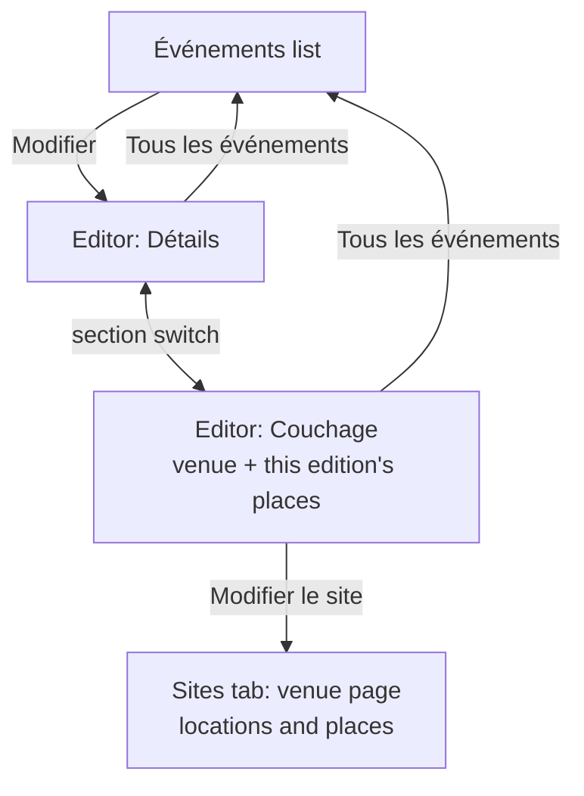

# Event editor: from a modal to a page (spec)

Binds to [`DESIGN.md`](./DESIGN.md) (admin density 7). No new tokens, radii or colours.

## Why the modal failed

| # | Problem | Consequence |
|---|---|---|
| E1 | Switching browser tabs closed the dialog and dropped every unsaved edit | Root cause: `ProtectedRoute` was declared inside `App`'s render, so each auth event (Supabase fires one when the tab regains focus) produced a new component type and React remounted the whole `/admin` (and `/inscription`) subtree. Fixed at the root; the editor also keeps its draft outside the component and in `sessionStorage`. |
| E2 | One 92dvh scroll box for 4 fieldsets + an unbounded list of locations and places | The sleeping plan, the part that grew, got the least room; on a phone it was a sheet inside a sheet |
| E3 | Two save models in one dialog: fields wait for *Enregistrer*, locations save as you type | *Annuler* looked like it would undo location changes; it didn't |
| E4 | Places edited one at a time, each row = 4 controls with a default label "Place n" | Setting up 6 rooms × 3 beds took ~70 interactions |
| E5 | No overview: capacity per location only as a caption, no occupancy, no "who is where" | Admins bounced to the Vue d'ensemble tab to check totals |
| E6 | Numeric fields snapped to a fallback when cleared (`parseInt('') || 90`) | You could not clear "90" and type "85" |

## Information architecture

The editor is its own route under the admin shell (tab bar shown, Événements selected), so it
survives reloads and works with Back. `/admin/*` is one route element, so the admin state (and
every unsaved draft) stays mounted between the tabs and the editor:

`/admin/events/<id>?section=details|sleeping`

Other tabs link to `/admin/<id>` (ADR 0022); coming back to Événements shows the list, where an event
with an unsaved draft is marked.

## Editor page

- **Header**: ghost back button *Tous les événements*, the event title (live from the draft),
  status tag and dates. Under it a two-pill switch *Détails* / *Couchage · n places* (tablist).
- **Détails**: the three fieldsets as cards (*L'essentiel*, *Calendrier*, *Infos pour les
  membres*). From `lg`, a sticky rail on the left jumps to each card.
- **Save bar** (Détails only): sticky at the bottom, above the phone tab bar, in the thumb zone.
  Clean: faint *Tout est enregistré* + disabled *Enregistrer*. Dirty: warn *n modification(s) non
  enregistrée(s)* + ghost *Annuler les modifications* + primary *Enregistrer*. Saving keeps you on
  the page.
- **Draft**: held in `AdminView` (survives admin-tab and section switches) and mirrored to
  `sessionStorage` (survives a reload). A restored draft says so in an info notice. A dirty draft
  puts the warn marker on the Événements tab and a *Non enregistré* tag on the event's row, and
  `beforeunload` asks before closing the browser tab.
- **Validation** (only what the draft touches): numbers kept as typed, then whole number and a
  minimum per field; title required; when both dates are set, registration opens strictly before
  the event starts (a DB constraint follows in #141); links need a label and an http(s) URL, and
  fully empty rows are dropped on save. Errors show under the field, and the save bar says why it
  can't save.

## Couchage (the event's venue, #147)

Choosing where the edition happens and what of the venue it uses; the venue itself (its locations
and places) is edited on its page of the Sites tab (#146), with the master-detail editor described
under *Venue page* below. Saves as you go, and says so (same status line).

- **Site card**: a `Select` of the venues not archived (the event's own stays listed if archived),
  each option "<nom> · capacité n", the address under it, and *Modifier le site* (to the Sites
  tab). Without a venue: placeholder *Choisir un site…* and *Créer un site pour cet événement*.
- **Changing the venue** while attendees hold places: a confirm dialog lists them; confirming
  clears their places with the change (database), cancelling changes nothing.
- **Totals strip**: capacité du site, capacité cette édition, places disponibles `n/m`, personnes
  placées.
- **Per location**, a card listing its places: label, type, "capacité du site n" when this event
  differs, who of the event is there; a `Stepper` for this event's capacity and a switch
  *disponible*. An excluded place is dimmed and has no stepper. Excluding an occupied place is
  refused with the names.
- No location or place editing.

## Venue page (Sites tab, #146)

Saves as you go, and says so: a live status line (*Enregistré automatiquement* / *Enregistrement…* /
*Enregistré* / error).

- **Totals strip**: locations, places, capacity, assigned (`Stat`s, mono values).
- **Master-detail**: from `lg`, a 20rem list of locations (name, places, occupancy `3/6`) beside
  the selected location. Below `lg`, the list, then the location full-width with *Tous les lieux*.
- **Location pane**: name (large), note, then actions *Monter*, *Descendre*, *Dupliquer*,
  *Supprimer*. Places as a table from `sm` (Nom · Type · Capacité · Occupée par · delete), stacked
  rows below. Capacity is a `Stepper` (debounced write). Occupancy over capacity is warn.
- **Bulk add**: *Ajouter* `[− n +]` `[type]` → n places named "Lit 3", "Lit 4"… numbered after the
  location's existing places of that type.
- **Dupliquer**: copies the location and its places as "<nom> (copie)", selected right away.
- **Empty state**: bed icon, one line, primary *Ajouter un lieu*.
- Deleting something occupied is still refused with the names; a non-empty location asks first.

## States

| State | Détails | Couchage |
|---|---|---|
| Loading | admin skeleton (existing) | skeleton of strip + list |
| Empty | n/a | empty state + CTA |
| Dirty | save bar warn + tab marker | n/a (autosave) |
| Saving | primary button busy | status line *Enregistrement…* |
| Error | toast + bar stays dirty | `Notice` bad, reload from DB |
| Unknown event id | `EmptyState` + back | same |

## Accessibility

Tablist semantics for the section switch; every place control has a label naming the place;
status line is `aria-live="polite"`; icon buttons have names that include the location/place;
44px targets; focus ring from the tokens; the save bar never covers the last field (page bottom
padding).

## Acceptance

1. Open the editor, edit a field, switch browser tab and back: still open, edit still there.
2. Edit, go to another admin tab and back: same. Reload the page: draft restored with a notice.
3. Clear a number and type a new one; an invalid number blocks save with a message.
4. Add 3 beds to a location in one action; duplicate a location; totals update.
5. Occupied place/location deletion still refused with names.
