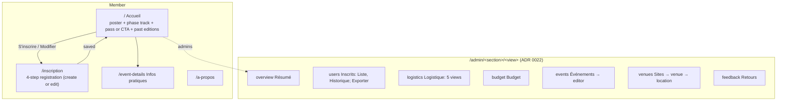
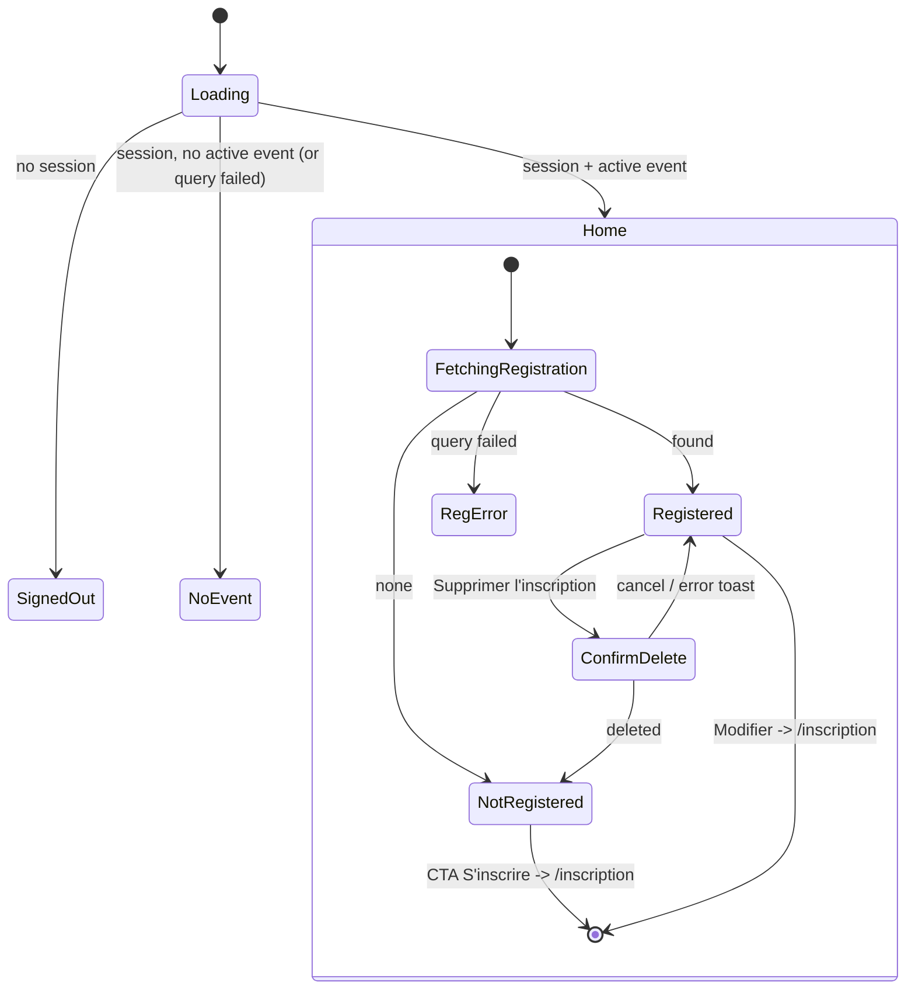
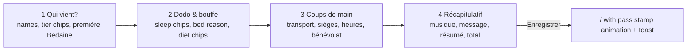
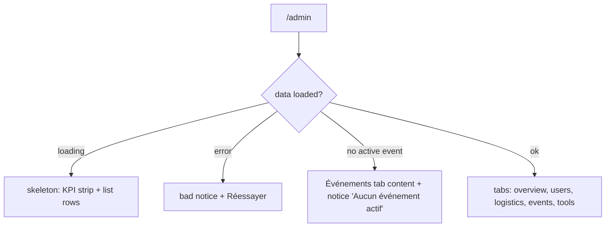

# La Bédaine redesign: member + admin (spec)

Binds to [`DESIGN.md`](./DESIGN.md). **Every screen must read as the same product if placed side
by side.**

## 1. Audit of the current UI (why it's "terrible")

| # | Problem | Where | Consequence |
|---|---|---|---|
| A1 | Light islands in a dark shell: `bg-white`, `bg-indigo-50`, `bg-teal-50` cards with `text-gray-700` inside a `slate-950` page | every view | Glare, no hierarchy, reads as three apps glued together |
| A2 | ~6 accents (blue, purple, green, amber, orange `#fb951a`, teal), stock blue→purple gradient banner | Home, Details, About | No identity, AI-default look, no focal point |
| A3 | Registration is one 570-line form: 5-option `<select>` for tier, per-attendee selects for sleep/diet, 4 transport fields, 11 volunteering checkboxes, 2 textareas, then the total at the very bottom | `RegistrationForm` | Mobile users scroll ~8 screens before seeing the price or Save; two "add participant" buttons; `fr.sameForEveryone` key missing so the toggle had no label |
| A4 | Summary screen is 8 bordered cards of label/value pairs; amount due buried in a sidebar | `RegistrationSummary` | The two things a member cares about (am I in? what do I owe?) have no priority |
| A5 | `alert()` / `window.confirm()` for delete, payment toggle, copy | Summary, Admin | Jarring, unstyled, untestable, blocks the thread |
| A6 | Admin is one long page: events, aggregates, tabs, simulator, export, feedback, stacked | `AdminView` | Admins scroll past everything to reach the one thing they came for (issue #83) |
| A7 | Hand-drawn SVG icons, `✕` text glyphs for close buttons, spinner loaders | everywhere | Inconsistent, inaccessible close buttons ("✕" as the accessible name) |
| A8 | Dialogs are `div.fixed` without `role="dialog"`, no focus trap, no Escape | Admin modals, EventModal, Feedback | Keyboard/screen-reader users get lost |
| A9 | Event details shows internal tunables ("Délai d'intention avant inscription (mois): 2") | `EventDetailsView` | Admin vocabulary leaked to members; the actual timeline isn't shown |
| A10 | Floating feedback FAB covers the form's submit button on mobile | `FeedbackModal` | Primary action hidden in the thumb zone |

## 2. Information architecture

- New route `/inscription` so the phone back button leaves the form instead of the app, and the
  form gets a focused full-screen layout. Existing routes and slugs are unchanged.
- **Admin (superseded, October 2026):** the 5 tabs below grew to 7 and outgrew the bottom bar. The
  admin's information architecture and navigation are now
  [ADR 0022](../../docs/adr/0022-admin-navigation-and-page-widths.md) (#191):
  - 7 flat sections, Outils dissolved;
  - a left sidebar with nested views on desktop;
  - on phones, a bottom bar (Résumé, Inscrits, Logistique, Budget) plus « Plus »;
  - one-line section headers, dense and narrow page widths, and `/admin/<section>/<view>` paths.

  §3.4 below still describes each section's content.
- Navigation: top bar (logo, "Infos", "Admin" for admins, account menu). Members get no bottom
  bar (3 destinations don't need one); their bottom zone is reserved for the form's action bar.
- The feedback button moves into the account menu + footer ("Signaler un problème"), no FAB.

## 3. Flows and states

### 3.1 Member: home

| State | What renders |
|---|---|
| Loading (auth) | Full-page skeleton of top bar + poster block. No spinner. |
| SignedOut | Full-bleed mural poster, "La Bédaine" display title, `fr.pleaseSignInHome` + instructions, one primary button "Se connecter avec Google" and a secondary "Facebook" text button. Nothing else. |
| NoEvent | EmptyState: calendar icon, `fr.noActiveEventTitle` / message. Past editions strip below if any. |
| FetchingRegistration | Pass-shaped skeleton (same size as the pass: no layout shift). |
| NotRegistered | Poster, PhaseTrack, **invite card**: headline "Vous venez cette année?", price line "Adulte, fin de semaine complète: 355 $" (from selling price, only if set), primary CTA "Inscrire mon groupe". In the intent phase the CTA reads "Déclarer mon intention" and a `warn` notice explains it's non-binding. |
| Registered | Poster, PhaseTrack, **Pass** (signature), then "Mon groupe" (attendee rows), "Logistique" (3 compact blocks: transport, bénévolat, demandes), "Historique des modifications" in a `
`. Actions: primary "Modifier" on the pass, danger-ghost "Supprimer l'inscription" at the bottom (a hard delete, as today; the softer "Se désinscrire" is issue #35) (only when status is editable, as today). |
| Waitlisted | Pass stamp `LISTE D'ATTENTE` in `warn`, one-line explanation under the pass. |
| RegError | Inline `bad` notice with the message and a "Réessayer" button. |

### 3.2 Member: registration (`/inscription`)

Four steps. Each step holds ≤ 4 decisions per attendee. The running total is always visible in a
sticky bottom bar (thumb zone) with the primary action.

- **Step header**: 4 clickable segments (label + number), current one in `neon`. Any step reachable
  when editing; when creating, forward jumps validate step 1 first.
- **Step 1**: one card per attendee. Name field; "Âge" chips (Adulte / Ado / Enfant); "Présence"
  chips (Fin de semaine / Soirée principale), hidden for Enfant (kids are after-party, 0 points);
  toggle "Première Bédaine"; per-person price in mono on the card's top-right. "Ajouter une
  personne" ghost button under the list (one, not two). Remove = icon button with
  `aria-label="Retirer {name}"`, not shown when only 1 attendee.
- **Step 2**: toggle "Mêmes choix pour tout le monde" (default on for groups > 1). When on, one
  set of chips applies to all; when off, one compact block per attendee. Sleep chips with icons
  (Camping, Plancher, Lit, Sofa, Extérieur/Autre); bed reason chips appear under "Lit"; free text
  appears under "Autre". Diet chips (Aucune, Végétarien, Végane, Sans gluten, Autre). The
  accommodation/food notices sit under the chips as `faint` text.
- **Step 3**: Transport chips (J'offre un lift / J'ai besoin d'un lift), seats stepper only for
  "offre", arrival/departure `datetime-local`. Volunteering as multi-select pill chips (11 options
  wrap), "Autre" reveals a text field.
- **Step 4**: music + message textareas; a read-only recap (headcount by tier, total) and the
  first-timer discount notice.
- **Bottom bar**: left = "Total estimé" + amount (mono, lg); right = "Retour" (ghost) and
  "Suivant" / "Enregistrer" (primary). When editing, "Enregistrer" is available from every step.
  Cancel = the close icon in the page header (`aria-label="Annuler"`) or the dialog header; no
  cancel button in the bar (it crowded the bar at 375px).
- Validation: empty name → field error under the input, step 1 header segment shows an error mark,
  focus moves to the first invalid field. No toast for validation.
- Waitlist: if headcount > `max_attendees`, a `warn` notice appears in the bottom bar area before
  saving ("Votre groupe sera placé sur la liste d'attente").
- Saving: primary button shows "Enregistrement..." and is disabled; on success navigate to `/`
  with `state.justSaved = true` → pass stamp animation + success toast. On error: `bad` toast +
  inline notice above the bottom bar, form state preserved.
- Admin god-mode reuses the same component inside a full-height dialog (bottom sheet on mobile),
  title "Modifier l'inscription de {name}", same steps, same bar ("Enregistrer (admin)").

Edge cases: refresh on `/inscription` refetches the registration and rehydrates (no local draft);
session expiry → save fails with the auth error toast, data stays on screen; no active event →
redirect to `/`; intent phase → same form, titles say "Intention".

### 3.3 Member: Infos pratiques (`/event-details`)

Poster header (compact), then:
- **PhaseTrack** in full (dates for each phase) replaces the raw "months/weeks" tunables.
- Fact grid (2 cols ≥ md, 1 col mobile): Dates (start → end), Lieu (map link with icon), Durée,
  Capacité.
- "Points de contact" and "Instructions" as readable text blocks (`whitespace-pre-line`, 70ch).
- "Liens" as a list of link rows with an external-link icon.
- Missing values: the block is omitted (no "Non spécifié" noise), except instructions which shows
  `fr.noInstructionsMessage`.

### 3.4 Admin

- **Vue d'ensemble**: KPI strip (Personnes, Groupes, Payés x/y, Reçu / Attendu in mono). Money
  block: collected vs outstanding as a single stacked bar (ok vs warn) with legend, total cost and
  estimated cost per participant vs selling price. Tier price list. Accommodation and diet counts as
  compact bar lists. All numbers derive from `attendees` (not the broken `counts`, see #41).
- **Inscriptions** (`users`): search field (name/email) + filter pills (Tous / À payer / Payés /
  Liste d'attente) with counts. Rows: name (button → profile dialog), email, headcount, amount
  (mono), payment Tag-button, admin switch, "Modifier" icon-button. Cards under `lg`. Payment toggle
  asks for confirmation in a Dialog (not `window.confirm`).
- **Logistique**: filter pills (Tous / Lit demandé / Non assignés). One card per party, attendee
  rows with preference + reason and the bed input. A sticky "N modifications non enregistrées"
  bar with "Enregistrer" per party (existing per-party save semantics kept).
- **Événements**: event list (status Tag, dates), actions Activer / Archiver (archive now asks for
  confirmation, as the requirements say) / Modifier. Edit dialog groups the 17 fields into 4
  fieldsets: *L'essentiel* (thème, description, lieu, durée) · *Calendrier* (dates, délais,
  inscriptions ouvertes, capacité) · *Argent* (coût total, catégorie, répartition, prix de vente,
  coût de revient) · *Infos membres* (contacts, instructions, liens).
- **Outils**: simulator (6 numeric inputs, since counts reach 50+ and a stepper would be slow; result as a stat block), export (two
  actions side by side), commentaires (filter pill "Afficher résolus", list with Résoudre).
- Profile dialog: identity block + history list, `<dialog>`, close icon button
  `aria-label="Fermer"`.

## 4. Component briefs

All values come from `DESIGN.md` tokens. Tailwind utilities map 1:1 to `@theme` tokens
(`bg-surface`, `text-muted`, `border-edge`, `rounded-card`, `font-display`, `font-data`...).

| Component | Purpose / variants | States | A11y |
|---|---|---|---|
| `Button` | primary (neon bg, night text), secondary (edge border), ghost, danger (bad), icon-only; sizes md (44px) / sm (36px, desktop tables only) | hover (raised / brighter), active scale .98, focus ring, disabled 50% + `aria-disabled`, loading (label swap, disabled) | native `<button>`; icon-only needs `aria-label` |
| `Field` | label above, control, hint, error | default, focus (neon ring), invalid (bad border + message), disabled | `htmlFor`/`id`, `aria-describedby` hint+error, `aria-invalid` |
| `Input`/`Textarea`/`Select` | inset well: bg night, border edge, radius control, 16px text | placeholder in faint | real `<input>` |
| `ChipGroup` | single (radio) or multi (checkbox); optional icon | unselected (edge border, muted), selected (neon 2px border, neon/12% fill, ink text, check icon), focus, disabled | `role="radiogroup"`/`group` + visually hidden native inputs, arrow keys via native radios |
| `Toggle` | switch with label | on (neon track), off (edge track) | `<button role="switch" aria-checked>` |
| `Stepper` | − value + for counts | min/max disabled | buttons labelled "Moins"/"Plus", value in `aria-live` |
| `Tag` | ok / warn / bad / info / neutral pill | static; as button when toggling payment | text always present (never color only) |
| `Card` | surface + line border + radius card; `raised` variant | hover only if interactive | never nested |
| `Dialog` | native `<dialog>` via `showModal()`; centered ≥ sm, bottom sheet < sm; header (title + close icon), scroll body, sticky footer | enter animation, Escape closes, backdrop click closes (not for dirty forms) | focus trapped by the platform, `aria-labelledby` |
| `ConfirmDialog` | replaces `window.confirm`: title, body, cancel + confirm (danger or primary) | confirming (loading) | focus starts on cancel |
| `Tabs` | top pills ≥ md, fixed bottom bar < md (admin) | active neon underline/label | `role=tablist/tab/tabpanel`, `aria-selected`, arrow keys |
| `Toast` | bottom-center stack (above bars), ok/bad/warn/info icon | auto-dismiss 4s, manual close | `role="status"` (`alert` for bad) |
| `EmptyState` | icon, title, one line, optional action | | heading level fits page |
| `Skeleton` | shimmer-free pulse blocks matching final layout | reduced motion: static | `aria-busy` on container |
| `PosterHeader` | mural photo + night scrim, display title, mono meta line (date · lieu · durée), optional action | compact variant for sub-pages | image `alt=""` (decorative), title is `h1` |
| `PhaseTrack` | 4-5 phases (Intention, Inscriptions, Paiement, Fin de semaine) with dates, current highlighted | horizontal ≥ sm, vertical list < sm | `<ol>`, current has `aria-current="step"` |
| `Pass` | signature (see DESIGN.md) | registered, paid, waitlisted, intent; stamp animation on `justSaved` | stamp text is real text; barcode `aria-hidden` |

## 5. Pre-Flight

Identity lock: all colors/radii/type come from the `@theme` block; icon family lucide only; one
accent. **Pass.**
Anti-slop: fonts Archivo + JetBrains Mono (not in the ban list); no gradient UI, no purple glow
(neutrals are tinted but chroma 0.03, accent is pink from the mural); no 3 equal cards (KPI strip
is a single ruled strip, not cards); no eyebrow numbering (step numbers are a real sequence); 0
em-dashes in new copy; no fake numbers. **Pass.**
State coverage: loading / empty / error / success for home, form, admin tabs, dialogs. **Pass.**
Accessibility: contrast table in DESIGN.md; focus ring token; native dialog; tabs with arrow keys;
44px targets; reduced motion. **Pass.**
Cognitive load: admin nav 5 items; ≤ 4 decisions per attendee per step; one primary action per
view. **Pass.**

Scored self-critique (0–4): distinctiveness 3 · hierarchy 3 · consistency 4 · accessibility 3 ·
state coverage 3 · copy 3 · restraint 3 · motion motivation 3 = **25/32**, no axis ≤ 2.

## 6. Build handoff

- Target: this is a Vite + React 19 SPA (no SSR) → `react-vite-tailwind-engineer` role (built in
  this session).
- Design system: bespoke on Tailwind v4 `@theme` tokens + native `<dialog>`; install
  `@fontsource-variable/archivo` and `@fontsource-variable/jetbrains-mono`.
- *Implement exactly this spec. Theme with our locked tokens; do NOT redesign.*

Acceptance criteria:
1. No `bg-white`, `bg-indigo-*`, `bg-teal-*`, `bg-blue-*`, `text-gray-*`, gradient banner classes
   remain in `src/` (grep = 0).
2. No `window.confirm` / `alert(` in `src/`.
3. No inline `<svg>` path icons in `src/`; lucide only.
4. Every string in `fr.json`; `fr.dates` and `fr.sameForEveryone` exist.
5. Registration works end to end (create, edit, delete) for a member; god-mode edit and payment
   toggle work for an admin, verified in a real browser against local Supabase.
6. At 375px: no horizontal scroll on any screen; primary action visible without scrolling in the
   form (sticky bar); admin bottom tab bar reachable.
7. `npm run build`, `npm test`, `npm run test:pricing` pass; e2e specs updated for the new tab set
   and pass.
