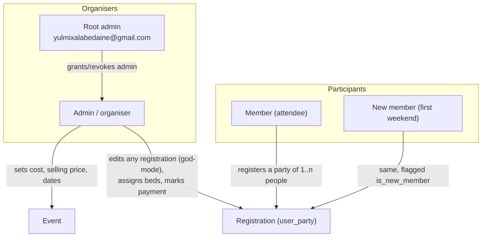
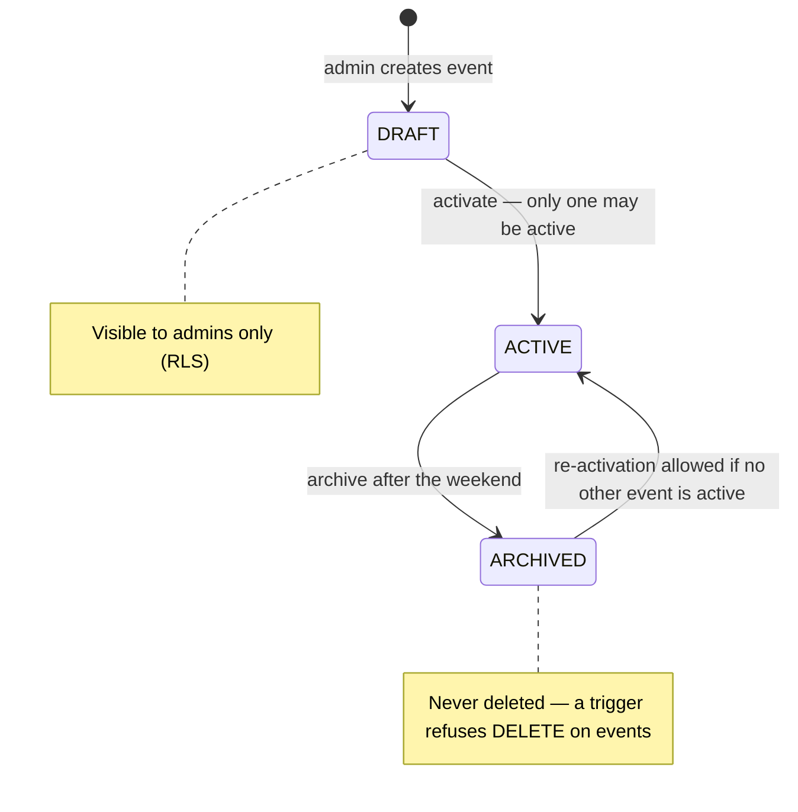
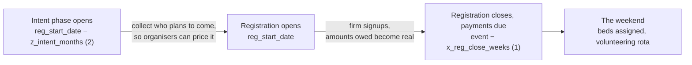

# Product overview

## What it is

**La Bédaine** is a small web app that coordinates an annual weekend in a rented cottage for a
large group of friends — roughly 90 people. The event has been running for two decades; the app
replaces the Google Sheets/Excel workbook the group has used for most of that history to collect
who is coming, work out what each group of friends owes, and organise sleeping spots, food,
transport and volunteering.

The app is French-only (fr-CA) for end users; the codebase is in English.

## Why an app instead of the spreadsheet

The spreadsheet worked but had structural limits the app is meant to fix:

| Spreadsheet pain | What the app does instead |
|---|---|
| Everyone can see and accidentally edit everyone's data | Row Level Security: you see your own registration, organisers see all |
| Prices recomputed by hand, formulas drift | A single [pricing engine](./04-pricing-and-business-rules.md) with tests |
| No history — last year's numbers are a separate tab, or lost | `events` are archived, never deleted; `user_event_history` view spans years |
| No enforcement: two active weekends, duplicate signups, over-capacity | DB constraints: one active event, one registration per user per event, capacity/waitlist trigger |
| Cost vs. price confusion in the same cells | Two explicit columns: internal `total_cost` estimate vs. admin-set `selling_price_whole_event` |
| Chasing payments in a chat thread | `payment_status` per registration, visible to the person who owes |

## Actors

- **Member** — signs in with Google or Facebook, registers a *party* (themselves plus partner,
  kids, teens, friends), states logistics preferences, sees what they owe and whether they've paid.
- **New member** — someone attending for the first time. Gets a deliberate discount so the group
  keeps recruiting (see [pricing](./04-pricing-and-business-rules.md#new-member-rule)).
- **Admin / organiser** — one of the named organisers (registration, volunteering, food, parking,
  first aid / beds). Sets the event's money and dates, edits any registration on someone's behalf,
  assigns sleeping spots, toggles payment status, exports to the spreadsheet.
- **Root admin** — a hardcoded email that is always an admin and cannot be demoted
  (`protect_root_admin` and `is_admin()` in `supabase/migrations/`). It is the break-glass account.

## The event lifecycle

Exactly one event may be `is_active = TRUE`, enforced by the partial unique index
`only_one_active_event`. The UI checks first and also catches the constraint error
(`src/views/AdminView.jsx:129`).

## Registration timeline

The event carries three tunables that drive which phase the home page shows:

The organisers' stated cadence (`docs/Bedaine App - Requirements.md`, "Bédaine info"):
intentions **2 months** ahead to compute the price, price published **1 month** ahead,
payments due at the latest **1 week** before.

> **Gap:** only the intent-phase boundary is implemented (`src/views/HomeView.jsx:52`).
> `x_reg_close_weeks` is displayed but never enforces anything, and the event has no actual
> event date column — only `reg_start_date`. See
> [issue #33](https://github.com/YULmix/yulmix-la-bedaine/issues/33).

## Relationship to the spreadsheet

The app is intended to *replace* the workbook, with a CSV / TSV-to-clipboard export
(`src/views/AdminView.jsx:471`, `:555`) as the bridge while organisers still trust the sheet.

**Not yet confirmed:** this documentation was written without access to
`https://docs.google.com/spreadsheets/d/1czE52meVxILFLLdtxN86KaUS6gCVvLJKnuuYsLrZzPk` —
the Google Drive connector in this environment is not authenticated, so the sheet could not be
read. Two things should be checked against it and then written up here:

1. **Historical data**: with roughly two decades of editions in the spreadsheet, how much of that
   should be backfilled into `events` + `user_parties` so `user_event_history` is genuinely useful,
   versus starting the app's own history fresh from this edition onward.
2. **Columns the app has no home for**: the sheet is the only place that knows the real column
   list. Anything it tracks that is not in [the data model](./03-data-model.md) is a requirement
   the app is currently missing — the 48-beds floor plan mentioned in the requirements notes is
   one likely example.
