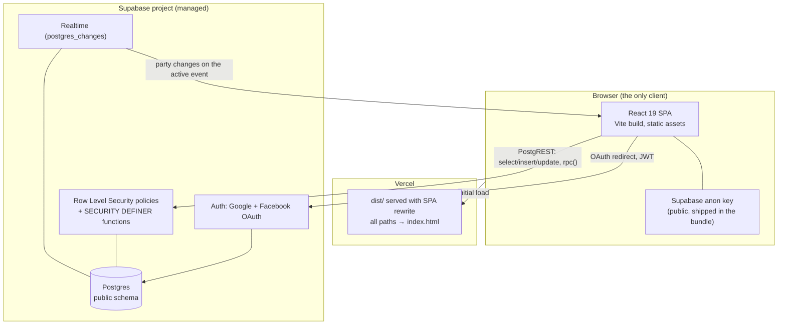
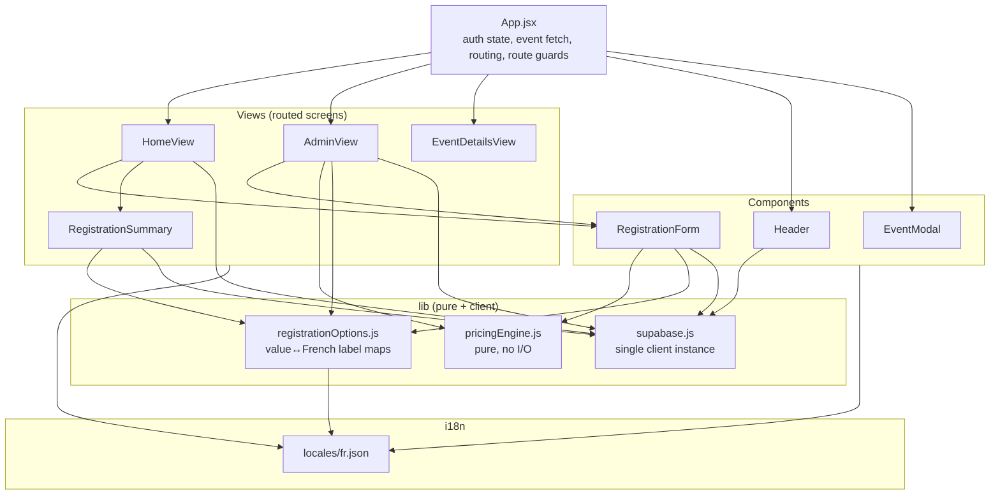
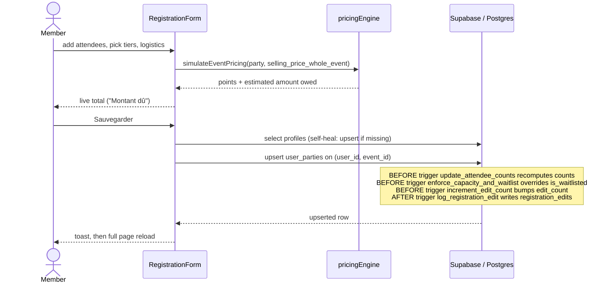
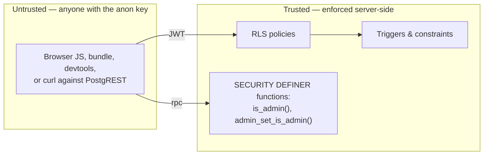
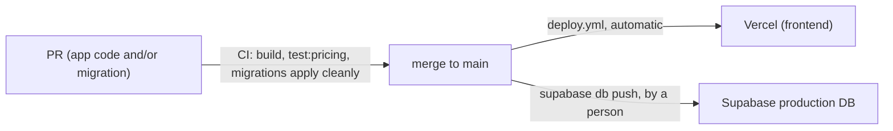

# Architecture

## One sentence

A React single-page app talks directly to Supabase (Postgres + Auth) from the browser; there is no
backend of our own, and **Row Level Security in the database is the only authorisation boundary**.

## Runtime shape

Everything the app does is a direct, authenticated PostgREST call from the browser. There is no
API layer, no server-side rendering, no serverless function, no cron. See
[ADR 0001](./adr/0001-supabase-as-the-only-backend.md).

**Consequence that matters:** any rule that must not be bypassed has to live in Postgres — as a
constraint, a trigger, an RLS policy, or a `SECURITY DEFINER` function. A check written only in
React is a UX nicety; a determined member with the anon key and a REST client is not bound by it.

## Layers

- **`App.jsx`** owns session state, admin status, the event list, and the route guard
  (`ProtectedRoute`, `src/App.jsx:140`). It is also, currently, a view itself — the "other events"
  grid is inlined into the `/` route.
- **`views/`** are screens; **`components/`** are reused across screens. `RegistrationSummary.jsx`
  lives in `views/` but is really a component rendered inside `HomeView` — a naming inconsistency,
  not a deliberate boundary.
- **`lib/pricingEngine.js`** is the one genuinely pure module: no React, no Supabase, no I/O. It is
  the only module with its own test file, and that is not a coincidence — see
  [ADR 0003](./adr/0003-pricing-as-a-pure-module.md).
- **`lib/registrationOptions.js`** is the single place where a raw DB value (`bed`, `dj_evening`)
  is mapped to French UI text. Never render a raw enum.

## Registration data flow

Two things to notice, because they shape every future change:

1. **The amount owed is computed in the browser and written as a value.** The database does not
   recompute or validate it (`src/components/RegistrationForm.jsx:312`). A member could post any
   number. This is the single largest integrity gap in the system — see
   [issue #30](https://github.com/YULmix/yulmix-la-bedaine/issues/30).
2. **Server triggers override client fields.** `counts` and `is_waitlisted` are recomputed by
   Postgres on every write, so whatever the client sent is discarded. That is correct design; a
   tier-naming mismatch that used to break this for `counts` was fixed in production
   ([issue #34](https://github.com/YULmix/yulmix-la-bedaine/issues/34)). The capacity check behind
   `is_waitlisted` is currently defeated by stale French status values
   ([#49](https://github.com/YULmix/yulmix-la-bedaine/issues/49)).

## Admin data flow

`AdminView` fetches everything for the active event on mount and subscribes to Realtime for
`user_parties` filtered by `event_id` (`src/views/AdminView.jsx:59`), re-fetching the whole list on
any change. Writes go straight to the tables, except granting admin, which must go through
`rpc('admin_set_is_admin')` because direct `UPDATE` on `profiles.is_admin` is revoked.

## Trust boundaries

Rules currently enforced on the trusted side: who can read which event, who can read/write which
registration, one active event, no event deletion, no self-promotion to admin, root admin
protection, capacity/waitlist, counts, audit log.

Rules enforced **only** in the browser today: the amount owed, the intent/registration phase
windows, capacity messaging, and the "cannot edit your own admin flag" convenience check. The
first of those should move; the others are cosmetic.

## Deployment

**Production runs on Vercel.** `vercel.json` sets the build command (`npm run build`), the `dist`
output directory, and the SPA rewrite (all paths → `index.html`). A stale `netlify.toml` is also
committed from before the host was settled and should be deleted
([issue #45](https://github.com/YULmix/yulmix-la-bedaine/issues/45)).

Deploys go through `.github/workflows/deploy.yml`, which runs `npm run build` and
`npm run test:pricing` before deploying to production via the Vercel CLI — this bypasses Vercel's
own (disconnected) git integration. See [Live environment audit](./11-live-environment.md#deployment)
for the history of why.

The **database schema ships separately from the app.** It lives in `supabase/migrations/`
([ADR 0013](./adr/0013-supabase-migrations.md)). CI only checks that the migrations apply to an
empty database. A person applies merged migrations to production with `supabase db push`, so a
merge to `main` deploys the frontend but never changes the database by itself:

Because the frontend deploys the moment a PR merges, frontend code that needs a schema change will
break until someone pushes the migration. Run `db push` right after merging. For anything
non-additive, split the work into two PRs: first the migration, pushed, then the code that uses it.

Environment variables are build-time (`VITE_` prefix), so they are baked into the bundle:

| Variable | Used by | Secret? |
|---|---|---|
| `VITE_SUPABASE_URL` | `src/lib/supabase.js` | No — public |
| `VITE_SUPABASE_ANON_KEY` | `src/lib/supabase.js` | No — public by design, safe *only* because RLS is correct |
| `SUPABASE_SERVICE_ROLE_KEY` | RLS test suite only, never the app | **Yes** — never put it in a `VITE_` variable |

The client throws at import time if the two `VITE_` variables are missing
(`src/lib/supabase.js:3`), so a misconfigured deploy fails loudly rather than silently.

## What deliberately does not exist

- **No email/notification layer.** Confirmation emails are on the backlog.
- **No file storage in use.** A `feedback` storage bucket is specified for screenshot paste;
  the feature is unbuilt.
- **No state management library.** Component-local `useState` plus prop drilling from `App.jsx`.
- **No TypeScript, no linter, no CI.** See [contributing](./08-contributing.md) for the
  recommended minimum.
