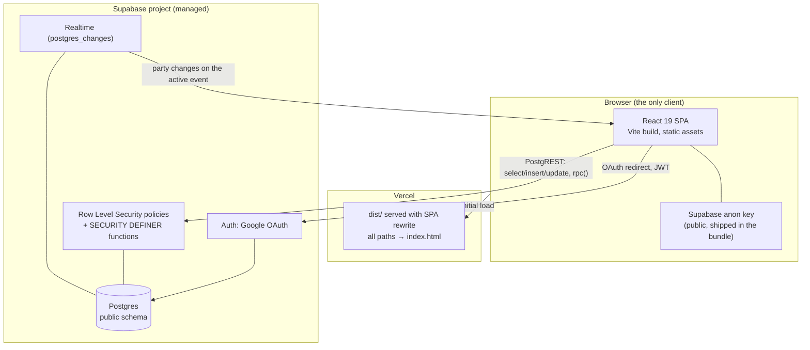
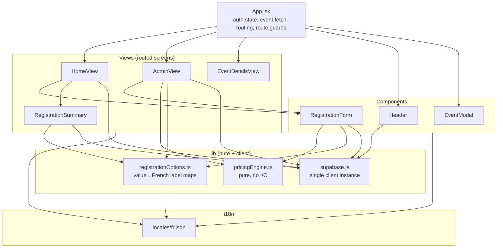
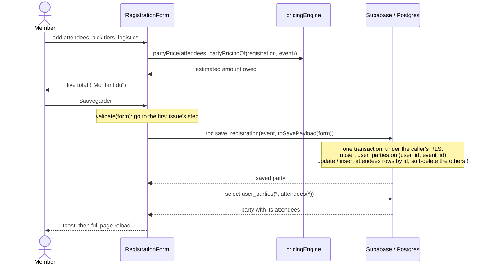
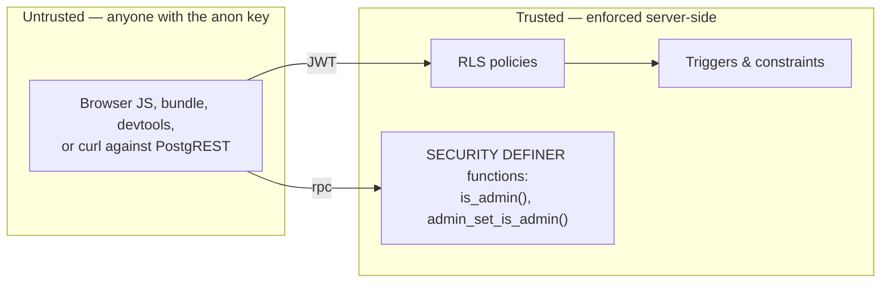
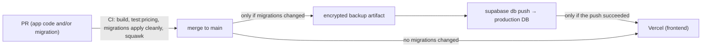

# Architecture

## One sentence

A React single-page app talks directly to Supabase (Postgres + Auth) from the browser; there is no
backend of our own, and **Row Level Security in the database is the only authorisation boundary**.

## Runtime shape

```mermaid
flowchart TD
  subgraph Browser["Browser (the only client)"]
    SPA["React 19 SPA<br/>Vite build, static assets"]
    ANON["Supabase anon key<br/>(public, shipped in the bundle)"]
    SPA --- ANON
  end

  subgraph Host["Vercel"]
    CDN["dist/ served with SPA rewrite<br/>all paths → index.html"]
  end

  subgraph Supabase["Supabase project (managed)"]
    AUTH["Auth: Google OAuth"]
    PG[("Postgres<br/>public schema")]
    RLS["Row Level Security policies<br/>+ SECURITY DEFINER functions"]
    RT["Realtime (postgres_changes)"]
    AUTH --> PG
    RLS --- PG
    RT --- PG
  end

  Browser -->|"initial load"| CDN
  SPA -->|"OAuth redirect, JWT"| AUTH
  SPA -->|"PostgREST: select/insert/update, rpc()"| RLS
  RT -->|"party changes on the active event"| SPA
```

Everything the app does is a direct, authenticated PostgREST call from the browser. There is no
API layer, no server-side rendering, no cron. See
[ADR 0001](./adr/0001-supabase-as-the-only-backend.md). Two Supabase Edge Functions
(`supabase/functions/`) do what the database can't:

- `send-party-email`, transactional email: a Postgres trigger calls it and it sends through Resend
  ([ADR 0016](./adr/0016-edge-function-for-transactional-email.md), issue #12). The browser never
  calls it.
- `impersonate`, « Voir comme »: an admin's browser calls it to open (and end) a read-only session
  of a member ([ADR 0025](./adr/0025-voir-comme-read-only-impersonation.md), issue #266). It mints
  the session with the service role (magic link generated and verified server side); the database
  still decides who may be viewed, marks the session through the custom access token hook, and
  refuses every write made with it. Its checks are in
  [Security](./06-security-and-rls.md#-voir-comme--read-only-impersonation-265-adr-0025).

**Consequence that matters:** any rule that must not be bypassed has to live in Postgres — as a
constraint, a trigger, an RLS policy, or a `SECURITY DEFINER` function. A check written only in
React is a UX nicety; a determined member with the anon key and a REST client is not bound by it.

## Layers

```mermaid
flowchart TD
  subgraph V["Views (routed screens)"]
    HV["HomeView"]
    AV["AdminView"]
    EDV["EventDetailsView"]
    RS["RegistrationSummary"]
  end
  subgraph C["Components"]
    H["Header"]
    EM["EventModal"]
    RF["RegistrationForm"]
  end
  subgraph L["lib (pure + client)"]
    PE["pricingEngine.ts<br/>pure, no I/O"]
    RO["registrationOptions.ts<br/>value↔French label maps"]
    SB["supabase.js<br/>single client instance"]
  end
  subgraph I["i18n"]
    FR["locales/fr.json"]
  end

  APP["App.jsx<br/>auth state, event fetch, routing, route guards"]
  APP --> HV & AV & EDV
  APP --> H & EM
  HV --> RF & RS
  AV --> RF
  RF --> PE & RO & SB
  RS --> RO & SB
  AV --> PE & RO & SB
  HV --> SB
  H --> SB
  C --> FR
  V --> FR
  RO --> FR
```

- **`App.jsx`** owns session state, admin status, the event list, and the route guard
  (`ProtectedRoute`, `src/App.jsx:140`). It is also, currently, a view itself — the "other events"
  grid is inlined into the `/` route.
- **`views/`** are screens; **`components/`** are reused across screens. `RegistrationSummary.jsx`
  lives in `views/` but is really a component rendered inside `HomeView` — a naming inconsistency,
  not a deliberate boundary.
- **`lib/pricingEngine.ts`** is pure: no React, no Supabase, no I/O, and it has its own test file
  (`npm run test:pricing`); that is not a coincidence — see
  [ADR 0003](./adr/0003-pricing-as-a-pure-module.md).
- **`lib/registrationOptions.ts`** is the single place where a raw DB value (`bed`, `dj_evening`)
  is mapped to French UI text. Never render a raw enum.
- **`lib/registration.ts`** is the registration form's model, also pure (#194): the form state read
  from a saved party (`fromParty`), the save payload (`toSavePayload`), every rule between fields
  (`registrationReducer`) and the validation (`validate`). `RegistrationForm` is that reducer plus
  rendering. A new party-level field changes the module and its input, nothing else.

## Registration data flow

```mermaid
sequenceDiagram
  actor U as Member
  participant RF as RegistrationForm
  participant PE as pricingEngine
  participant PG as Supabase / Postgres

  U->>RF: add attendees, pick tiers, logistics
  RF->>PE: partyPrice(attendees, partyPricingOf(registration, event))
  PE-->>RF: estimated amount owed
  RF-->>U: live total ("Montant dû")
  U->>RF: Sauvegarder
  Note over RF: validate(form): go to the first issue's step
  RF->>PG: rpc save_registration(event, toSavePayload(form))
  Note over PG: one transaction, under the caller's RLS:<br/>upsert user_parties on (user_id, event_id)<br/>update / insert attendees rows by id, soft-delete the others (#237)<br/>update the party, whose triggers run:<br/>enforce_calculated_amount_owed locks the price, computes the amount<br/>enforce_capacity_and_waitlist sets is_waitlisted<br/>increment_edit_count bumps edit_count<br/>log_registration_edit writes registration_edits
  PG-->>RF: saved party
  RF->>PG: select user_parties(*, attendees(*))
  PG-->>RF: party with its attendees
  RF-->>U: toast, then full page reload
```

Two things to notice, because they shape every future change:

1. **The browser's total is an estimate.** The database computes `calculated_amount_owed` from
   the party's attendee rows and its locked price (#30, #117); the form never sends it.
2. **A party and its attendees are saved together, by the database.** Attendees are rows of their
   own table ([ADR 0018](./adr/0018-attendees-in-their-own-table.md)), and PostgREST can't write
   two tables in one transaction, so the form calls `save_registration()`. It is the only way to
   write attendees; `is_waitlisted`, the amount and the audit log come from the party's triggers.

## Admin data flow

The admin sections read module stores in `src/lib` (#195). The active event's parties come from
the admin parties store (`src/lib/adminParties.ts`), which subscribes to Realtime for
`user_parties` filtered by `event_id` while a section shows them and re-fetches the whole list on
any change. Comité reads them through `rpc('edition_parties')` instead, without their finances and
without Realtime ([ADR 0026](./adr/0026-comite-does-not-see-finances.md)). Writes go through the data modules (`parties.ts`, `profiles.ts`, `events.ts`); granting
admin must go through `rpc('admin_set_is_admin')` (`setIsAdmin`) because direct `UPDATE` on
`profiles.is_admin` is revoked.

## Trust boundaries

```mermaid
flowchart LR
  subgraph Untrusted["Untrusted — anyone with the anon key"]
    B["Browser JS, bundle, devtools,<br/>or curl against PostgREST"]
  end
  subgraph Trusted["Trusted — enforced server-side"]
    P["RLS policies"]
    T["Triggers & constraints"]
    F["SECURITY DEFINER functions:<br/>is_admin(), admin_set_is_admin()"]
  end
  B -->|JWT| P --> T
  B -->|rpc| F
```

Rules currently enforced on the trusted side: who can read which event, who can read/write which
registration, one active event, no event deletion, no self-promotion to admin, root admin
protection, capacity/waitlist, amount owed and price lock, attendees written only through
`save_registration()`, audit log.

Rules enforced **only** in the browser today: the amount owed, the intent/registration phase
windows, capacity messaging, and the "cannot remove your own admin flag" convenience check (« Équipe »). The
first of those should move; the others are cosmetic.

## Deployment

**Production runs on Vercel.** `vercel.json` sets the build command (`npm run build`), the `dist`
output directory, and the SPA rewrite (all paths → `index.html`). A stale `netlify.toml` is also
committed from before the host was settled and should be deleted
([issue #45](https://github.com/YULmix/yulmix-la-bedaine/issues/45)).

Deploys go through `.github/workflows/deploy.yml`, which runs `npm run build` and
`npm run test:pricing` before deploying to production via the Vercel CLI — this bypasses Vercel's
own (disconnected) git integration. See [Live environment audit](./11-live-environment.md#deployment)
for the history of why.

The **database schema ships with the app, in the same run.** It lives in `supabase/migrations/`
([ADR 0013](./adr/0013-supabase-migrations.md)). On a PR, CI checks that the migrations apply to an
empty database and lints the new ones with Squawk. When a merge to `main` brings new migrations, the
workflow backs up production, runs `supabase db push`, and deploys the frontend only if that
succeeded ([ADR 0014](./adr/0014-ci-applies-migrations-on-merge.md)). A merge without migrations
goes straight to the Vercel deploy:

```mermaid
flowchart LR
  PR["PR (app code and/or migration)"] -->|"CI: build, test:pricing, migrations apply cleanly, squawk"| Main["merge to main"]
  Main -->|"only if migrations changed"| Backup["encrypted backup artifact"]
  Backup --> DB["supabase db push → production DB"]
  DB -->|"only if the push succeeded"| Vercel["Vercel (frontend)"]
  Main -->|"no migrations changed"| Vercel
```

The schema changes a minute or two before the new frontend is live, while the old frontend is still
serving. Additive changes (new table, new nullable column) are safe. To remove or rename something
the frontend reads, use two PRs: first the code that stops reading it, then the migration that drops
it. There are no down-migrations; a bad migration is fixed by a new one.

Environment variables are build-time (`VITE_` prefix), so they are baked into the bundle:

| Variable | Used by | Secret? |
|---|---|---|
| `VITE_SUPABASE_URL` | `src/lib/supabase.ts` | No — public |
| `VITE_SUPABASE_ANON_KEY` | `src/lib/supabase.ts` | No — public by design, safe *only* because RLS is correct |
| `SUPABASE_SERVICE_ROLE_KEY` | RLS test suite only, never the app | **Yes** — never put it in a `VITE_` variable |

The client throws at import time if the two `VITE_` variables are missing
(`src/lib/supabase.ts:3`), so a misconfigured deploy fails loudly rather than silently.

## What deliberately does not exist

- **No notification layer beyond five lifecycle emails.** Registration, waitlist, promotion,
  payment and bed-assignment emails exist ([ADR 0016](./adr/0016-edge-function-for-transactional-email.md));
  there are no reminders, scheduled sends or marketing emails.
- **Little file storage.** Two public buckets: `feedback` (pasted screenshots) and
  `location-photos` (gallery images of venues and locations, admin-written, #124, #177). Objects are removed through the
  Storage API, never by SQL (see [data model](./03-data-model.md#sleeping-locations-and-places)).
- **No state management library.** Component-local `useState` plus prop drilling from `App.jsx`.
- **No TypeScript, no linter, no CI.** See [contributing](./08-contributing.md) for the
  recommended minimum.
