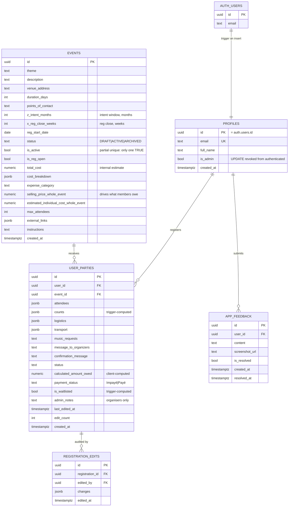
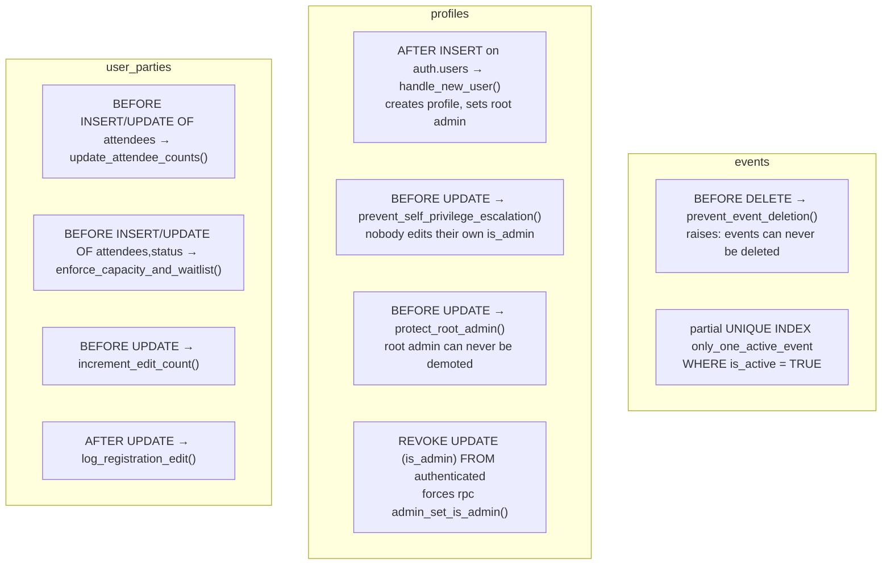

# Data model

Everything in this document is derived from `supabase/schema.sql`. That file is **not** guaranteed
to match the live database — there is no migration history and no drift check
([ADR 0002](./adr/0002-single-schema-file-no-migrations.md)). Statements below describe the schema
file; where the live DB may differ, it is called out.

## Entity relationships



`UNIQUE (user_id, event_id)` on `user_parties` is what makes the registration form an *upsert*
rather than an insert: one party per person per event, editable forever.

## JSONB payload shapes

Four columns carry structured data. These shapes are a contract between the form, the triggers and
the admin screens, and nothing validates them — treat changes here as breaking.

### `user_parties.attendees`

**What the code actually writes** (`src/components/RegistrationForm.jsx:200`):

```json
[
  {
    "name": "Jean Tremblay",
    "type": "Adult",                  // 'Adult' | 'Teenager' | 'Kid'
    "participation": "Whole",         // 'Whole' | 'Main' | 'After-Party'
    "is_new_member": false,
    "sleeping_preference": "bed",     // camping | floor | bed | sofa
    "bed_reason": "health",           // health | children | comfort (required if bed)
    "dietary_needs": "vegetarian",    // none | vegetarian | vegan | gluten_free | other
    "dietary_other": ""
  }
]
```

**What the schema documents and the counts trigger expects**
(`supabase/schema.sql`, `COMMENT ON COLUMN … attendees`, `update_attendee_counts`):

```json
[{ "name": "…", "tier": "adult_whole", "is_new_member": false }]
```

> ⚠️ **These two shapes disagree, and it is not cosmetic.** The trigger reads
> `attendee->>'tier'`, which is absent from every row the app writes, so it computes an all-zero
> `counts` object and overwrites whatever the client sent. Every admin aggregate that reads
> `counts` therefore reads zero. This is finding #1 in
> [state of the code](./09-state-of-the-code.md). *Unverified:* the live database may have a
> corrected trigger; check before "fixing" it twice.

Per-attendee logistics living inside `attendees` (rather than in the party-level `logistics`) is
deliberate — see [ADR 0004](./adr/0004-per-attendee-logistics-inside-attendees.md).

### `user_parties.counts`

```json
{ "adult_whole": 0, "adult_main": 0, "teen_whole": 0, "teen_main": 0, "kids": 0 }
```

Derived, never authored. Exists so admin dashboards can aggregate without unpacking `attendees`.

### `user_parties.logistics`

```json
{
  "sleeping":       { "pref": "bed", "reason": "health", "assigned": "Chambre 2, lit A" },
  "food_requests":  { "requests": "vegetarian, gluten_free", "notes": "free text" },
  "volunteering":   ["cook_meal", "dj_evening"]
}
```

- `sleeping.pref` / `reason` are copied from the **first attendee only**
  (`src/components/RegistrationForm.jsx:264`) — a party-level summary of per-person data.
- `sleeping.assigned` is **admin-write only**: the member asks, the organiser answers
  (`src/views/AdminView.jsx:366`).
- `food_requests.requests` is a comma-joined string of raw option values across all attendees, and
  admin aggregation does substring matching on it (`src/views/AdminView.jsx:939`) — fragile, but
  currently the only food summary there is.

### `user_parties.transport`

```json
{ "type": "offer", "seats": 3, "arrival": "2026-05-01T17:00", "departure": "2026-05-03T14:00" }
```

`type` is `offer` (has room in a car) or `need` (looking for a lift). The schema default is the
string `"None"`, which is not one of the two option values — harmless today, confusing later.

### `events.cost_breakdown` and `events.external_links`

```json
// cost_breakdown
[{ "category": "Chalet", "amount": 1500 }, { "category": "Food", "amount": 1000 }]
// external_links — labels are free text; "Liste d'achats" is the one users look for
[{ "label": "Liste d'achats", "url": "https://…" }]
```

## Enumerations

Postgres `CHECK` constraints, not Postgres enum types — so adding a value means an `ALTER TABLE`.

| Column | Allowed values | Notes |
|---|---|---|
| `events.status` | `DRAFT`, `ACTIVE`, `ARCHIVED` | Mirrored by `is_active`; the two can drift |
| `events.expense_category` | `Chalet`, `Food`, `Music`, `Tech`, `Accessories` | Unused by the UI |
| `user_parties.payment_status` | `Impayé`, `Payé` | **French values stored in the database** — see [ADR 0006](./adr/0006-french-values-in-payment-and-status-columns.md) |
| `user_parties.status` | *unconstrained text* | In practice `Enregistré`; RLS and a view also accept `En attente`. `Annulé` is specified but never written |

## Derived state: who computes what

| Field | Computed by | Trusted? |
|---|---|---|
| `counts` | `update_attendee_counts` (BEFORE INSERT/UPDATE OF attendees) | Yes — but currently produces zeros, see above |
| `is_waitlisted` | `enforce_capacity_and_waitlist` (BEFORE INSERT/UPDATE), advisory-locked per event | Yes |
| `edit_count`, `last_edited_at` | `increment_edit_count` (BEFORE UPDATE) | Yes |
| `registration_edits` rows | `log_registration_edit` (AFTER UPDATE), field-by-field diff | Yes, but attributed to `NEW.user_id` — so an admin's god-mode edit is logged as the *member's* edit |
| `calculated_amount_owed` | **The browser**, written as a plain value | **No** |
| `profiles.is_admin` on signup | `handle_new_user`, true iff email is the root admin | Yes |

## Triggers and constraints, in full



### Capacity and waitlisting

`enforce_capacity_and_waitlist` (`supabase/schema.sql`) is the one piece of concurrency-aware logic
in the system:

1. Reads `max_attendees` for the event; if null or ≤ 0, clears the waitlist flag and returns.
2. Takes `pg_advisory_xact_lock(hashtext(event_id))` so two simultaneous registrations cannot both
   pass the capacity check.
3. Sums `jsonb_array_length(attendees)` over all non-waitlisted, non-cancelled parties for the
   event, excluding the row being written.
4. Adds this party's size; if the total exceeds `max_attendees`, sets `is_waitlisted = TRUE`.
5. Always overwrites the client's `is_waitlisted`.

Two properties worth knowing: waitlisting is **all-or-nothing per party** (a party of 4 that
straddles the cap goes entirely to the waitlist), and nothing ever moves a party *off* the waitlist
when someone else cancels — that is a manual admin action today, and there is no UI for it.

## Views

| View | Purpose | Notes |
|---|---|---|
| `user_event_history` | Joins `profiles` × `user_parties` × `events` so admins can drill into a member's history across editions | The requirements record a Supabase advisory about this view being `SECURITY DEFINER`, and note it as resolved — but the schema file creates it **without** `WITH (security_invoker = true)`. Verify against the live DB and then make the file match |
| `registration_summary_view` | Flattened registration fields for `status IN ('Enregistré','En attente')` | **Not referenced by any code.** Dead unless something outside the repo reads it |

## Extending the model — the checklist

1. Add the column/constraint to `supabase/schema.sql` **and** produce an isolated `ALTER` snippet
   for the Supabase SQL editor (`.clinerules` requires this; so does staying sane without
   migrations).
2. If it is user-visible, add an RLS consideration: does the new column leak anything a member
   should not see? `admin_notes` is the precedent for organiser-only data.
3. If it is an enum-like value, add it to `src/lib/registrationOptions.js` with a French label, and
   the label to `src/locales/fr.json`. Never render the raw value.
4. If it is derived, prefer a trigger over client computation — the browser is not trusted.
5. Update this document and the ERD above.
