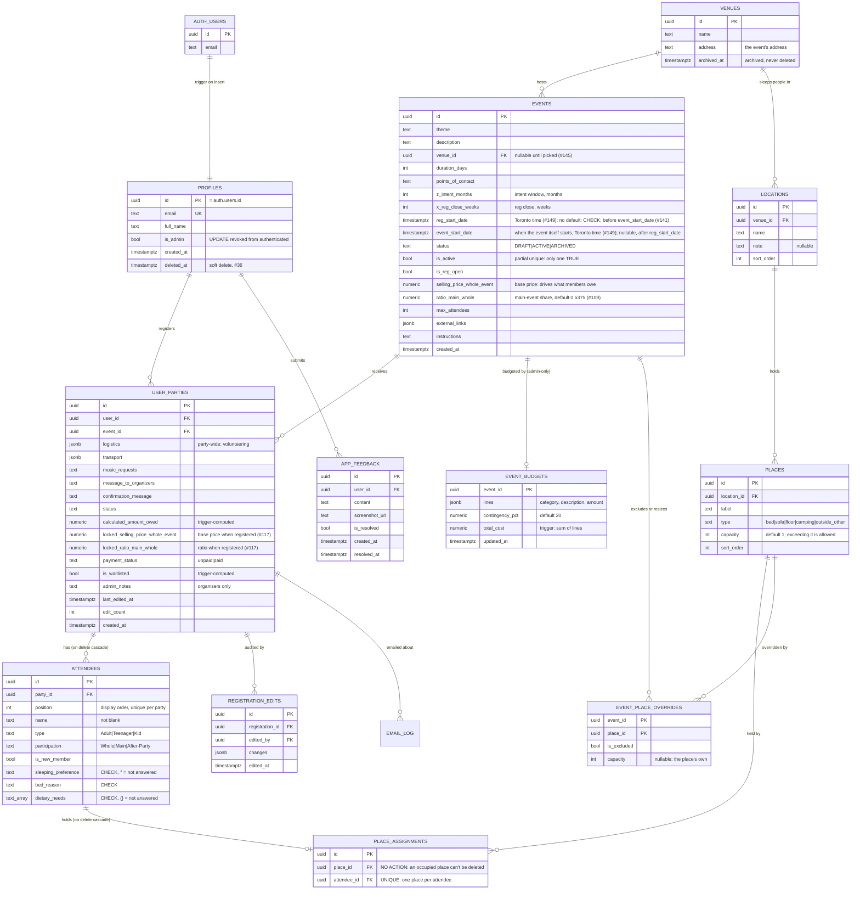
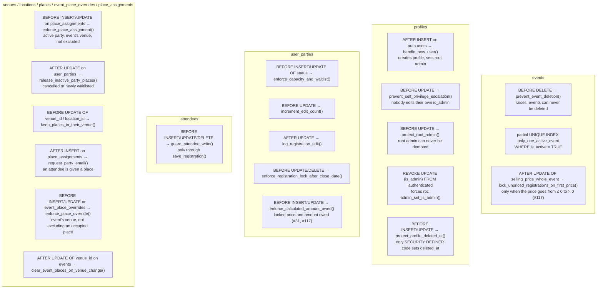

# Data model

Everything in this document is derived from `supabase/migrations/`. Its first file,
`20260924233313_baseline_live_schema.sql`, is a dump of the production schema as of 2026-09-24
([ADR 0013](./adr/0013-supabase-migrations.md)). Later migrations change it from there. Where
production has a known defect, it is called out.

## Entity relationships


```mermaid
erDiagram
  AUTH_USERS ||--|| PROFILES : "trigger on insert"
  PROFILES ||--o{ USER_PARTIES : "registers"
  EVENTS ||--o{ USER_PARTIES : "receives"
  USER_PARTIES ||--o{ ATTENDEES : "has (on delete cascade)"
  EVENTS ||--o| EVENT_BUDGETS : "budgeted by (admin-only)"
  PROFILES ||--o{ APP_FEEDBACK : "submits"
  USER_PARTIES ||--o{ REGISTRATION_EDITS : "audited by"
  USER_PARTIES ||--o{ EMAIL_LOG : "emailed about"
  VENUES ||--o{ EVENTS : "hosts"
  VENUES ||--o{ LOCATIONS : "sleeps people in"
  LOCATIONS ||--o{ PLACES : "holds"
  PLACES ||--o{ PLACE_ASSIGNMENTS : "held by"
  EVENTS ||--o{ EVENT_PLACE_OVERRIDES : "excludes or resizes"
  PLACES ||--o{ EVENT_PLACE_OVERRIDES : "overridden by"
  ATTENDEES ||--o| PLACE_ASSIGNMENTS : "holds (on delete cascade)"

  AUTH_USERS {
    uuid id PK
    text email
  }
  PROFILES {
    uuid id PK "= auth.users.id"
    text email UK
    text full_name
    bool is_admin "UPDATE revoked from authenticated"
    timestamptz created_at
    timestamptz deleted_at "soft delete, #36"
  }
  EVENTS {
    uuid id PK
    text theme
    text description
    uuid venue_id FK "nullable until picked (#145)"
    int duration_days
    text points_of_contact
    int z_intent_months "intent window, months"
    int x_reg_close_weeks "reg close, weeks"
    timestamptz reg_start_date "Toronto time (#149); no default; CHECK: before event_start_date (#141)"
    timestamptz event_start_date "when the event itself starts, Toronto time (#149); nullable, after reg_start_date"
    text status "DRAFT|ACTIVE|ARCHIVED"
    bool is_active "partial unique: only one TRUE"
    bool is_reg_open
    numeric selling_price_whole_event "base price: drives what members owe"
    numeric ratio_main_whole "main-event share, default 0.5375 (#109)"
    int max_attendees
    jsonb external_links
    text instructions
    timestamptz created_at
  }
  EVENT_BUDGETS {
    uuid event_id PK
    jsonb lines "category, description, amount"
    numeric contingency_pct "default 20"
    numeric total_cost "trigger: sum of lines"
    timestamptz updated_at
  }
  USER_PARTIES {
    uuid id PK
    uuid user_id FK
    uuid event_id FK
    jsonb logistics "party-wide: volunteering"
    jsonb transport
    text music_requests
    text message_to_organizers
    text confirmation_message
    text status
    numeric calculated_amount_owed "trigger-computed"
    numeric locked_selling_price_whole_event "base price when registered (#117)"
    numeric locked_ratio_main_whole "ratio when registered (#117)"
    text payment_status "unpaid|paid"
    bool is_waitlisted "trigger-computed"
    text admin_notes "organisers only"
    timestamptz last_edited_at
    int edit_count
    timestamptz created_at
  }
  ATTENDEES {
    uuid id PK
    uuid party_id FK
    int position "display order, unique per party"
    text name "not blank"
    text type "Adult|Teenager|Kid"
    text participation "Whole|Main|After-Party"
    bool is_new_member
    text sleeping_preference "CHECK, '' = not answered"
    text bed_reason "CHECK"
    text_array dietary_needs "CHECK, {} = not answered"
  }
  VENUES {
    uuid id PK
    text name
    text address "the event's address"
    timestamptz archived_at "archived, never deleted"
  }
  LOCATIONS {
    uuid id PK
    uuid venue_id FK
    text name
    text note "nullable"
    int sort_order
  }
  EVENT_PLACE_OVERRIDES {
    uuid event_id PK
    uuid place_id PK
    bool is_excluded
    int capacity "nullable: the place's own"
  }
  PLACES {
    uuid id PK
    uuid location_id FK
    text label
    text type "bed|sofa|floor|camping|outside_other"
    int capacity "default 1; exceeding it is allowed"
    int sort_order
  }
  PLACE_ASSIGNMENTS {
    uuid id PK
    uuid place_id FK "NO ACTION: an occupied place can't be deleted"
    uuid attendee_id FK "UNIQUE: one place per attendee"
  }
  APP_FEEDBACK {
    uuid id PK
    uuid user_id FK
    text content
    text screenshot_url
    bool is_resolved
    timestamptz created_at
    timestamptz resolved_at
  }
  REGISTRATION_EDITS {
    uuid id PK
    uuid registration_id FK
    uuid edited_by FK
    jsonb changes
    timestamptz edited_at
  }
```

`UNIQUE (user_id, event_id)` on `user_parties` is what makes saving the registration form an
*upsert* rather than an insert: one party per person per event, editable forever.

## Attendees

Each person in a party is a row of `attendees` ([ADR 0018](./adr/0018-attendees-in-their-own-table.md),
#126, which superseded the `user_parties.attendees` JSON array of ADR 0004). `position` is the
display order (from 1, unique per party). The enumerated columns have `CHECK` constraints with the
values of `src/lib/registrationOptions.js`; `''` means "not answered", as it did in the JSON.

| Column | Values |
|---|---|
| `type` | `Adult`, `Teenager`, `Kid` |
| `participation` | `Whole`, `Main`, `After-Party` (kids) |
| `sleeping_preference` (+ `_other`) | `''`, `camping`, `floor`, `bed`, `sofa`, `outside_other` |
| `bed_reason` (+ `_other`) | `''`, `health`, `children`, `comfort`, `other` |
| `dietary_needs` (+ `dietary_other`) | an array (#153), `{}` = not answered, of `none`, `vegetarian`, `vegan`, `gluten_free`, `dairy_free`, `other`: each at most once, `none` only on its own, and `dietary_other` filled exactly when `other` is chosen |

**One write path.** The form saves a party and its attendees in one transaction with
`save_registration(p_event_id, p_attendees, p_party, p_user_id)`, a `SECURITY INVOKER` function, so
the RLS of both tables applies. It upserts the party, then updates the attendees whose `id` it is
sent, inserts the others and deletes the ones left out, then updates the party so its triggers
recompute what depends on the attendees. Saving registers the party (again, if it was cancelled).
An admin saves someone else's registration by passing `p_user_id`.

`trg_guard_attendee_write` refuses any other write to `attendees` from a client
(`attendees_write_through_save_registration`), admins included, except the cascade when an admin
deletes a party. `save_registration()` marks the party it is saving in a transaction-local setting
(`bedaine.saving_party`) that PostgREST gives clients no way to set. Where an attendee sleeps is
not an attendee column but a [place assignment](#sleeping-locations-and-places), so it stays with
the attendee, by id, whatever the member edits.

**Reading.** Embed them: `user_parties(*, attendees(*, place:attendee_places(place_id, bed_label)))`,
ordered by `position` (`PARTY_WITH_ATTENDEES` in `src/lib/parties.js`). Screens receive an
`attendees` array, as they did with the JSON, each attendee with `place` (or null). PostgREST
embeds the view one-to-one, through `place_assignments.attendee_id`'s unique foreign key.

**Assigning.** The Logistique tab keeps places and admin notes as a draft (`src/lib/logisticsDraft.js`)
and saves them all with `save_logistics(p_changes)` (#150): `[{ party_id, places: { <attendee id>:
<place id> | null }, admin_notes? }]`. Each party is saved entirely or not at all; the function
returns the refused ones (`[{ party_id, code, message, details }]`, `message` being the error code),
and the tab keeps their drafts.

## JSONB payload shapes

Three columns carry structured data. These shapes are a contract between the form and the admin
screens, and nothing validates them — treat changes here as breaking.

### `user_parties.logistics`

```json
{ "volunteering": ["cook_meal", "dj_evening", "other"], "volunteering_other": "free text" }
```

Party-wide answers only. Everything about a person (sleeping, bed, food) is on their attendee row.
`sleeping` (a copy of the first attendee's choice) and `food_requests` (a join of everyone's dietary
needs) were removed with the move to the attendees table (#126); older `registration_edits` rows
still contain them.

### `user_parties.transport`

```json
{ "type": "offer", "seats": 3, "arrival": "2026-05-01T17:00", "departure": "2026-05-03T14:00", "departure_place": "Montréal (Rosemont)" }
```

`type` is `offer` (has room in a car) or `need` (looking for a lift). `seats` is the seats offered,
or the seats needed (#179): the form starts a need at the party's size, and a need saved before
it had a count reads as a seat per attendee. With no lift, the form saves `type: ""` and
`seats: 0`. The schema default is the string `"None"`, which is not one of the two option values;
readers treat it like `""` (`transportKindOf()` in `src/lib/registrationOptions.js`).
`departure_place` (#181) is where an offer or a need leaves from, free text, trimmed, at most 100
characters. It's absent with no lift or when left blank (`transportOf()` in
`src/lib/registrationDraft.js`).

### `event_budgets.lines` and `events.external_links`

```json
// event_budgets.lines (admin-only, #109). Checked by a trigger, which also sets total_cost.
[{ "category": "Chalet", "description": "Location du chalet", "amount": 1500 },
 { "category": "Food", "description": "Épicerie", "amount": 1000 }]
// external_links — labels are free text; "Liste d'achats" is the one users look for
[{ "label": "Liste d'achats", "url": "https://…" }]
```

`event_budgets` has one row per event (`event_id` is the primary key): `lines`, `contingency_pct`
(default 20) and `total_cost`, always the sum of the lines. Admins only, for reading too: it is the
simulation the organisers set the price from, and never feeds an amount (see
[Pricing](./04-pricing-and-business-rules.md#the-budget-and-the-break-even-price)).

## Enumerations

Postgres `CHECK` constraints, not Postgres enum types — so adding a value means an `ALTER TABLE`.

| Column | Allowed values | Notes |
|---|---|---|
| `events.status` | `DRAFT`, `ACTIVE`, `ARCHIVED` | Mirrored by `is_active`; the two can drift |
| `event_budgets.lines[].category` | `Chalet`, `Food`, `Music`, `Tech`, `Accessories`, `Other` | Checked by the `enforce_event_budget` trigger, not a column constraint (the values live in jsonb) |
| `user_parties.payment_status` | `unpaid`, `paid` | English values — see [ADR 0012](./adr/0012-migrate-status-columns-to-english.md), which migrated this from French |
| `user_parties.status` | `registered`, `pending`, `cancelled` | RLS and a view treat `registered`/`pending` as editable; `cancelled` is written when a member un-registers (#35). A cancelled party owes nothing (no refunds): the admin totals, logistics and exports leave it out, and the users tab lists it only under "Annulées" (#101) |

## Derived state: who computes what

| Field | Computed by | Trusted? |
|---|---|---|
| `is_waitlisted` | `enforce_capacity_and_waitlist` (BEFORE INSERT/UPDATE OF status), advisory-locked per event | Yes |
| `edit_count`, `last_edited_at` | `increment_edit_count` (BEFORE UPDATE); the update that completes a new registration isn't counted | Yes |
| `registration_edits` rows | `log_registration_edit` (AFTER UPDATE), field-by-field diff; `attendees` holds the party's attendees before and after a `save_registration()`, as JSON arrays | Yes, attributed to `auth.uid()` |
| `calculated_amount_owed` | `enforce_calculated_amount_owed` (BEFORE INSERT/UPDATE), from the party's `attendees` rows and its locked price; frozen once paid (#31) | Yes |
| Headcount per tier | Not stored: counted from `attendees` where needed (`tierCountsOf()` in `src/lib/adminStats.js`) | — |
| `locked_selling_price_whole_event`, `locked_ratio_main_whole` | `enforce_calculated_amount_owed`: the event's values on insert (or on re-registering after a cancellation), the stored ones on update; locked when the event first gets a price if it had none (#117) | Yes |
| `profiles.is_admin` on signup | `handle_new_user`, true iff email is the root admin | Yes |
| `profiles.deleted_at` | `delete_my_account()` only; `protect_profile_deleted_at` (BEFORE INSERT/UPDATE) keeps the stored value on any direct client write | Yes |

## Triggers and constraints, in full


```mermaid
flowchart TD
  subgraph events
    E1["BEFORE DELETE → prevent_event_deletion()<br/>raises: events can never be deleted"]
    E2["partial UNIQUE INDEX only_one_active_event<br/>WHERE is_active = TRUE"]
    E3["AFTER UPDATE OF selling_price_whole_event → lock_unpriced_registrations_on_first_price()<br/>only when the price goes from ≤ 0 to > 0 (#117)"]
  end
  subgraph profiles
    P1["AFTER INSERT on auth.users → handle_new_user()<br/>creates profile, sets root admin"]
    P2["BEFORE UPDATE → prevent_self_privilege_escalation()<br/>nobody edits their own is_admin"]
    P3["BEFORE UPDATE → protect_root_admin()<br/>root admin can never be demoted"]
    P4["REVOKE UPDATE (is_admin) FROM authenticated<br/>forces rpc admin_set_is_admin()"]
    P5["BEFORE INSERT/UPDATE → protect_profile_deleted_at()<br/>only SECURITY DEFINER code sets deleted_at"]
  end
  subgraph user_parties
    U2["BEFORE INSERT/UPDATE OF status → enforce_capacity_and_waitlist()"]
    U3["BEFORE UPDATE → increment_edit_count()"]
    U4["AFTER UPDATE → log_registration_edit()"]
    U5["BEFORE UPDATE/DELETE → enforce_registration_lock_after_close_date()"]
    U6["BEFORE INSERT/UPDATE → enforce_calculated_amount_owed()<br/>locked price and amount owed (#31, #117)"]
  end
  subgraph attendees
    A1["BEFORE INSERT/UPDATE/DELETE → guard_attendee_write()<br/>only through save_registration()"]
  end
  subgraph places["venues / locations / places / event_place_overrides / place_assignments"]
    L1["BEFORE INSERT/UPDATE on place_assignments → enforce_place_assignment()<br/>active party, event's venue, not excluded"]
    L2["AFTER UPDATE on user_parties → release_inactive_party_places()<br/>cancelled or newly waitlisted"]
    L3["BEFORE UPDATE OF venue_id / location_id → keep_places_in_their_venue()"]
    L4["AFTER INSERT on place_assignments → request_party_email()<br/>an attendee is given a place"]
    L5["BEFORE INSERT/UPDATE on event_place_overrides → enforce_place_override()<br/>event's venue, not excluding an occupied place"]
    L6["AFTER UPDATE OF venue_id on events → clear_event_places_on_venue_change()"]
  end
```

### Sleeping locations and places

A **venue** (`venues`: name, address) is where an event takes place, defined once and reused by
every edition held there ([ADR 0019](./adr/0019-shared-venues.md)). An event uses at most one
(`events.venue_id`, NULL until picked), and its address is the venue's. A venue's **locations**
(`locations`: a room, the yard…) hold **places** (`places`: a bed, a sofa…, with a type from the
sleeping-preference list and a capacity). What is particular to one edition is an
`event_place_overrides` row: the place is excluded this time (`is_excluded`), or has another
capacity for this event (`capacity`); the venue itself is unchanged. Venues are archived
(`archived_at`), never deleted: `authenticated` has no `DELETE` grant on them.

An attendee holds at most one place for the whole event, as a `place_assignments` row
(`UNIQUE (attendee_id)`, a foreign key to `attendees` with `ON DELETE CASCADE`), so two events at
one venue each assign its places to their own people. Readers use the `attendee_places` view
below; no copy of the label is stored. Migrations: `20260929024111_event_locations_and_places.sql`
(#113), `20260929030708_place_assignments_replace_assigned_bed.sql` (#114), which dropped the
free-text `attendees.assigned_bed`, and `20260929162040_shared_venues.sql` (#145), which moved each
event's locations to a venue of its own and the address from `events.venue_address` to it.

- **Capacity is advisory.** Nothing stops more people than `capacity` in a place: organisers may
  overbook on purpose, and the UI warns.
- **Freeing places.** Removing an attendee from the party deletes their assignment (the cascade).
  A party that is cancelled or becomes waitlisted loses its assignments
  (`trg_release_inactive_party_places`).
- **Who can be assigned.** `trg_enforce_place_assignment` refuses an attendee of a cancelled or
  waitlisted party (`place_assignment_party_inactive`), a place that isn't at the event's venue
  (`place_assignment_wrong_event`), and a place the event excludes
  (`place_assignment_place_excluded`). A location can't move to another venue, nor a place to
  another venue's location (`place_venue_fixed`).
- **Exclusions and overrides.** `trg_enforce_place_override` refuses an override for a place that
  isn't at the event's venue (`place_override_wrong_venue`), and excluding a place that an
  attendee of that event holds (`place_exclusion_occupied`): they are moved first.
- **Changing venue.** An event whose `venue_id` changes loses its assignments and overrides
  (`trg_clear_event_places_on_venue_change`): they point at the old venue's places. The admin UI
  says who is affected and asks first (#147).
- **Archived events keep their layout** ([ADR 0020](./adr/0020-freeze-archived-event-layout.md),
  #148). Archiving an event (`trg_freeze_layout_on_archive` → `private.freeze_event_layout()`)
  copies its venue, locations and places into a frozen venue (`venues.snapshot_of` = the venue
  copied, archived from birth) and moves the event, its assignments and overrides onto the copy
  in the same transaction. Nothing may change a frozen layout (`venue_layout_frozen`), nor an
  archived event's venue or overrides (`event_layout_frozen`). The live venue's places are then
  free to change or go. The Sites tab lists the copy's event under the venue it copies; the
  copies themselves aren't listed. An archived event's Couchage section is read-only.
  Un-archiving (SQL only) leaves the event on its copy; archiving it again copies nothing.
- **Location photos** (#124). A location may have one photo (`locations.photo_path`: an object
  name in the public `location-photos` bucket, `"<location id>/<uuid>.jpg"`), shared by its
  places. Anyone with the URL can see it; only admins can upload, replace or delete an object
  (`storage.objects` policy "Location photos: Admin full access"), and members read the path where
  they read the location, and through `attendee_places.location_photo_path`. The Sites editor
  shrinks the image to 1600 px as JPEG before uploading (`src/lib/locationPhotos.js`); the
  member's summary shows each location their party sleeps in once, with its photo and who sleeps
  where, in its Logistique card (`sleepingByLocation()` in `src/lib/places.js`). A frozen copy keeps the photo its location had
  (it points at the same object). Postgres can't delete a Storage object, so after replacing or
  removing a photo, or deleting a location, the app asks `unused_location_photos(paths)` (admin
  only) which objects no location points at (those named, and any older than an hour) and
  removes them through the Storage API. Migration `20260930202924_location_photos.sql`.
- **Deleting.** The `place_id` foreign key is `NO ACTION`, so deleting a place anyone holds, in any
  event at the venue, or the location holding it, fails; the Sites editor looks up who holds it
  (in any event) when asked to delete, and names them instead.
- A venue, its locations and places are edited on its page of the Sites tab
  (`src/components/admin/AdminVenues.jsx`, `/admin?tab=venues&venue=<id>`, #146), which lists
  every venue with its capacity and events, and archives or restores one. A venue lives outside
  any event, so the page shows its capacity (in total and by place type, #164) but no
  assignments: who sleeps where belongs to the Logistique tab. Every change is saved immediately.
- The event editor's Couchage section (`src/components/admin/EventVenue.jsx`, #147) picks the
  event's venue (archived ones aren't offered) and sets this edition's exclusions and capacities
  (`overrideWrite()` in `src/lib/places.js`: a row that changes nothing is deleted). Excluding a
  place someone of the event holds is refused with their names. Changing the venue while
  attendees hold places names them and asks first; the database then clears their places in the
  same update. An event without a venue can get one named after it
  (`create_event_venue(p_event_id)`, `SECURITY INVOKER`: the venue and the link in one
  transaction, returning the existing venue if there is one). No location or place is edited there.
  The Logistique tab lists the venue's places less the event's exclusions, at the event's
  capacities (`flattenPlaces()` in `src/lib/places.js`). They are
  assigned in the Logistique tab (`src/components/admin/PlacePicker.jsx`, ordering in
  `src/lib/places.js`): open places of the attendee's preferred type first, then other open ones,
  then full ones, still pickable with a warning. Saving upserts or deletes the attendee's row.
- Vue d'ensemble shows, for an event with places, each location's occupancy (and each of its
  places'), the attendees still without a place (waitlisted and cancelled parties left out), and
  the overbooked places (`computePlaceStats()` in `src/lib/adminStats.js`). Without places it
  keeps the requested/assigned bed count.

### Capacity and waitlisting

`enforce_capacity_and_waitlist` is the one piece of concurrency-aware logic in the system. It is
`SECURITY DEFINER`, so it counts every party whoever writes: under the member's RLS it used to see
only the member's own party, and never waitlisted a member (#118). It:

1. Reads `max_attendees` for the event; if null or ≤ 0, clears the waitlist flag and returns.
2. Takes `pg_advisory_xact_lock(hashtext(event_id))` so two simultaneous registrations cannot both
   pass the capacity check.
3. Counts the `attendees` rows of all non-waitlisted, non-cancelled parties for the event,
   excluding the row being written (`private.event_headcount`).
4. Adds this party's size; if the total exceeds `max_attendees`, sets `is_waitlisted = TRUE`.
5. Always overwrites the client's `is_waitlisted`.

It runs on insert and on any update that sets `status`, which `save_registration()`'s last step
always does, so it sees the party's attendees as saved.

Waitlisting is **all-or-nothing per party** (a party of 4 that straddles the cap goes entirely to
the waitlist). When a party is cancelled, `promote_waitlisted_parties` moves waitlisted parties off
the list, oldest first, while they fit.

### Transactional emails

`trg_request_party_email_on_insert` (every insert), `trg_request_party_email_on_update` (only
when `is_waitlisted`, `payment_status` or `status` changes) and, on `attendees`,
on `place_assignments`, `trg_request_party_email_on_place` (an attendee is given a place) ask the
`send-party-email` Edge Function, through pg_net, to look
at the party ([ADR 0016](./adr/0016-edge-function-for-transactional-email.md), #12). The function
decides what is owed from the committed row and `email_log`:

| Template | Owed when |
|---|---|
| `registration` | active event, not cancelled, not waitlisted, never sent a `registration` or `waitlist` email |
| `waitlist` | waitlisted and never sent one |
| `promotion` | no longer waitlisted after a `waitlist` email, and never sent one |
| `payment` | `payment_status = 'paid'`, not waitlisted |
| `accommodation` | at least one attendee has a place (`attendee_places`), not waitlisted |

`email_log` has one row per party and template (unique), claimed before sending, so each email goes
out at most once whatever happens later (paid, unpaid, paid again sends one receipt). `status` is
`sent`, `failed` (Resend refused; never retried), `dry_run` (no `RESEND_API_KEY` in that
environment), `pending` (claimed, send in progress or interrupted) or `backfilled` (the state
already held when the table was created; nobody was emailed about it). Admins can read it; nobody
writes it but the function (service role).

Members read their own emails through `my_party_emails(p_party_id)` (#93), a `SECURITY DEFINER`
function that returns only `template`, `sent_at` and `sent` | `not_sent` (for `failed`), for a
party the caller owns. `pending`, `dry_run` and `backfilled` rows are left out: no email went out
for them. The app shows this under the member's Pass. Admins see every row in the party's edit
dialog, and `failed` + `pending` rows for the active event in Vue d'ensemble.

The function's URL is per environment, in `private.settings` (`email_function_url`): the local
seed sets it, CI sets it in production. Preview loads the same seed, so its URL points at a host
that only exists locally: the request fails and nothing is sent. Where it's unset, the trigger
does nothing.

### Registration close date

`enforce_registration_lock_after_close_date` (added for
[#38](https://github.com/YULmix/yulmix-la-bedaine/issues/38)) is the only place the "registration
close date" — the start day of `events.event_start_date` minus `events.x_reg_close_weeks` weeks — is actually enforced,
with `save_registration()` for the attendees (both use `private.registration_closed`). Neither
blocks new registrations, edits, or adding participants; they only block, once the close date has
passed and the caller isn't an admin:

- `DELETE` on `user_parties` (members can't delete at all since #35; this is a second guard).
- `UPDATE` on `user_parties` that moves the row to `cancelled` (a member un-registering, #35).
- A `save_registration()` that leaves the party with fewer attendees than it had (a member removing
  a participant), unless the row was `cancelled`: registering again with a smaller group isn't
  removing anyone from a registration that owed something. Replacing someone is allowed. This check
  is in `save_registration()`, the only place that sees the attendees before and after a save.

The app mirrors the date with `getRegistrationCloseDate()` / `isRegistrationLocked()` in
`src/lib/eventPhase.js`, to hide "Se désinscrire" and explain why; the trigger is what enforces it.

### Event times and the time zone

`event_start_date` and `reg_start_date` are `timestamptz` (#149): an admin enters a date and a
time. They are entered and shown in one fixed zone, `America/Toronto` (Montréal's), whatever the
viewer's browser is set to: `EVENT_TIME_ZONE` in `src/lib/eventTime.js`, and
`private.toronto_day()` in the database. Values from before #149 became 00:00 Toronto on their
date.

The rules stay day-based, in Toronto days: registration closes at the end of the Toronto day that
falls `x_reg_close_weeks` weeks before the start's Toronto day, and an event is over after its last
day (start day + `duration_days`). Only the intent phase is to the minute: it ends when registration
opens. A client must write full instants (with an offset). A bare `'YYYY-MM-DD'` would be read in
the session's zone, UTC for PostgREST, which is the evening before in Toronto.

The amount already owed is never reimbursed by this trigger — it just stops the row (or the
attendee list) from shrinking. If either `event_start_date` or `x_reg_close_weeks` is null, the
trigger is a no-op, since there is nothing to compute the close date from.

## Views

| View | Purpose | Notes |
|---|---|---|
| `attendee_places` | Where each assigned attendee sleeps: `place_assignments` × `attendees` × `user_parties` (the event) × `places` × `locations`, with `bed_label` = `"<location> · <place>"` (#113, #145) and the location's `location_photo_path` (#124) | `security_invoker`. An admin sees every row; a member sees their own attendees', since the place tables let a member read only the places and locations their attendees hold. `SELECT` for `authenticated` and `service_role` |
| `user_event_history` | Joins `profiles` × `user_parties` × `events` so admins can drill into a member's history across editions | `WITH (security_invoker = true)`, so the querying user's RLS applies: members see only their own rows. `SELECT` for `authenticated` only |

`registration_summary_view` no longer exists. It was unused and bypassed RLS, and was dropped in
production on 2026-09-18 (`supabase/legacy/fix_views_security.sql`).

## Extending the model — the checklist

1. Add a migration (`supabase migration new <name>`) with the `ALTER TABLE`, and check it locally
   with `supabase db reset`. It reaches production when its PR merges (CI runs `supabase db push`);
   see [Development setup → Database migrations](./07-development-setup.md#database-migrations).
2. If it is user-visible, add an RLS consideration: does the new column leak anything a member
   should not see? `admin_notes` is the precedent for organiser-only data.
3. If it is an enum-like value, add it to `src/lib/registrationOptions.js` with a French label, and
   the label to `src/locales/fr.json`. Never render the raw value.
4. If it is derived, prefer a trigger over client computation — the browser is not trusted.
5. Update this document and the ERD above.

## Account deletion (#36)

Deleting an account is a soft delete, and no row is ever removed. `profiles.id` cascades from
`auth.users` and `user_parties.user_id` from `profiles`, so a hard delete would wipe the member's
registration and payment history.

`delete_my_account()` (a `SECURITY DEFINER` RPC, callable by `authenticated`) does all of it in one
transaction:

1. It refuses, changing nothing, if the member has an active registration (`registered` or
   `pending`) for an event that isn't over and whose [registration close date](#registration-close-date)
   has passed. The amount owed stays owed. It also refuses for the root admin. Refusals are
   raised as codes, not French text: `account_deletion_locked` (with `details` =
   `{"event", "close_date"}`), `root_admin_cannot_be_deleted` and `not_authenticated`. The app
   maps them to `fr.json` through `src/lib/dbErrors.js`.
2. It cancels the member's active registrations for events still to come, meaning not archived
   and not over (the start's Toronto day + `duration_days`). This is the same soft status change as a
   member's own cancellation (#35), so the waitlist is promoted. Registrations for past or
   archived events are history: they aren't touched, and they never block a deletion.
3. It stamps `profiles.deleted_at`.

After that, the account has no member access. The member-side RLS policies require
`is_account_active()`, and `is_admin()` is false for a deleted profile. The one thing still readable
is the member's own profile row, which is how the app knows to show "Compte supprimé". Admins
still see the member's past registrations (`user_event_history`), but no longer see them among the
current edition's parties. Reactivating an account isn't built.
