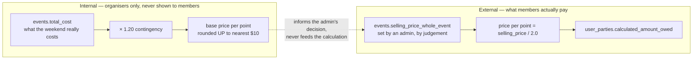

# Pricing and business rules

This is the part of the app that has to be right. Everything here is implemented in
`src/lib/pricingEngine.js` and covered by `src/lib/pricingEngine.test.js` (5/5 passing when run as
`npm run test:pricing`).

## The core idea: two unrelated numbers

The single most important distinction in the domain, and the one the spreadsheet blurred:



The base cost is a **break-even yardstick**. The selling price is a **decision**. They are
connected only by an organiser looking at both numbers side by side in the admin dashboard
("Coût de revient estimé par participant" vs "Prix de vente fixé", `src/views/AdminView.jsx:897`).

Why it matters: if the price were derived from the cost, every new registration would silently
change what everyone owes. Members would be quoted a number, then invoiced a different one. See
[ADR 0007](./adr/0007-selling-price-not-cost-drives-member-pricing.md).

## Points

The weighting that spreads the weekend across attendees by how much of it they consume:

| Tier | French label | Points | Share of adult-whole price |
|---|---|---|---|
| Adult, whole event | Adulte - Fin de semaine complète | **2.0** | 100% |
| Adult, main event | Adulte - Événement principal | **1.5** | 75% |
| Teenager, whole event | Ado - Fin de semaine complète | **1.0** | 50% |
| Teenager, main event | Ado - Événement principal | **0.5** | 25% |
| Kid / after-party | Enfant | **0.0** | Free |

`calculateBasePoints(type, participation)` — `src/lib/pricingEngine.js:33`.

Note the defaulting: any non-`Whole` participation for an adult returns 1.5, and any non-`Whole`
for a teenager returns 0.5. Anything that is not `Adult` or `Teenager` is 0.0. So an unknown or
missing `type` silently prices as free — worth a guard if tiers ever grow.

## What a member owes

```
price_per_point       = selling_price_whole_event / 2.0
attendee_cost         = final_points(attendee) × price_per_point
                        × 0.70 if attendee.is_new_member
amount_owed(party)    = Σ attendee_cost
```

Zero guard: if `selling_price_whole_event` is missing, ≤ 0 or not finite, the price per point is
`0`, so everyone owes `0,00 $` rather than the app crashing on a freshly drafted event
(`src/lib/pricingEngine.js:74`).

### New member rule

A first-time attendee gets two stacked reductions, in this order
(`getFinalPoints`, `src/lib/pricingEngine.js:88`, then the ×0.7 at `:172`):

1. **Downgrade to the main-event equivalent.** Adult-whole → 1.5 pts; teen-whole → 0.5 pts.
   Main-event tiers and kids are unchanged.
2. **Then 30% off** the resulting amount.

So a new-member adult attending the whole weekend pays `1.5 × price_per_point × 0.70`
= **52.5%** of what a returning adult pays for the same weekend.

> The requirements flag *"Validate the rebate for new members"* as an open investigation. The code
> implements the rule as specified; what is unvalidated is whether 52.5% is the intended generosity.
> That is a decision for the group, not a bug.

### Worked example

Event with `selling_price_whole_event = 200 $`, so `price_per_point = 100 $`.

A party of four: one returning adult (whole), one new-member adult (whole), one teen (main), one kid.

| Attendee | Points | New member | Cost |
|---|---|---|---|
| Adult, whole | 2.0 | no | `2.0 × 100` = **200,00 $** |
| Adult, whole | 2.0 → 1.5 | yes | `1.5 × 100 × 0.70` = **105,00 $** |
| Teen, main | 0.5 | no | `0.5 × 100` = **50,00 $** |
| Kid | 0.0 | — | **0,00 $** |
| | | | **355,00 $ CAD owed** |

### Grandfathering

Once a party's payment is recorded, its amount is frozen: `simulateEventPricing` returns the
stored historical amount for any party flagged as paid, regardless of later selling-price changes
(`src/lib/pricingEngine.js:145`). Nobody gets a supplementary invoice after settling.

> **Implementation note:** the engine reads `party.is_paid` / `party.historical_owed`, which are
> *simulation* field names. The database column is `payment_status = 'paid'` and the stored amount
> is `calculated_amount_owed`. Nothing in the app maps one to the other, so grandfathering is
> currently only exercised by the simulator and the tests — a paid member who re-opens and saves
> their registration after a price change **will** have their amount recomputed. See
> [issue #31](https://github.com/YULmix/yulmix-la-bedaine/issues/31).

## The internal base cost

Used only to tell organisers whether the price covers reality
(`calculatePricePerPointFromTotalCost`, `src/lib/pricingEngine.js:57`):

```
contingency_cost      = total_cost × 1.20
raw_price_per_point   = contingency_cost / total_points_across_all_attendees
base_price_per_point  = ceil(raw_price_per_point / 10) × 10      -- always rounds UP
```

Rounding up to the nearest $10 is deliberate and asymmetric: `$70.01 → $80`, `$71 → $80`,
`$70.00 → $70`. Organisers would rather over-collect slightly than chase a shortfall.

Zero guards: returns `0` if `total_cost` ≤ 0 or `total_points` is 0, so a new draft event with no
registrations does not divide by zero.

There is a second, simpler helper, `calculateEstimatedCostPerParticipant(totalCost, parties)`
(`src/lib/pricingEngine.js:196`): `total_cost ÷ headcount excluding kids`, straight from the
`counts` JSONB. Note it does **not** apply the contingency and does **not** weight by points, so it
answers a different question than the base price per point. Both are shown to admins; be precise
about which one you mean.

## Scenario simulator

`simulateEventPricing(attendeeParties, sellingPriceWholeEvent, priceOverride = null)` is pure: it
returns `{ totalPoints, basePricePerPoint, calculated_amount_owed, parties, … }` and mutates
nothing. The admin sandbox (`src/views/AdminView.jsx:418`) builds synthetic one-attendee parties
from four headcount inputs and optional price overrides, so organisers can answer
"what if 60 adults and 10 teens come, at $180?" before committing a price.

Limitation worth knowing: the simulator never sets `isNewMember`, so it always models a
zero-newcomer crowd — it over-estimates revenue whenever newcomers are expected.

## Capacity and the waitlist

- `max_attendees` defaults to **90**.
- Over capacity never blocks a signup. The party is accepted and flagged `is_waitlisted`, with
  *"L'événement est malheureusement complet, mais vous serez ajouté à la liste d'attente."*
  ([ADR 0005](./adr/0005-waitlist-instead-of-blocking.md))
- The authoritative decision is the Postgres trigger, which counts people across all parties under
  an advisory lock. The browser's own check compares *this party's size* to `max_attendees`
  (`src/components/RegistrationForm.jsx:122`), which is wrong in isolation but harmless, because the
  trigger overwrites the flag on write. Do not rely on the client value for anything.

## Rounding and money presentation

- Money is stored as `NUMERIC(10,2)`; amounts owed are computed in floating point in JS and written
  as-is. Test tolerance is `< 0.01`.
- All display goes through `Intl.NumberFormat('fr-CA', { style: 'currency', currency: 'CAD' })`,
  producing `355,00 $`. Four separate components define their own `formatCurrency` with identical
  bodies — a good first extraction into `src/lib/format.js`.
- The only deliberate rounding rule in the domain is *round up to the nearest $10*, and it applies
  **only** to the internal base cost, never to what a member is charged.

## Changing the rules safely

The pricing engine is pure and tested; keep it that way.

1. Change `src/lib/pricingEngine.js`.
2. Add or amend a case in `src/lib/pricingEngine.test.js` and run `npm run test:pricing`.
3. Grep for callers: `RegistrationForm` (live total + the value written to the DB), `AdminView`
   (simulator + cost-vs-price panel). There are no others.
4. Ask whether already-registered parties should be repriced. Today nothing recomputes stored
   amounts in bulk — changing the selling price leaves every existing `calculated_amount_owed`
   stale until each member re-saves. That is a real operational gap, not a documented feature.
