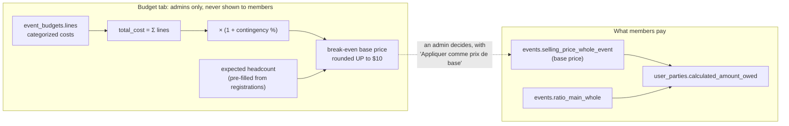

# Pricing and business rules

This is the part of the app that has to be right. The authoritative amount is computed in the
database (`calculate_party_amount_owed`, set on every `user_parties` write by a trigger);
`src/lib/pricingEngine.js` computes the same thing for the live estimates in the UI and the admin
simulator. The two must agree: `src/lib/pricingEngine.test.js` covers the rules
(`npm run test:pricing`), and #109 checked the pair against every seeded party.

## The core idea: the budget informs, the base price decides


```mermaid
flowchart LR
  subgraph Internal["Budget tab: admins only, never shown to members"]
    B["event_budgets.lines<br/>categorized costs"]
    T["total_cost = Σ lines"]
    C["× (1 + contingency %)"]
    H["expected headcount<br/>(pre-filled from registrations)"]
    BE["break-even base price<br/>rounded UP to $10"]
    B --> T --> C --> BE
    H --> BE
  end
  subgraph External["What members pay"]
    SP["events.selling_price_whole_event<br/>(base price)"]
    R["events.ratio_main_whole"]
    OWED["user_parties.calculated_amount_owed"]
    SP --> OWED
    R --> OWED
  end
  BE -.->|"an admin decides, with<br/>'Appliquer comme prix de base'"| SP
```

The budget is a **simulation tool**. Saving it changes no amount. Only two numbers on the event
drive what members owe: the **base price** (`selling_price_whole_event`, what an adult pays for
the whole weekend) and the **main-event ratio** (`ratio_main_whole`). Changing either reprices
every unpaid registration of the event (#32, #109); paid ones keep their amount.

Why it matters: if the price were derived from the cost, every new registration would silently
change what everyone owes. See
[ADR 0007](./adr/0007-selling-price-not-cost-drives-member-pricing.md).

## Price shares

Every price is a share of the base price:

| Tier | French label | Share of the base price | Default |
|---|---|---|---|
| Adult, whole event | Adulte - Fin de semaine complète | 1 | 100 % |
| Adult, main event | Adulte - Événement principal | `ratio_main_whole` | 53.75 % |
| Teenager, whole event | Ado - Fin de semaine complète | ½ | 50 % |
| Teenager, main event | Ado - Événement principal | ½ × `ratio_main_whole` | 26.875 % |
| Kid / after-party | Enfant | 0 | free |

- `ratio_main_whole` is set per event, `0 < ratio ≤ 1` (a database check). Its default, 0.5375,
  reproduces the point weights used before #109 (2.0 / 1.075 / 1.0 / 0.5375 points at
  `selling_price / 2` per point).
- Teens always pay half the adult price of the same tier. That is fixed in code, not a setting.
- `getPriceShare(attendee, ratios)` in the engine; the `CASE` in `calculate_party_amount_owed`.

### New members

A first Bédaine (`is_new_member`) pays the **main-event** share of their age, whatever tier they
picked: an adult pays `ratio_main_whole`, a teen `½ × ratio_main_whole`. There is no other
discount. Kids stay free.

## What a party owes

```
amount_owed(party) = ceil( Σ share(attendee) × selling_price_whole_event )   -- up to the dollar
```

If `selling_price_whole_event` is missing or ≤ 0, everyone owes `0,00 $`.

### Worked example

`selling_price_whole_event = 200 $`, `ratio_main_whole = 0.6`. A party of four: a returning adult
(whole), a new adult (whole), a teen (main), a kid.

| Attendee | Share | Cost |
|---|---|---|
| Adult, whole | 1 | 200,00 $ |
| New adult, whole → main | 0.6 | 120,00 $ |
| Teen, main | ½ × 0.6 = 0.3 | 60,00 $ |
| Kid | 0 | 0,00 $ |
| | | **380,00 $ owed** |

### Grandfathering

Once a party is marked paid, its amount is frozen: the trigger keeps the stored
`calculated_amount_owed` on every later update (#31), and a price or ratio change skips paid rows.
Nobody gets a supplementary invoice after settling.

## The budget and the break-even price

The **Budget** admin tab (`?tab=budget`, active event only) holds the event's
`event_budgets` row, which only admins can read or write (RLS, #109):

- **Lines**: category (`Chalet`, `Food`, `Music`, `Tech`, `Accessories`, `Other`), description,
  amount. `total_cost` is always their sum, computed by a trigger.
- **Contingency**: a percentage, default 20.

From these and an expected headcount, the simulator computes the **break-even base price**
(`calculateBreakEvenPrice`):

```
break_even = roundUpTo10( total_cost × (1 + contingency / 100) / Σ share(expected attendees) )
```

Rounding up to $10 is deliberate and asymmetric: `$70.01 → $80`, `$70.00 → $70`. It returns 0
when there is no budget or nobody who pays. The overview shows the same number for the people
registered so far.

## Simulator

The simulator (in the Budget tab) takes:

- the expected headcount per group (adults and teens by tier, new adults, new teens, kids),
  pre-filled from the active registrations and never saved;
- a base price and a main-event ratio to try, without saving.

It shows the break-even base price, the projected revenue and margin at the tried values, and the
tier prices they give. **"Appliquer comme prix de base"** saves the tried base price and ratio
after a confirmation that names the number of unpaid registrations that will be repriced.

## Capacity and the waitlist

- `max_attendees` defaults to **90**.
- Over capacity never blocks a signup. The party is accepted and flagged `is_waitlisted`, with
  *"L'événement est malheureusement complet, mais vous serez ajouté à la liste d'attente."*
  ([ADR 0005](./adr/0005-waitlist-instead-of-blocking.md))
- The authoritative decision is the Postgres trigger, which counts people across all parties under
  an advisory lock. The browser's own check compares *this party's size* to `max_attendees`
  (`src/components/RegistrationForm.jsx:122`), which is wrong in isolation but harmless, because the
  trigger overwrites the flag on write. Do not rely on the client value for anything.

## Rounding and money presentation

- Money is stored as `NUMERIC(10,2)`. The database computes amounts in exact `NUMERIC`; the engine
  works in floating point and trims float noise before rounding up, so an exact amount (0.5375 ×
  160 = 86) is not bumped a dollar.
- A party's amount rounds **up to the dollar**; the break-even price rounds **up to $10**. The
  $10 rounding never applies to what a member is charged.
- All display goes through `formatCurrency` in `src/lib/format.js` (`fr-CA`, e.g. `355,00 $`).

## Changing the rules safely

1. Change `calculate_party_amount_owed` in a new migration **and** `src/lib/pricingEngine.js`, in
   the same PR.
2. Add or amend a case in `src/lib/pricingEngine.test.js` and run `npm run test:pricing`. Check the
   same case against the SQL function on a local Supabase (`select calculate_party_amount_owed(…)`).
3. Callers of the engine: `RegistrationForm` (live estimate), `AdminView` (per-party totals),
   `AdminOverview` (tier prices, break-even), `AdminBudget` (simulator).
4. Existing registrations: a change to the base price or the ratio reprices unpaid ones through the
   `trg_reprice_unpaid_on_price_change` trigger. A change to the rules themselves (a new migration)
   does not: decide whether it should, and touch the rows in that migration if so.
