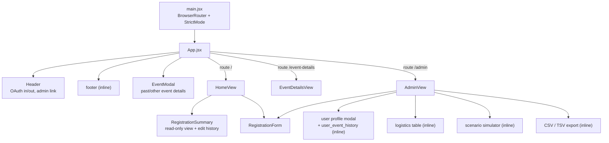
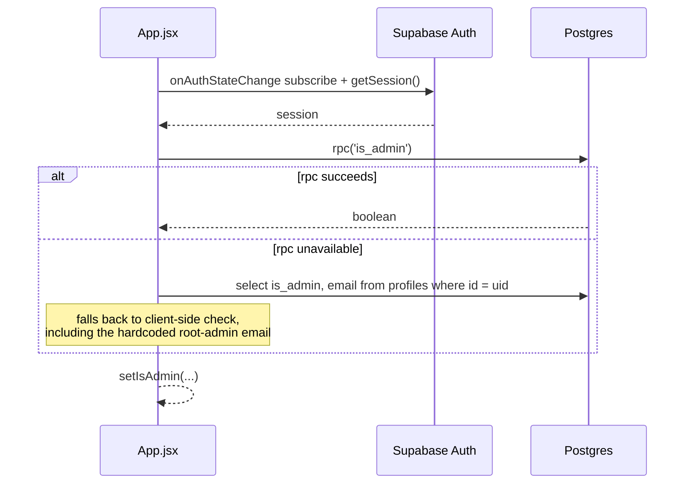

# Frontend guide

## Stack

React 19 · Vite 6 · Tailwind CSS v4 (via `@tailwindcss/vite`, no `tailwind.config.js`) ·
React Router 7 · Lucide React · `@supabase/supabase-js` v2. No TypeScript, no state library,
no component library.

## Routes

| Path | Screen | Guard |
|---|---|---|
| `/` | `HomeView` + inline "other events" grid (in `App.jsx`) | Content differs for signed-out visitors; no redirect |
| `/event-details` | `EventDetailsView` | Authenticated |
| `/admin` | `AdminView` | Authenticated **and** admin |

`ProtectedRoute` (`src/App.jsx:140`) renders a spinner while auth resolves, redirects
unauthenticated users to `/`, and shows an "Accès réservé aux administrateurs" panel for
non-admins. It is a UX guard only — the real boundary is RLS.

## Component map



Sizes, as a blunt signal of where the complexity is:

| File | Lines |
|---|---|
| `src/views/AdminView.jsx` | 1364 |
| `src/components/RegistrationForm.jsx` | 576 |
| `src/views/RegistrationSummary.jsx` | 461 |
| `src/App.jsx` | 381 |
| `src/views/HomeView.jsx` | 240 |
| `src/lib/pricingEngine.js` | 210 |

`AdminView` is eight screens in one file (event list, metadata editor, aggregates, cost-vs-price,
logistics table, user table, profile modal, simulator, export). It is the obvious first
refactoring target and the most likely source of merge conflicts once more than one person is
committing — splitting it is [roadmap](./10-roadmap.md) work, not cleanup.

## State and data ownership

There is no store. Ownership is:

- **`App.jsx`** — `session`, `user`, `isAuthenticated`, `isAdmin`, `activeEvent`, `otherEvents`.
  Passed down as props.
- **`HomeView`** — the current user's registration for the active event, and whether the form is in
  edit mode.
- **`AdminView`** — its own independent copy of events, parties and profiles, refetched on mount and
  on Realtime events. It does not trust the props `App.jsx` passes it.
- **`RegistrationForm`** — the entire attendee array and all party-level fields as local state,
  hydrated from `userRegistration` on mount.

Two patterns to be aware of because they will bite:

1. **`window.location.reload()` after a successful save** (`src/views/HomeView.jsx:186`, `:205`).
   It works, and it discards all client state including any unsaved sibling form. Replace with a
   refetch callback when touching that code.
2. **`AdminView` refetches the full party list on every Realtime event** (`src/views/AdminView.jsx:59`).
   Fine at ~40 parties; not a pattern to copy at scale.

### The auth → admin handshake



The fallback duplicates the root-admin email in the client bundle (`src/App.jsx:41`). Harmless
(the email is not a secret and RLS re-checks everything server-side), but it is a second copy of a
rule that should live in one place.

## Localisation (fr-CA)

**Rule:** all user-facing text comes from `src/locales/fr.json`; code, columns and identifiers stay
English. Raw database values are never rendered — they are mapped through
`src/lib/registrationOptions.js`, which pairs each stored value with its French label.

```js
import fr from '../locales/fr.json';
import { ACCOMMODATION_OPTIONS, getOptionLabel } from '../lib/registrationOptions';

<h3>{fr.logisticsSummary}</h3>
<span>{getOptionLabel(ACCOMMODATION_OPTIONS, attendee.sleeping_preference)}</span>
```

Current reality, measured:

- `fr.json` holds **255 keys**; **167** are referenced; **91 are unused**.
- **2 keys are referenced but missing**, so they render as nothing at all:
  `fr.dates` (`src/components/EventModal.jsx:129`) and
  `fr.sameForEveryone` (`src/components/RegistrationForm.jsx:432`).
- Roughly **45** French strings are still hardcoded in JSX rather than pulled from the dictionary
  (the whole of `RegistrationForm`'s labels, most of `AdminView`'s headings, `HomeView`'s empty
  states, "Tableau de bord admin" in `Header.jsx:95`).
- Three abandoned dictionaries sit beside the real one: `fr_broken.json`, `fr_fixed.json`,
  `fr_temp.json`. **All three are invalid JSON** and none is imported. Delete them.

### Encoding

`.clinerules` requires UTF-8 **without** BOM. Five tracked files currently start with a BOM:
`src/locales/fr.json`, the three abandoned dictionaries, and `src/views/AdminView.jsx`. Vite
tolerates it; `JSON.parse`, `jq` and Python's `json` do not. Strip them, and keep editors off
Windows-1252 — the mojibake in the requirements notes (`Événement archivé`) is what happens
otherwise.

### Formats

- Currency: `Intl.NumberFormat('fr-CA', { style: 'currency', currency: 'CAD' })` → `355,00 $`.
- Dates: `toLocaleDateString('fr-CA', { year: 'numeric', month: 'long', day: 'numeric' })`.
- Both are re-implemented in four or five components. Extract to `src/lib/format.js`.

## Styling

Tailwind v4 through the Vite plugin; `src/index.css` contains only `@import "tailwindcss";`.
Do not add `tailwind.config.js` or `postcss.config.js` — the v4 plugin does not use them and
`.clinerules` forbids them.

There is no design system: colours and spacing are chosen per component (`bg-blue-600` headers,
`bg-gradient-to-r from-blue-600 to-purple-600` event banners, white `rounded-xl shadow-lg` cards).
If the look is going to be worked on, agree a small token set first.

## Patterns to follow

**Toasts.** Every screen that writes data defines its own local `toasts` array plus `addToast`,
auto-dismissing after 5s with a manual "X" (`src/components/RegistrationForm.jsx:174`,
`src/views/AdminView.jsx:304`). Two identical implementations; a third should become a shared
component instead.

**Option lists.** Add new choices to `src/lib/registrationOptions.js`, never inline in JSX.
`getOptionLabel(options, value, fallback)` and `getDietaryRequestsLabel(csv)` handle display.

**Destructive or consequential actions** get a confirmation. Payment toggle uses
`window.confirm` (`src/views/AdminView.jsx:254`); event archiving currently does not, and the
requirements say it should.

**Supabase errors** are logged with `message`, `code`, `details`, `hint` before being surfaced in
French. Keep that — PostgREST errors are otherwise very hard to diagnose from a screenshot.

## Known frontend defects

Confirmed by reading the code; full list with severities in
[state of the code](./09-state-of-the-code.md):

- `saveLogisticsChanges` calls `fetchPartiesForActiveEvent()`, which **does not exist**
  (`src/views/AdminView.jsx:403`). The write succeeds, then the ReferenceError is swallowed by the
  surrounding `catch`, so the organiser sees *"Erreur lors de la sauvegarde"* and a stale table.
- `aggregateTotals()` (`src/views/AdminView.jsx:292`) builds a zeroed object and returns it without
  counting anything. It is also never called — dead code that looks authoritative.
- Admin aggregates read `party.counts`, which the counts trigger fills with zeros (see
  [data model](./03-data-model.md#user_partiesattendees)).
- The registration form has **two** "Annuler" buttons (`RegistrationForm.jsx:556`, `:560`) and no
  "Se désinscrire" action at all, despite both being specified.
- `App.jsx:70` invents an active event when none exists — it promotes the newest event
  (possibly ARCHIVED) to active in the UI, and falls back to hardcoded demo events when the table is
  empty or the query fails. In production this shows members a fictional weekend.
- `src/App.jsx.backup` is a tracked 355-line copy of an older `App.jsx`. Delete it; git is the backup.
