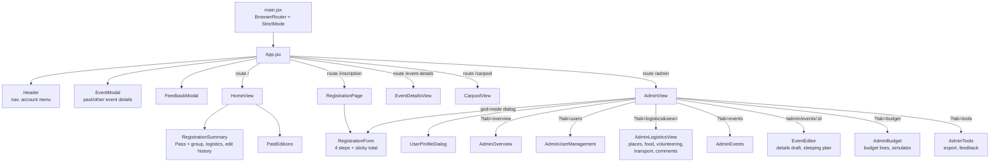
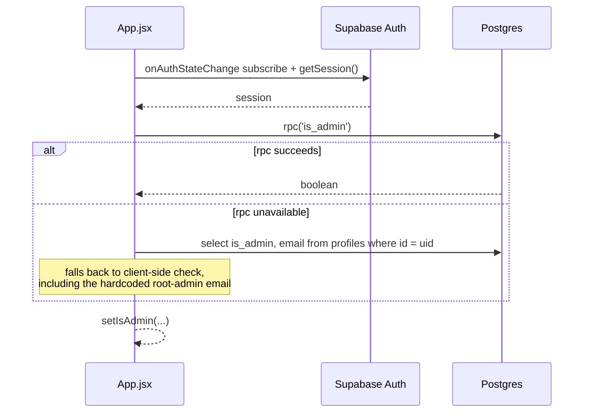

# Frontend guide

## Stack

React 19 · Vite 6 · Tailwind CSS v4 (via `@tailwindcss/vite`, no `tailwind.config.js`) ·
React Router 7 · Lucide React · `@supabase/supabase-js` v2. No TypeScript, no state library,
no component library.

## Routes

| Path | Screen | Guard |
|---|---|---|
| `/` | `HomeView` (poster, phase track, the registration pass or an invite, past editions) | Content differs for signed-out visitors; no redirect |
| `/inscription` | `RegistrationPage`: the 4-step registration form, create or edit | Authenticated |
| `/event-details` | `EventDetailsView` | Authenticated |
| `/carpool` | `CarpoolView`: the carpool board (#180), « Covoiturage » | Authenticated; the database (`carpool_board()`) refuses anyone not admin or confirmed (not waitlisted) for the active event, and the page says so. The nav item shows only for them (`useCarpoolAccess`) |
| `/admin` | `AdminView`, tabs `?tab=overview\|users\|logistics\|events\|tools` | Authenticated **and** admin |
| `/admin/events/:id` | `AdminView` → `EventEditor` (`?section=details\|sleeping&location=<id>`), same admin shell | Authenticated **and** admin |
| `/a-propos` | `AboutView` | None |

`ProtectedRoute` (`src/App.jsx`) renders a skeleton while auth resolves, redirects
unauthenticated users to `/`, and shows an "Accès réservé aux administrateurs" panel for
non-admins. It is a UX guard only — the real boundary is RLS. It is declared at module level on
purpose: declared inside `App`, it was a new component type on every `App` render (Supabase fires
an auth event whenever the tab regains focus), so the page under it remounted and lost unsaved
edits (#139). Don't declare components inside another component's render.

## Component map


```mermaid
flowchart TD
  MAIN["main.jsx<br/>BrowserRouter + StrictMode"] --> APP["App.jsx"]
  APP --> HEADER["Header<br/>nav, account menu"]
  APP --> MODAL["EventModal<br/>past/other event details"]
  APP --> FEEDBACK["FeedbackModal"]
  APP -->|route /| HOME["HomeView"]
  APP -->|route /inscription| REGPAGE["RegistrationPage"]
  APP -->|route /event-details| DETAILS["EventDetailsView"]
  APP -->|route /carpool| CARPOOL["CarpoolView"]
  APP -->|route /admin| ADMIN["AdminView"]

  HOME --> SUMMARY["RegistrationSummary<br/>Pass + group, logistics, edit history"]
  HOME --> PAST["PastEditions"]
  REGPAGE --> FORM["RegistrationForm<br/>4 steps + sticky total"]
  ADMIN -->|"god-mode dialog"| FORM
  ADMIN --> PROFILE["UserProfileDialog"]
  ADMIN -->|"?tab=overview"| OVERVIEW["AdminOverview"]
  ADMIN -->|"?tab=users"| USERS["AdminUserManagement"]
  ADMIN -->|"?tab=logistics&view="| LOGISTICS["AdminLogisticsView<br/>places, food, volunteering,<br/>transport, comments"]
  ADMIN -->|"?tab=events"| EVENTS["AdminEvents"]
  ADMIN -->|"/admin/events/:id"| EDITOR["EventEditor<br/>details draft, sleeping plan"]
  ADMIN -->|"?tab=budget"| BUDGET["AdminBudget<br/>budget lines, simulator"]
  ADMIN -->|"?tab=tools"| TOOLS["AdminTools<br/>export, feedback"]
```

Sizes, as a blunt signal of where the complexity is:

| File | Lines |
|---|---|
| `src/views/AdminView.jsx` | 1000 |
| `src/components/RegistrationForm.jsx` | 667 |
| `src/App.jsx` | 299 |
| `src/views/RegistrationSummary.jsx` | 244 |
| `src/lib/pricingEngine.js` | 210 |

`AdminView` keeps all admin state, data fetching and write handlers; each tab is a component in
`src/components/admin/` (`AdminOverview`, `AdminUserManagement`, `AdminLogisticsView`,
`AdminEvents`, `AdminTools`, `UserProfileDialog`). The active tab is the `?tab=` query param
(`overview` by default), so tabs are deep-linkable; tabs are declared in the `ADMIN_TABS` array.
Because state lives in `AdminView`, unsaved logistics edits survive a tab switch. On phones the
tab list is a fixed bottom bar; from `md` up it's a row of pills.

The Logistique tab has views of its own (#179), in `?view=` (`places` by default, declared in
`LOGISTICS_VIEWS`): place assignment, and read-only views of the form's answers (`food`,
`volunteering`, `transport`, `comments`, in `LogisticsFormViews.jsx`). Those list confirmed
parties only (not cancelled, not waitlisted); their aggregations are pure functions in
`src/lib/adminStats.js`. Pending place changes stay in `AdminView`, so they survive switching
views too.

The Outils tab's export (#178) builds each table once, as `{ headers, rows }`
(`partyExportRows`, `attendeeExportRows` in `src/lib/dataExport.js`), and serialises it with
`toCsv` (BOM, every cell quoted) or `toTsv` (line breaks flattened, for a Sheets paste). Unlike
the Logistique views, it keeps waitlisted parties, with a « Statut » column; the totals skip them.

Outils has views too, in `?view=` (`exports` by default, `history`, `feedback`), switched with the
same `ViewTabs` / `ViewPanel` (`src/components/ui`) as Logistique. Its « Historique des
changements » (#173) lists one event's `registration_edits`, newest first, picked with its own
event selector (the active event by default).

**One scrollbar at a time.** A long list that scrolls inside its own box must end on screen with
the page at the top, or the box and the page fight over the wheel. `useFitToViewport`
(`src/hooks/`) caps the box at the height left above the bottom of the screen (and the phone's
fixed tab bar, `[data-bottom-bar]`). Where that would be under 256 px (a phone, under the
controls above the list), the box isn't capped and the page scrolls instead. `describeChanges()`
(`src/lib/editHistory.js`) turns each entry into French lines, the same ones the member's
« Historique » shows; `historyExportRows()` (`src/lib/changeHistory.js`) makes one export row per
line, for the same `toCsv` / `toTsv`.

## State and data ownership

There is one store, for one thing: the **event places** (`src/lib/eventPlaces.js`, #193), a cache
per event that Aperçu, Logistique and the event editor's Couchage section all read through
`useEventPlaces(eventId)`, so a change made in one shows in the others without a refetch. Its own
writes (`editPlace`, then `savePlace`) update it; anything else that changes an event's places
calls `invalidateEventPlaces()` (AdminView after archiving, Couchage on arriving and after a venue
change, the Sites editor after any write). Assignments aren't followed: Aperçu and Logistique take
who sleeps where from the parties, and only Couchage shows it from the event places.

The two editors without a Save button, Couchage and Sites (the venue layout, read through
`venue_layout()`), save through `useAutosave` (`src/hooks/`): writes with the same key go out one
after the other, each built when its turn comes; a Stepper's writes wait 400 ms for the last
click; what is still waiting is sent when the editor goes away; one status line
(« Enregistrement… » / « Enregistré ») and one error say how it went, and a failure reloads. Otherwise ownership is:

- **`App.jsx`** — `session`, `user`, `isAuthenticated`, `isAdmin`, `activeEvent`, `otherEvents`.
  Passed down as props.
- **`HomeView`** — the current user's registration for the active event, and whether the form is in
  edit mode.
- **`AdminView`** — its own independent copy of events, parties and profiles, refetched on mount and
  on Realtime events. It does not trust the props `App.jsx` passes it.
- **`RegistrationForm`** — the entire attendee array and all party-level fields as local state,
  hydrated from `userRegistration` on mount.

Two patterns to be aware of because they will bite:

1. **`window.location.reload()` after a successful save** (`src/views/HomeView.jsx:186`, `:205`).
   It works, and it discards all client state including any unsaved sibling form. Replace with a
   refetch callback when touching that code.
2. **`AdminView` refetches the full party list on every Realtime event** (`src/views/AdminView.jsx:59`).
   Fine at ~40 parties; not a pattern to copy at scale.

### The auth → admin handshake


```mermaid
sequenceDiagram
  participant APP as App.jsx
  participant SB as Supabase Auth
  participant PG as Postgres
  APP->>SB: onAuthStateChange subscribe + getSession()
  SB-->>APP: session
  APP->>PG: rpc('is_admin')
  alt rpc succeeds
    PG-->>APP: boolean
  else rpc unavailable
    APP->>PG: select is_admin, email from profiles where id = uid
    Note over APP: falls back to client-side check,<br/>including the hardcoded root-admin email
  end
  APP-->>APP: setIsAdmin(...)
```

The fallback duplicates the root-admin email in the client bundle (`src/App.jsx:41`). Harmless
(the email is not a secret and RLS re-checks everything server-side), but it is a second copy of a
rule that should live in one place.

## Localisation (fr-CA)

**Rule:** all user-facing text comes from `src/locales/fr.json`; code, columns and identifiers stay
English. Raw database values are never rendered — they are mapped through
`src/lib/registrationOptions.js`, which pairs each stored value with its French label.

```js
import fr from '../locales/fr.json';
import { ACCOMMODATION_OPTIONS, getOptionLabel } from '../lib/registrationOptions';

<h3>{fr.logisticsSummary}</h3>
<span>{getOptionLabel(ACCOMMODATION_OPTIONS, attendee.sleeping_preference)}</span>
```

Current reality, measured:

- `fr.json` holds **255 keys**; **167** are referenced; **91 are unused**.
- **2 keys are referenced but missing**, so they render as nothing at all:
  `fr.dates` (`src/components/EventModal.jsx:129`) and
  `fr.sameForEveryone` (`src/components/RegistrationForm.jsx:432`).
- Roughly **45** French strings are still hardcoded in JSX rather than pulled from the dictionary
  (the whole of `RegistrationForm`'s labels, most of `AdminView`'s headings, `HomeView`'s empty
  states, "Tableau de bord admin" in `Header.jsx:95`).
- Three abandoned dictionaries sit beside the real one: `fr_broken.json`, `fr_fixed.json`,
  `fr_temp.json`. **All three are invalid JSON** and none is imported. Delete them.

### Encoding

`.clinerules` requires UTF-8 **without** BOM. Five tracked files currently start with a BOM:
`src/locales/fr.json`, the three abandoned dictionaries, and `src/views/AdminView.jsx`. Vite
tolerates it; `JSON.parse`, `jq` and Python's `json` do not. Strip them, and keep editors off
Windows-1252 — the mojibake in the requirements notes (`Événement archivé`) is what happens
otherwise.

### Formats

- Currency: `Intl.NumberFormat('fr-CA', { style: 'currency', currency: 'CAD' })` → `355,00 $`.
- Dates: `toLocaleDateString('fr-CA', { year: 'numeric', month: 'long', day: 'numeric' })`.
- Both are re-implemented in four or five components. Extract to `src/lib/format.js`.

## Styling

Tailwind v4 through the Vite plugin. Do not add `tailwind.config.js` or `postcss.config.js`: the
v4 plugin does not use them and `.clinerules` forbids them.

The visual language is locked in [`.ulpi/design/DESIGN.md`](../.ulpi/design/DESIGN.md) (palette,
type, radii, motion, voice) and the screens are specified in
[`.ulpi/design/redesign.md`](../.ulpi/design/redesign.md). Read DESIGN.md before touching the UI.

- Tokens live in the `@theme` block of `src/index.css` (`bg-surface`, `text-muted`, `border-edge`,
  `text-neon`, `rounded-card`, `font-display`, `font-data`...). Use them; never raw Tailwind
  palette colors like `bg-blue-600`.
- Build screens from the primitives in `src/components/ui/` (`Button`, `Field`, `Input`,
  `ChipGroup`, `Toggle`, `Tag`, `Card`, `Dialog`, `ConfirmDialog`, `Notice`, `EmptyState`,
  `Skeleton`...). Dialogs are native `<dialog>` elements; never `window.confirm` / `alert`.
- Brand pieces (`PosterHeader`, `PhaseTrack`, `Pass`) are in `src/components/brand/`.
- Icons: `lucide-react` only. Fonts are self-hosted via `@fontsource-variable/archivo` and
  `@fontsource-variable/jetbrains-mono`.
- Dark theme only.

## Patterns to follow

**Toasts.** Screens that write data use the shared `useToasts` hook and render `ToastContainer`
(`src/components/Toast.jsx`), a bottom-center stack above the sticky bars.

**Saving a registration says so (#155).** A new registration is confirmed in place:
`RegistrationPage` swaps the form for `RegistrationConfirmation`, which says it is saved and what
to do about paying (Interac details, "don't pay yet" for a waitlisted party or an intention). The
member reaches the pass by choosing to. An edit goes straight back to the pass with a
"Modifications enregistrées" toast, because there is nothing new to explain. Either way, never
navigate home after a save without one of the two. `Button` shows a spinner while `loading`.

**Option lists.** Add new choices to `src/lib/registrationOptions.js`, never inline in JSX.
`getOptionLabel(options, value, fallback)` and `getDietaryRequestsLabel(csv)` handle display.

**Destructive or consequential actions** get a confirmation through `ConfirmDialog` (payment
toggle, event archiving, deleting a registration). Focus starts on Cancel.

**Supabase errors** are logged with `message`, `code`, `details`, `hint` before being surfaced in
French. Keep that — PostgREST errors are otherwise very hard to diagnose from a screenshot.

## Known frontend defects

Tracked in [GitHub Issues](https://github.com/YULmix/yulmix-la-bedaine/issues), not here. Notably:

- `aggregateTotals()` (`src/views/AdminView.jsx:292`) builds a zeroed object and returns it without
  counting anything. It is also never called — dead code that looks authoritative. See
  [issue #41](https://github.com/YULmix/yulmix-la-bedaine/issues/41).
- The registration form has **two** "Annuler" buttons (`RegistrationForm.jsx:556`, `:560`) and no
  "Se désinscrire" action at all, despite both being specified.
- `App.jsx:70` invents an active event when none exists — it promotes the newest event
  (possibly ARCHIVED) to active in the UI, and falls back to hardcoded demo events when the table is
  empty or the query fails. In production this shows members a fictional weekend.
- `src/App.jsx.backup` is a tracked 355-line copy of an older `App.jsx`. Delete it; git is the backup.
