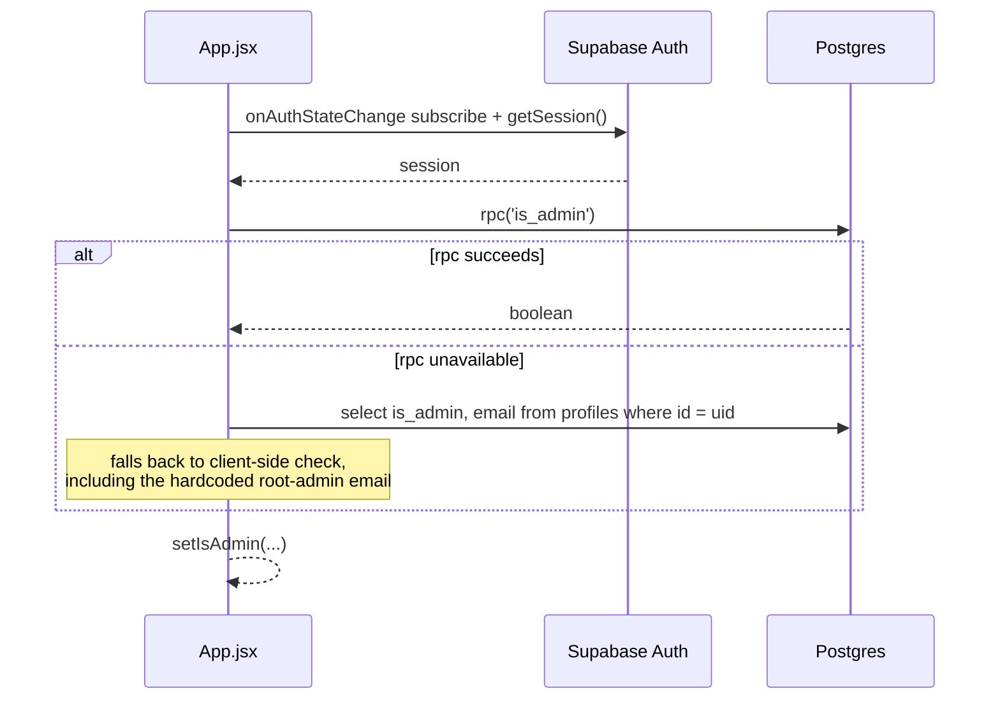

# Frontend guide

## Stack

React 19 · Vite 6 · Tailwind CSS v4 (via `@tailwindcss/vite`, no `tailwind.config.js`) ·
React Router 7 · Lucide React · `@supabase/supabase-js` v2. No TypeScript, no state library,
no component library.

## Routes

| Path | Screen | Guard |
|---|---|---|
| `/` | `HomeView` (poster, phase track, the registration pass or an invite, past editions) | Content differs for signed-out visitors; no redirect |
| `/inscription` | `RegistrationPage`: the 4-step registration form, create or edit | Authenticated |
| `/event-details` | `EventDetailsView` | Authenticated |
| `/carpool` | `CarpoolView`: the carpool board (#180), « Covoiturage » | Authenticated; the database (`carpool_board()`) refuses anyone not admin or confirmed (not waitlisted) for the active event, and the page says so. The nav item shows only for them (`useCarpoolAccess`) |
| `/admin/*` | `AdminView`: `/admin/<tab>[/<view>]`, tabs `overview\|users\|logistics\|budget\|events\|venues\|tools`; `/admin/venues/<venue>[/<location>]`. A bare `/admin` and the older `?tab=` / `?view=` / `?venue=` URLs redirect there (`src/lib/adminRoutes.ts`, #196) | Authenticated **and** admin |
| `/admin/events/:id` | `AdminView` → `EventEditor` (`?section=sleeping`), same admin shell | Authenticated **and** admin |
| `/a-propos` | `AboutView` | None |

`ProtectedRoute` (`src/App.jsx`) renders a skeleton while auth resolves, redirects
unauthenticated users to `/`, and shows an "Accès réservé aux administrateurs" panel for
non-admins. It is a UX guard only — the real boundary is RLS. It is declared at module level on
purpose: declared inside `App`, it was a new component type on every `App` render (Supabase fires
an auth event whenever the tab regains focus), so the page under it remounted and lost unsaved
edits (#139). Don't declare components inside another component's render.

## Component map


```mermaid
flowchart TD
  MAIN["main.jsx<br/>BrowserRouter + StrictMode"] --> APP["App.jsx"]
  APP --> HEADER["Header<br/>nav, account menu"]
  APP --> MODAL["EventModal<br/>past/other event details"]
  APP --> FEEDBACK["FeedbackModal"]
  APP -->|route /| HOME["HomeView"]
  APP -->|route /inscription| REGPAGE["RegistrationPage"]
  APP -->|route /event-details| DETAILS["EventDetailsView"]
  APP -->|route /carpool| CARPOOL["CarpoolView"]
  APP -->|route /admin| ADMIN["AdminView"]

  HOME --> SUMMARY["RegistrationSummary<br/>Pass + group, logistics, edit history"]
  HOME --> PAST["PastEditions"]
  REGPAGE --> FORM["RegistrationForm<br/>4 steps + sticky total"]
  ADMIN -->|"god-mode dialog"| FORM
  ADMIN --> PROFILE["UserProfileDialog"]
  ADMIN -->|"/admin/overview"| OVERVIEW["AdminOverview"]
  ADMIN -->|"/admin/users"| USERS["AdminUserManagement"]
  ADMIN -->|"/admin/logistics/&lt;view&gt;"| LOGISTICS["AdminLogisticsView<br/>places, food, volunteering,<br/>transport, comments"]
  ADMIN -->|"/admin/events"| EVENTS["AdminEvents"]
  ADMIN -->|"/admin/events/:id"| EDITOR["EventEditor<br/>details draft, sleeping plan"]
  ADMIN -->|"/admin/budget"| BUDGET["AdminBudget<br/>budget lines, simulator"]
  ADMIN -->|"/admin/tools/&lt;view&gt;"| TOOLS["AdminTools<br/>export, feedback"]
```

Sizes, as a blunt signal of where the complexity is:

| File | Lines |
|---|---|
| `src/components/RegistrationForm.jsx` | 808 |
| `src/App.jsx` | 313 |
| `src/views/RegistrationSummary.jsx` | 293 |
| `src/views/AdminView.jsx` | 186 |
| `src/lib/pricingEngine.ts` | 154 |

`AdminView` is the shell (#195); each tab is a self-contained section in
`src/components/admin/sections/` reading the stores, around the presentational components in
`src/components/admin/` (`AdminOverview`, `AdminUserManagement`, `AdminLogisticsView`,
`AdminBudget`, `AdminEvents`, `AdminVenues`, `AdminTools`). The active tab is the URL's first segment
(`/admin/<tab>`, `overview` by default), so tabs are deep-linkable. Every admin URL is parsed and
built by `src/lib/adminRoutes.ts` (`parseAdminLocation`, `adminHref`, `adminRedirect`), which
also owns the tab and view ids; components never format one themselves.
Because the drafts live in stores, unsaved edits survive a tab switch.

The navigation (#208) renders from the section registry, `src/lib/adminSections.ts`: each
section's labels, icon, views, page width, marker, and whether it has a slot in the phone bar.
`src/components/admin/AdminNav.jsx` draws it: from `md` up a sidebar with the current section's
views nested under it; on phones a fixed bottom bar (`[data-bottom-bar]`) with four sections and
« Plus », a sheet (`Dialog`) with the rest, and the views as `ViewTabs` under the page header.
The page header is one line, the `h1` (« Section · Vue ») and the page's actions: a section
puts a button or a search field there with `<AdminHeaderActions>`, from anywhere in its tree.
The shell wraps the page in its width (`dense`, or `narrow`: `max-w-3xl`, `pageWidthClass` in `src/lib/pageWidth.ts`, which the member pages use too), inside one centred
container (`max-w-screen-2xl`) that the header shares on admin pages. The sidebar sticks under
the header at its measured height (`--header-height`, set by `Header.jsx`). Save bars
(`SaveBar`) float over the page as a raised toolbar, not a pane. A drill-down (the
event editor, a venue) still brings its own header until #210.

The Logistique tab has views of its own (#179), in `/admin/logistics/<view>` (`places` by default, the
ids in `LOGISTICS_VIEW_IDS`): place assignment, and read-only views of the form's answers (`food`,
`volunteering`, `transport`, `comments`, in `LogisticsFormViews.jsx`). Those list confirmed
parties only (not cancelled, not waitlisted); their aggregations are pure functions in
`src/lib/adminStats.js`. Pending place changes stay in the logistics store, so they survive
switching views too.

The Outils tab's export (#178) builds each table once, as `{ headers, rows }`
(`partyExportRows`, `attendeeExportRows` in `src/lib/dataExport.js`), and serialises it with
`toCsv` (BOM, every cell quoted) or `toTsv` (line breaks flattened, for a Sheets paste). Unlike
the Logistique views, it keeps waitlisted parties, with a « Statut » column; the totals skip them.

Outils has views too, in `/admin/tools/<view>` (`exports` by default, `history`, `feedback`), switched by
the shell like Logistique's. Its « Historique des
changements » (#173) lists one event's `registration_edits`, newest first, picked with its own
event selector (the active event by default).

**One scrollbar at a time.** A long list that scrolls inside its own box must end on screen with
the page at the top, or the box and the page fight over the wheel. `useFitToViewport`
(`src/hooks/`) caps the box at the height left above the bottom of the screen (and the phone's
fixed bottom bar, `[data-bottom-bar]`). Where that would be under 256 px (a phone, under the
controls above the list), the box isn't capped and the page scrolls instead. `describeChanges()`
(`src/lib/editHistory.js`) turns each entry into French lines, the same ones the member's
« Historique » shows; `historyExportRows()` (`src/lib/changeHistory.js`) makes one export row per
line, for the same `toCsv` / `toTsv`.

## Navigation and layout

The navigation model is [ADR 0022](./adr/0022-admin-navigation-and-page-widths.md) (#191). It is
being implemented: the path URLs (#196) and the shell (#208) are in; « Outils » is still a section
until #209, and the drill-downs keep their own headers until #210. New screens follow the model.

### Adding an admin section or view

Before adding a screen, answer these in the PR description. Reviewers check them.

1. **Where does its data live?** Put the screen in the section whose data it shows or changes,
   as a view (Logistique's views are about logistics; Inscrits' « Historique » logs
   registrations). An action on a section's data, like an export, goes in that section's header,
   not on its own screen. A new section is for data no existing section owns. There is no
   miscellaneous section.
2. **View or drill-down?** A view is a sibling way of looking at the section's data (a list, a
   log, a per-topic table). A drill-down is one item's page (an event, a venue). Views are listed
   in the sidebar (desktop) and in `ViewTabs` (phone); a drill-down opens with a back link naming
   its parent, and its own sections use `ViewTabs` too. Don't build another kind of switcher.
3. **Dense or narrow?** Lists, logs, tables and dashboards are `dense`: full width, scrolling
   inside a box fitted with `useFitToViewport`. Forms are `narrow` (max ~`3xl`). Cards side by
   side switch columns with container queries (`@container`, `@4xl:`), since the sidebar takes
   part of the window. Declare it on
   the view; the shell applies it. Don't set your own `max-w-*` on the page.
4. **What's its URL?** `/admin/<section>/<view>` with English ids, built and parsed only by the
   admin routes module. If the screen replaces an old URL, add a redirect there.
5. **A new section?** Add it to the section registry (`src/lib/adminSections.ts`): id, label
   keys (full and short), icon, views, width, marker; then its id to the admin routes module and
   its component to `SECTION_COMPONENTS` in `src/views/AdminView.jsx`. It appears in the
   sidebar and under « Plus » on phones. Putting it in the phone bar (4 slots: Résumé, Inscrits, Logistique, Budget) is a separate decision that
   needs an organiser's approval.

Every label goes in `fr.json`, and every view has a heading (visible, or `sr-only` when the
switcher already names it).

## State and data ownership

Shared state lives in module stores in `src/lib` (`useSyncExternalStore`), not in a component
that has to stay mounted (#195): one store per data area, each admin section reading the ones it
needs.

The **events** (`src/lib/events.ts`, #195): the event list, the active one (`splitEvents`) and
the others, which the app shell and the admin both read through `useEvents()`, so they can't
disagree. The list loads when the first screen subscribes. The admin's event writes are the store's
(`activateEvent`, `archiveEvent`, `saveEventChanges`, `applyPricing`), and each reloads the list,
so the member pages show the change without a reload (#192).

The **toasts** (`src/lib/toasts.ts`): one app-wide stack. Anything can `notify(message, type)`,
and the app shell renders the one `ToastContainer`.

The **event places** (`src/lib/eventPlaces.ts`, #193): a cache
per event that Aperçu, Logistique and the event editor's Couchage section all read through
`useEventPlaces(eventId)`, so a change made in one shows in the others without a refetch. Its own
writes (`editPlace`, then `savePlace`) update it; anything else that changes an event's places
calls `invalidateEventPlaces()` (the events store after archiving, Couchage on arriving and after a venue
change, the Sites editor after any write). Assignments aren't followed: Aperçu and Logistique take
who sleeps where from the parties, and only Couchage shows it from the event places.

The two editors without a Save button, Couchage and Sites (the venue layout, read through
`venue_layout()`), save through `useAutosave` (`src/hooks/`): writes with the same key go out one
after the other, each built when its turn comes; a Stepper's writes wait 400 ms for the last
click; what is still waiting is sent when the editor goes away; one status line
(« Enregistrement… » / « Enregistré ») and one error say how it went, and a failure reloads.

The **admin parties** (`src/lib/adminParties.ts`, #195): an event's parties as the admin lists
them, in one cache per event that Résumé, Inscrits, Logistique, Budget and the exports share
through `useAdminParties(eventId)` (`parties`, cancelled ones included, and `activeParties`). An
entry loads for its first screen, on `refreshAdminParties(eventId)` after a write, and on any
change to the event's `user_parties` rows (a Realtime channel, open only while a screen watches).
Reloading parties never invalidates the event places. `updatePaymentStatus(party, status)` writes
and reloads. Profiles (the admin flag, a member's history across editions, who is signed in) are
plain functions in `src/lib/profiles.ts`.

The **budget** (`src/lib/budget.ts`, #195): an event's `event_budgets` row and the Budget
editor's draft, per event, through `useBudget(eventId)`; Résumé and Budget read the same entry.
`saveBudget` cleans the lines, writes, and drops the draft; a refusal throws the French message
and keeps it.

The **Logistique draft** (`src/lib/logistics.ts`, #150, #195): the unsaved places and notes per
event (the shape is `logisticsDraft.js`'s), the per-party refusal messages and the saving flag,
through `useLogistics(eventId)`. `saveLogistics(eventId)` sends one `save_logistics()`, reloads
the parties (never the event places), clears what was saved and keeps what was refused. The admin
shell reads `useUnsavedLogistics()` for its leave warnings and the tab's unsaved marker.

The **event editor's drafts** (`src/lib/eventDrafts.ts`, #195): each event's unsaved editor
changes, mirrored to sessionStorage on every edit and restored from it when the event is first
opened (`restored`), through `useEventDraft(eventId)`; `saveEventDraft(event)` sends only what
differs (`eventDraft.js`'s rules) through the events store. `useUnsavedEventIds(events)` marks the
list and the shell's leave warning.

The **feedback** (`src/lib/feedback.ts`, #195): the members' reports, newest first, and the
unresolved count, through `useFeedback()`; `resolveFeedback(id)` writes and reloads.

Admin sections that own their data live in `src/components/admin/sections/`: they take no data
props, read the stores, own their dialogs, and show `SectionStatus` (skeleton, or the error with
« Réessayer ») and `NoActiveEvent` (which also covers the events still loading, or failing)
themselves. Every section is there; `AdminView` is the shell: it routes to the section, draws the
navigation, keeps the active event's caches subscribed so switching sections never reloads them,
and guards unsaved work (`beforeunload`, the leave-admin blocker, the tab markers). It never reads
or writes the database.

Parties (registrations) are read and written only through the party module, `src/lib/parties.ts`
(#197), never with `supabase.from('user_parties')` in a component. Its functions log the raw error
and throw one whose message is already French, so a caller shows `error.message` (or passes the
error to `dbErrorMessage`, which keeps it). New data modules follow the same contract.

Otherwise ownership is:

- **`App.jsx`** — `session`, `user`, `isAuthenticated`, `isAdmin`; `activeEvent` and
  `otherEvents` from the events store. Passed down as props.
- **`HomeView`** — the current user's registration for the active event, and whether the form is in
  edit mode.
- **`AdminView`** — the navigation and the leave warnings; no data. It reloads the events on
  arrival.
- **`RegistrationForm`** — the entire attendee array and all party-level fields as local state,
  hydrated from `userRegistration` on mount.

Two patterns to be aware of because they will bite:

1. **`window.location.reload()` after a successful save** (`src/views/HomeView.jsx:186`, `:205`).
   It works, and it discards all client state including any unsaved sibling form. Replace with a
   refetch callback when touching that code.
2. **The admin parties store refetches the event's full party list on every Realtime event**
   (`src/lib/adminParties.ts`). Fine at ~40 parties; not a pattern to copy at scale.

### The auth → admin handshake


```mermaid
sequenceDiagram
  participant APP as App.jsx
  participant SB as Supabase Auth
  participant PG as Postgres
  APP->>SB: onAuthStateChange subscribe + getSession()
  SB-->>APP: session
  APP->>PG: rpc('is_admin')
  alt rpc succeeds
    PG-->>APP: boolean
  else rpc unavailable
    APP->>PG: select is_admin, email from profiles where id = uid
    Note over APP: falls back to client-side check,<br/>including the hardcoded root-admin email
  end
  APP-->>APP: setIsAdmin(...)
```

The fallback duplicates the root-admin email in the client bundle (`src/App.jsx:41`). Harmless
(the email is not a secret and RLS re-checks everything server-side), but it is a second copy of a
rule that should live in one place.

## Localisation (fr-CA)

**Rule:** all user-facing text comes from `src/locales/fr.json`; code, columns and identifiers stay
English. Raw database values are never rendered — they are mapped through
`src/lib/registrationOptions.ts`, which pairs each stored value with its French label.

```js
import fr from '../locales/fr.json';
import { ACCOMMODATION_OPTIONS, getOptionLabel } from '../lib/registrationOptions';

<h3>{fr.logisticsSummary}</h3>
<span>{getOptionLabel(ACCOMMODATION_OPTIONS, attendee.sleeping_preference)}</span>
```

Current reality, measured:

- `fr.json` holds **255 keys**; **167** are referenced; **91 are unused**.
- **2 keys are referenced but missing**, so they render as nothing at all:
  `fr.dates` (`src/components/EventModal.jsx:129`) and
  `fr.sameForEveryone` (`src/components/RegistrationForm.jsx:432`).
- Roughly **45** French strings are still hardcoded in JSX rather than pulled from the dictionary
  (the whole of `RegistrationForm`'s labels, most of `AdminView`'s headings, `HomeView`'s empty
  states, "Tableau de bord admin" in `Header.jsx:95`).
- Three abandoned dictionaries sit beside the real one: `fr_broken.json`, `fr_fixed.json`,
  `fr_temp.json`. **All three are invalid JSON** and none is imported. Delete them.

### Encoding

`.clinerules` requires UTF-8 **without** BOM. Five tracked files currently start with a BOM:
`src/locales/fr.json`, the three abandoned dictionaries, and `src/views/AdminView.jsx`. Vite
tolerates it; `JSON.parse`, `jq` and Python's `json` do not. Strip them, and keep editors off
Windows-1252 — the mojibake in the requirements notes (`Événement archivé`) is what happens
otherwise.

### Formats

- Currency: `Intl.NumberFormat('fr-CA', { style: 'currency', currency: 'CAD' })` → `355,00 $`.
- Dates: `toLocaleDateString('fr-CA', { year: 'numeric', month: 'long', day: 'numeric' })`.
- Both are re-implemented in four or five components. Extract to `src/lib/format.js`.

## Styling

Tailwind v4 through the Vite plugin. Do not add `tailwind.config.js` or `postcss.config.js`: the
v4 plugin does not use them and `.clinerules` forbids them.

The visual language is locked in [`.ulpi/design/DESIGN.md`](../.ulpi/design/DESIGN.md) (palette,
type, radii, motion, voice) and the screens are specified in
[`.ulpi/design/redesign.md`](../.ulpi/design/redesign.md). Read DESIGN.md before touching the UI.

- Tokens live in the `@theme` block of `src/index.css` (`bg-surface`, `text-muted`, `border-edge`,
  `text-neon`, `rounded-card`, `font-display`, `font-data`...). Use them; never raw Tailwind
  palette colors like `bg-blue-600`.
- Build screens from the primitives in `src/components/ui/` (`Button`, `Field`, `Input`,
  `ChipGroup`, `Toggle`, `Tag`, `Card`, `Dialog`, `ConfirmDialog`, `Notice`, `EmptyState`,
  `Skeleton`...). Dialogs are native `<dialog>` elements; never `window.confirm` / `alert`.
- Brand pieces (`PosterHeader`, `PhaseTrack`, `Pass`) are in `src/components/brand/`.
- Icons: `lucide-react` only. Fonts are self-hosted via `@fontsource-variable/archivo` and
  `@fontsource-variable/jetbrains-mono`.
- Dark theme only.

## Patterns to follow

**Toasts.** Screens call `addToast` from the `useToasts(durationMs)` hook, or `notify()` from
`src/lib/toasts.ts`. They don't render a container: the app shell's one `ToastContainer`
(`src/components/Toast.jsx`) is a bottom-center stack above the sticky bars, and a popover, so it
also shows above an open modal dialog.

**Saving a registration says so (#155).** A new registration is confirmed in place:
`RegistrationPage` swaps the form for `RegistrationConfirmation`, which says it is saved and what
to do about paying (Interac details, "don't pay yet" for a waitlisted party or an intention). The
member reaches the pass by choosing to. An edit goes straight back to the pass with a
"Modifications enregistrées" toast, because there is nothing new to explain. Either way, never
navigate home after a save without one of the two. `Button` shows a spinner while `loading`.

**Option lists.** Add new choices to `src/lib/registrationOptions.ts`, never inline in JSX.
`getOptionLabel(options, value, fallback)` and `getDietaryRequestsLabel(csv)` handle display.

**Destructive or consequential actions** get a confirmation through `ConfirmDialog` (payment
toggle, event archiving, deleting a registration). Focus starts on Cancel.

**Supabase errors** are logged with `message`, `code`, `details`, `hint` before being surfaced in
French. Keep that — PostgREST errors are otherwise very hard to diagnose from a screenshot.

## Known frontend defects

Tracked in [GitHub Issues](https://github.com/YULmix/yulmix-la-bedaine/issues), not here. Notably:

- `aggregateTotals()` (`src/views/AdminView.jsx:292`) builds a zeroed object and returns it without
  counting anything. It is also never called — dead code that looks authoritative. See
  [issue #41](https://github.com/YULmix/yulmix-la-bedaine/issues/41).
- The registration form has **two** "Annuler" buttons (`RegistrationForm.jsx:556`, `:560`) and no
  "Se désinscrire" action at all, despite both being specified.
- `App.jsx:70` invents an active event when none exists — it promotes the newest event
  (possibly ARCHIVED) to active in the UI, and falls back to hardcoded demo events when the table is
  empty or the query fails. In production this shows members a fictional weekend.
- `src/App.jsx.backup` is a tracked 355-line copy of an older `App.jsx`. Delete it; git is the backup.
