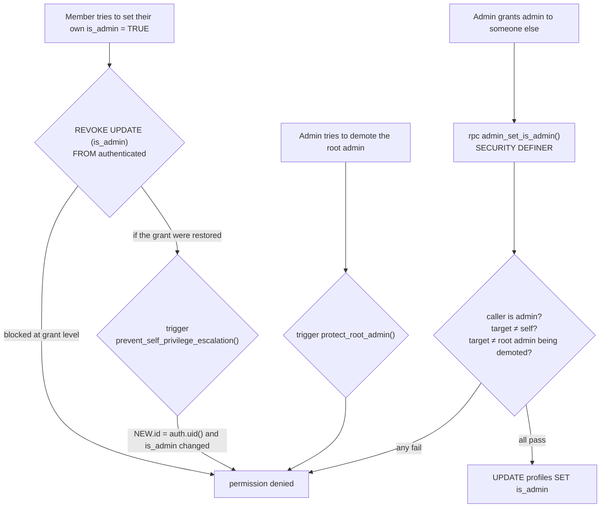

# Security and Row Level Security

## The model in one line

The browser holds a public anon key and an OAuth JWT; **Postgres decides everything**. If a rule is
not expressed as an RLS policy, a constraint, a trigger or a `SECURITY DEFINER` function, it is not
enforced.

## Authentication

- Google and Facebook OAuth through Supabase (`src/components/Header.jsx:16`), redirecting to
  `window.location.origin`. Redirect URLs must be registered in the Supabase dashboard for each
  environment (localhost:5173 and the production domain).
- No email/password, no magic links. There is no account-creation form to secure.
- On first sign-in, `handle_new_user` (AFTER INSERT on `auth.users`) creates the `profiles` row and
  sets `is_admin` only for the root-admin email.
- `RegistrationForm` self-heals a missing profile by upserting it before saving a registration
  (`src/components/RegistrationForm.jsx:255`) — a workaround for the race between the trigger and the
  first write.

## Roles

| Role | How you get it | What it means |
|---|---|---|
| Anonymous | no session | `SELECT` on ACTIVE/ARCHIVED events only |
| Authenticated member | any OAuth sign-in | own profile, own registrations, own feedback |
| Admin | `profiles.is_admin = TRUE`, granted via `admin_set_is_admin` | full read/write on everything, including DRAFT events and `admin_notes` |
| Root admin | email = `yulmixalabedaine@gmail.com` | always admin, cannot be demoted |

### `is_admin()`

```sql
CREATE FUNCTION public.is_admin() RETURNS BOOLEAN
LANGUAGE plpgsql SECURITY DEFINER STABLE AS $$ … $$;
```

`SECURITY DEFINER` is what makes it usable inside policies on `profiles` without infinite recursion
(a policy that queries the table it protects, under the caller's own RLS, deadlocks on itself).
Every policy in the schema is written as `own-row OR public.is_admin()`.

### Privilege escalation defences, layered



Three independent layers for the same rule. That is appropriate: admin access is the keys to
everyone's personal data and the payment ledger.

## Policy matrix

Derived from `supabase/schema.sql`. "own" = `auth.uid()` matches the row's owner column.

| Table | SELECT | INSERT | UPDATE | DELETE |
|---|---|---|---|---|
| `profiles` | own or admin | own (`id = auth.uid()`) or admin | own or admin — **but `is_admin` column UPDATE is revoked** | *no policy* → denied |
| `events` | `status IN ('ACTIVE','ARCHIVED')` for everyone, DRAFT for admins | admin only | admin only | admin policy exists, but a BEFORE DELETE trigger raises unconditionally → **nobody, ever** |
| `user_parties` | own or admin | own or admin | own **while status is `Enregistré`/`En attente`**, or admin | own or admin |
| `app_feedback` | own or admin | own (`user_id = auth.uid()`) | own or admin | admin only |
| `registration_edits` | `edited_by = auth.uid()` or admin | `edited_by = auth.uid()` or admin | *no policy* → denied | *no policy* → denied |

Notes on specific choices:

- **DRAFT events are admin-only**, which is what lets organisers plan next year's weekend in the open
  without members seeing half-finished prices.
- **The `user_parties` UPDATE status gate** is how cancellation is meant to become final: once a
  registration leaves `Enregistré`/`En attente`, the member can no longer edit it, only an admin can.
  The cancellation flow that would set that status does not exist yet.
- **Members can DELETE their own registration.** The spec says unregistering should mark the record
  cancelled, not remove it, so this policy is wider than the intent. Nothing in the UI calls delete
  today, but the policy permits it via the API.
- **`registration_edits` INSERT is open to the row's own author**, so a member could in principle
  forge audit entries about themselves. Low impact, but the audit log is not tamper-proof; if that
  matters, restrict INSERT to the trigger's definer context only.
- **`GRANT ALL ON ALL TABLES IN SCHEMA public TO authenticated`** is broad. RLS still applies, so it
  is not an open door, but it means every future table is writable-by-default the moment it is
  created without policies. Prefer explicit per-table grants.

## The gap that matters most

**`calculated_amount_owed` is computed in the browser and written as a plain column value**
(`src/components/RegistrationForm.jsx:312`). The UPDATE policy lets a member write their own
registration row, and no trigger recomputes or validates the amount.

A member who opens devtools — or just posts to PostgREST with the anon key and their own JWT — can
set their balance to `0.00`. Nothing detects it; the admin table displays whatever is stored.

The fix is structural, not cosmetic: recompute the amount in a `BEFORE INSERT OR UPDATE` trigger
from `attendees` and the event's `selling_price_whole_event`, which also makes grandfathering and
bulk repricing possible. That means porting the point weights and the new-member rule into SQL and
keeping the two implementations in step — the cost of having no backend of our own. Tracked as
item #2 in [state of the code](./09-state-of-the-code.md).

## Secrets

| Thing | Where it belongs | Status |
|---|---|---|
| `VITE_SUPABASE_URL`, `VITE_SUPABASE_ANON_KEY` | build-time env; public by design | fine |
| `SUPABASE_SERVICE_ROLE_KEY` | local `.env.test` and CI secrets **only** | `.env.test` is committed but contains only placeholders — verified, no leak |
| OAuth client secrets | Supabase dashboard | never in the repo |

Care needed: `.gitignore` covers `.env`, `.env.*.local` — but **`.env.test` is tracked**. It is
harmless today. The moment someone pastes a real service-role key into it, the key is in git history
forever. Add `.env.test` to `.gitignore` and keep only `.env.test.example`.

Any `VITE_`-prefixed variable is inlined into the public bundle. Never prefix a secret with `VITE_`.

## Resolved advisory, unresolved in the file

Supabase flagged `public.user_event_history` as a `SECURITY DEFINER` view (it enforces the *creator's*
permissions and RLS, not the querying user's). The requirements list it under "Done Issues", but
`supabase/schema.sql` still creates the view without `WITH (security_invoker = true)`. Either the
live database was fixed and the file was not, or the fix was lost. Verify against the live project,
then make the file match — and consider that this is exactly the class of bug that a migration
history prevents ([ADR 0002](./adr/0002-single-schema-file-no-migrations.md)).

## Testing RLS

`src/__tests__/rlsPolicies.test.js` drives a local Supabase instance with both an anon client and a
service-role client, asserting that members cannot see DRAFT events, cannot read others'
registrations, and so on. It is the right idea and the highest-value test suite in the repo.

Current state: **it does not run.** Every case fails with `ReferenceError: fetch is not defined`,
because Jest's jsdom environment does not expose `fetch`, and it needs a local Supabase plus a real
service-role key. See [development setup](./07-development-setup.md#running-the-rls-tests) for what
it would take to fix.
