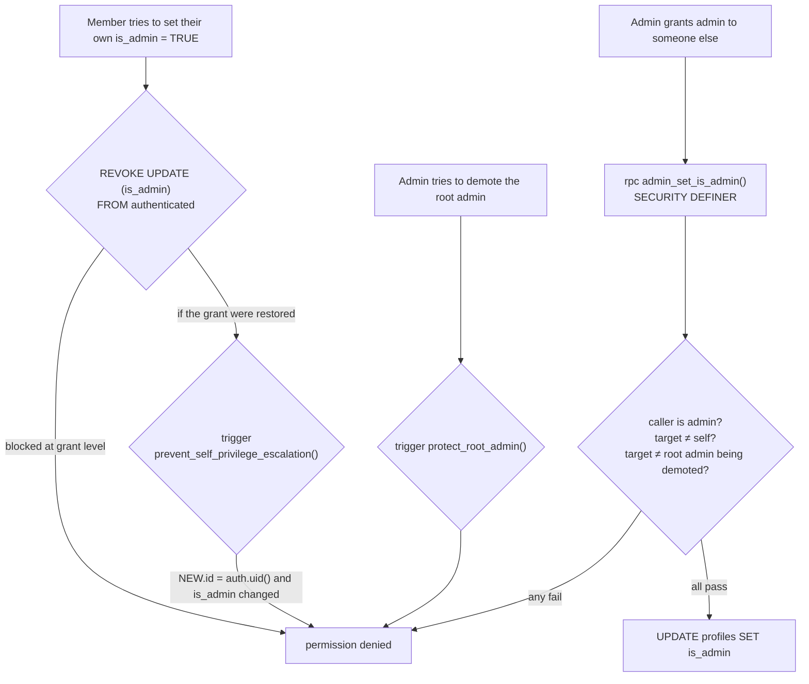

# Security and Row Level Security

## The model in one line

The browser holds a public anon key and an OAuth JWT; **Postgres decides everything**. If a rule is
not expressed as an RLS policy, a constraint, a trigger or a `SECURITY DEFINER` function, it is not
enforced.

## Authentication

- Google OAuth through Supabase (`handleSignIn` in `src/components/Header.jsx`), redirecting to
  `window.location.origin`. Redirect URLs must be registered in the Supabase dashboard for each
  environment (localhost:5173 and the production domain).
- Facebook sign-in was removed from the UI
  ([#21](https://github.com/YULmix/yulmix-la-bedaine/issues/21)): Meta refused the redirect
  because the app's domains were never registered with it. Bringing it back means registering the
  Supabase callback and app domains in the Meta app, then re-adding the menu item.
- No email/password, no magic links. There is no account-creation form to secure.
- On first sign-in, `handle_new_user` (AFTER INSERT on `auth.users`) creates the `profiles` row and
  sets `is_admin` only for the root-admin email.
- `RegistrationForm` self-heals a missing profile by upserting it before saving a registration
  (`src/components/RegistrationForm.jsx:255`) — a workaround for the race between the trigger and the
  first write.

## Roles

| Role | How you get it | What it means |
|---|---|---|
| Anonymous | no session | `SELECT` on ACTIVE/ARCHIVED events only |
| Authenticated member | any OAuth sign-in | own profile, own registrations, own feedback. A soft-deleted account (#36) keeps only read access to its own profile row |
| Admin | `profiles.is_admin = TRUE`, granted via `admin_set_is_admin` | full read/write on everything, including DRAFT events and `admin_notes` |
| Root admin | email = `yulmixalabedaine@gmail.com` | always admin, cannot be demoted |

### `is_admin()`

```sql
CREATE FUNCTION public.is_admin() RETURNS BOOLEAN
LANGUAGE plpgsql SECURITY DEFINER STABLE AS $$ … $$;
```

`SECURITY DEFINER` is what makes it usable inside policies on `profiles` without infinite recursion
(a policy that queries the table it protects, under the caller's own RLS, deadlocks on itself).
Every policy in the schema is written as `own-row OR public.is_admin()`.

### Privilege escalation defences, layered


```mermaid
flowchart TD
  A["Member tries to set their own is_admin = TRUE"] --> B{"REVOKE UPDATE (is_admin)<br/>FROM authenticated"}
  B -->|blocked at grant level| X["permission denied"]
  B -->|"if the grant were restored"| C{"trigger<br/>prevent_self_privilege_escalation()"}
  C -->|"NEW.id = auth.uid() and is_admin changed"| X
  D["Admin tries to demote the root admin"] --> E{"trigger protect_root_admin()"}
  E --> X
  F["Admin grants admin to someone else"] --> G["rpc admin_set_is_admin()<br/>SECURITY DEFINER"]
  G --> H{"caller is admin?<br/>target ≠ self?<br/>target ≠ root admin being demoted?"}
  H -->|all pass| I["UPDATE profiles SET is_admin"]
  H -->|any fail| X
```

Three independent layers for the same rule. That is appropriate: admin access is the keys to
everyone's personal data and the payment ledger.

## Policy matrix

Derived from production's schema as captured in the baseline migration
(`supabase/migrations/20260924233313_baseline_live_schema.sql`, 2026-09-24).
"own" = `auth.uid()` matches the row's owner column.

| Table | SELECT | INSERT | UPDATE | DELETE |
|---|---|---|---|---|
| `profiles` | own or admin | own (`id = auth.uid()`) or admin | own (active account) or admin — `is_admin` and `deleted_at` changes are blocked by triggers, see below | *no policy* → denied |
| `events` | `status IN ('ACTIVE','ARCHIVED')` for everyone, DRAFT for admins | admin only | admin only | admin policy exists, but a BEFORE DELETE trigger raises unconditionally → **nobody, ever** |
| `email_log` | admin only | *no policy* → denied (the Edge Function writes it with the service role) | *no policy* → denied | *no policy* → denied (rows go with their party) |
| `user_parties` | own or admin | own or admin | own, while the row is and stays `registered`/`pending`/`cancelled` (so a member can cancel, and register again over their cancelled row, #35), or admin. After the close date a trigger refuses a member's cancellation (see [Data model](./03-data-model.md#registration-close-date)). Admin-only fields are guarded by a trigger, see below | admin only (#35: cancelling is a status change, never a delete) |
| `app_feedback` | own (active account) or admin | own (`user_id = auth.uid()`, active account) | own (active account) or admin | admin only |
| `registration_edits` | `edited_by = auth.uid()` (active account) or admin | `edited_by = auth.uid()` (active account) or admin | *no policy* → denied | *no policy* → denied |

Notes on specific choices:

- **DRAFT events are admin-only**, which is what lets organisers plan next year's weekend in the open
  without members seeing half-finished prices.
- **Cancellation is a status change, not a delete** (#35). A member moves their own registration
  to `cancelled` ("Se désinscrire"); the row, its history and its email log stay. Members can't
  delete rows at all; admins can. Registering again reuses the cancelled row (one row per member
  and event), so the UPDATE policy lets a member act on their own cancelled row. After the
  registration close date, the close-date trigger refuses a member's cancellation.
- **`is_admin` is protected by triggers, not by column privileges.** `authenticated` holds table-level
  `UPDATE` on `profiles`. The old `schema.sql` had a `REVOKE UPDATE (is_admin)`, but a column-level
  revoke can't narrow a table-level grant, so it did nothing. The real guards are
  `trg_prevent_self_privilege_escalation` and `trg_protect_root_admin`, and changing someone
  else's admin flag goes through `admin_set_is_admin()`.
- **A deleted account keeps no member access** (#36). `delete_my_account()` is the only way to
  set `profiles.deleted_at`. The `protect_profile_deleted_at` trigger keeps the stored value on any
  direct write by `authenticated`/`anon`. Every member-side policy on `profiles` (UPDATE),
  `user_parties`, `app_feedback` and `registration_edits` also requires `is_account_active()`, and
  `is_admin()` is false for a deleted profile, so a deleted admin loses admin access too. The
  `user_parties` cells above read "own" for active accounts only. See
  [Data model](./03-data-model.md#account-deletion-36).
- **A registration's admin-only fields are protected by a trigger, not by the policies** (#94).
  RLS only decides which rows a member may write. `trg_protect_admin_only_party_fields` ignores
  whatever a non-admin end user sends for `payment_status`, `admin_notes` and
  `attendees[].assigned_bed`. On insert these become `unpaid`, no notes and no beds. On update the
  stored values stay, so a paid party stays paid through a member's own save (#31) or when they
  re-register over their cancelled row (#35). Beds follow attendees by name, because attendees
  have no stable id; a new or renamed attendee has no bed. The trigger ignores rather than
  refuses, since the member form sends these fields back on every save. `service_role` and
  direct connections are not restricted.
- **`registration_edits` INSERT is open to the row's own author**, so a member could in principle
  forge audit entries about themselves. Low impact, but the audit log is not tamper-proof; if that
  matters, restrict INSERT to the trigger's definer context only.
- **`authenticated` has `ALL` on every app table** (per-table grants in production). RLS still
  applies, so this isn't an open door. New tables are not auto-exposed (see
  `auto_expose_new_tables` in `supabase/config.toml`), so a migration adding a table must grant
  access explicitly, and should add its RLS policies in the same file.
- **`anon`/`authenticated` no longer have `CREATE` on the `public` schema** (only `USAGE`, since
  [#45](https://github.com/YULmix/yulmix-la-bedaine/issues/45)). The baseline migration's
  `GRANT ALL ON SCHEMA "public"` carried that forward from production; `service_role` keeps `ALL`,
  since it's the trusted server-side key and already bypasses RLS.

## The gap that matters most

**`calculated_amount_owed` is computed in the browser and written as a plain column value**
(`src/components/RegistrationForm.jsx:312`). The UPDATE policy lets a member write their own
registration row, and no trigger recomputes or validates the amount.

A member who opens devtools — or just posts to PostgREST with the anon key and their own JWT — can
set their balance to `0.00`. Nothing detects it; the admin table displays whatever is stored.

The fix is structural, not cosmetic: recompute the amount in a `BEFORE INSERT OR UPDATE` trigger
from `attendees` and the event's `selling_price_whole_event`, which also makes grandfathering and
bulk repricing possible. That means porting the point weights and the new-member rule into SQL and
keeping the two implementations in step — the cost of having no backend of our own. Tracked as
[issue #30](https://github.com/YULmix/yulmix-la-bedaine/issues/30).

## Secrets

| Thing | Where it belongs | Status |
|---|---|---|
| `VITE_SUPABASE_URL`, `VITE_SUPABASE_ANON_KEY` | build-time env; public by design | fine |
| `SUPABASE_SERVICE_ROLE_KEY` | local `.env.test` and CI secrets **only** | `.env.test` is committed but contains only placeholders — verified, no leak |
| OAuth client secrets | Supabase dashboard | never in the repo |
| `RESEND_API_KEY` | Supabase Edge Function secrets, **production project only** (`supabase secrets set`) | a "Sending access" key restricted to `yulmix.com`; never in the repo, Vercel, or Preview ([ADR 0016](./adr/0016-edge-function-for-transactional-email.md)) |

Care needed: `.gitignore` covers `.env`, `.env.*.local` — but **`.env.test` is tracked**. It is
harmless today. The moment someone pastes a real service-role key into it, the key is in git history
forever. Add `.env.test` to `.gitignore` and keep only `.env.test.example`.

Any `VITE_`-prefixed variable is inlined into the public bundle. Never prefix a secret with `VITE_`.

## The `SECURITY DEFINER` view advisory (resolved)

Supabase flagged `public.user_event_history` as a `SECURITY DEFINER` view: it enforced the
*creator's* permissions and RLS, not the querying user's. Production was fixed on 2026-09-18
(`supabase/legacy/fix_views_security.sql`). The view now runs `WITH (security_invoker = true)`,
only `authenticated` may `SELECT` it, and the unused `registration_summary_view` was dropped. The
old hand-maintained `schema.sql` never picked this up. The baseline migration, dumped from
production, has it, and that kind of silent drift is why migrations were adopted
([ADR 0013](./adr/0013-supabase-migrations.md)).

## Testing RLS

`src/__tests__/rlsPolicies.test.js` drives a local Supabase instance with both an anon client and a
service-role client, asserting that members cannot see DRAFT events, cannot read others'
registrations, and so on. It is the right idea and the highest-value test suite in the repo.

It runs under `npm run test:rls`, on Node rather than the default jsdom environment (via an
`@jest-environment node` pragma in the file — jsdom does not expose `fetch`), and is excluded from
the default `npm test` run since it needs infrastructure a plain `npm test` shouldn't require. It
still needs a local Supabase plus a real service-role key to actually pass; without one it fails on
`ECONNREFUSED`, which is the correct failure, not a bug. See
[development setup](./07-development-setup.md#running-the-rls-tests) for what it takes to stand
that up.
