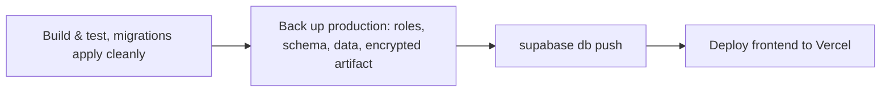

# Development setup

## Prerequisites

- **Node 20 LTS** — a safe default for a Vite 6 project; match it locally. Newer Node works for the
  build but produces npm compatibility warnings.
- **npm 9+**.
- A **Supabase project** (or the Supabase CLI for a local one).

There is no `.nvmrc` / `.tool-versions` in the repo. Adding one is a two-line fix that removes a
whole class of "works on my machine" — see [contributing](./08-contributing.md).

## First run

```bash
git clone <repo> && cd YULMixLaBedaine
npm install                 # NOT npm ci — see below
cp .env.example .env        # then fill in the two VITE_ values
npm run dev                 # http://localhost:5173
```

`src/lib/supabase.js` throws at import time if either variable is missing, so a bad `.env` fails
immediately and loudly rather than at the first query.

> ⚠️ **`npm ci` currently fails**: `package-lock.json` is out of sync with `package.json`
> (`@testing-library/dom` and its transitive deps are missing from the lock). Verified locally:
> `npm ci` exits with *"can only install packages when your package.json and package-lock.json are
> in sync"*. Run `npm install` once, commit the updated lockfile, and `npm ci` — and therefore CI —
> becomes usable.

## Supabase setup

1. Create a project; copy the URL and anon key into `.env`.
2. Enable the **Google** and **Facebook** providers, and register the redirect URLs
   (`http://localhost:5173` and the production origin) under
   *Authentication → URL Configuration*.
3. Apply the schema from `supabase/migrations/`. For a local database, `supabase start` applies
   every migration. For a new hosted project, link it and push:
   `supabase link --project-ref <ref>`, then `supabase db push`.

## Database migrations

The schema lives in `supabase/migrations/` ([ADR 0013](./adr/0013-supabase-migrations.md)). The
first file, `20260924233313_baseline_live_schema.sql`, is a dump of production as of
2026-09-24. Every later file is one reviewed change. Nothing else in `supabase/` is applied by
the CLI. `supabase/legacy/` holds the hand-run SQL snippets from before migrations, kept only as
history.

### Changing the schema

```bash
supabase migration new add_something        # creates supabase/migrations/<timestamp>_add_something.sql
# write the SQL (ALTER TABLE…, CREATE OR REPLACE FUNCTION…, new policies, GRANTs)
supabase db reset                           # local: rebuild from all migrations, fails loudly on bad SQL
```

- **Never edit a migration that has been applied to production.** Fix it with a new one.
- **New tables need explicit `GRANT`s** for `anon`/`authenticated`. New tables are not exposed to
  the Data API automatically (see `auto_expose_new_tables` in `supabase/config.toml`), and
  production's baseline grants only what it needs.
- If you changed the local database interactively (Studio, `psql`), `supabase db diff -f <name>`
  writes the difference to a new migration. Read the output before committing it.

Every PR that touches `supabase/migrations/` gets two checks in `.github/workflows/deploy.yml`:

- *Migrations apply cleanly* starts an empty local database and applies every migration. A
  migration that doesn't parse, or depends on something that doesn't exist, fails here.
- *Lint migrations (squawk)* runs [Squawk](https://squawkhq.com) on the migration files the PR adds
  or changes, and comments its findings on the PR. It blocks statements that would break the app
  still running while the new one deploys: dropping or renaming a column or table, changing a
  column's type, adding a `NOT NULL` column without a default. Rules about lock duration on big
  tables are off (`.squawk.toml` says why). To accept a finding on purpose, put
  `-- squawk-ignore <rule>` on the line above the statement and explain why in the PR.

### Applying to production

**Merging is applying.** Nobody runs `db push` day to day
([ADR 0014](./adr/0014-ci-applies-migrations-on-merge.md)). When a push to `main` brings new
migration files, the workflow runs, in order:



A push that touches no migration skips the backup and migrate jobs and goes straight to the Vercel
deploy. If the backup or `db push` fails, the Vercel deploy for that push doesn't run either, so no
code that needs the missing schema ships. Each migration file runs in its own transaction, so a
failed file leaves nothing half-applied.

Once it has run, check the app as both a member and an admin.

**When a migration fails in CI.** Read the *Apply migrations to production* job log. Either
re-run the failed jobs (for a transient error such as a network timeout), or fix it in a new PR. A
migration whose push failed was never applied, so it may be fixed in place. The next push to `main`
retries anything still pending, even a frontend-only push, because the workflow compares against
the last fully successful run, not the previous commit. Merge the fix before anything else.

**Fix forward.** There are no down-migrations. If an applied migration turns out wrong, write a new
migration that corrects it and merge it like any other. Never edit an applied migration: `db push`
won't re-run it, so the edit silently does nothing in production. If data was lost, restore it from
the backup the workflow took just before the push (next section).

**Removing things takes two PRs.** The frontend deploys a minute or two after the migration runs,
and the old frontend keeps running until then. To drop or rename something the frontend reads,
first merge a PR that stops reading it, then a PR that drops it.

### Backups

Every migrate run is preceded by a dump of production (roles, schema, all data including
`auth.users`), uploaded as the workflow artifact `supabase-backup-<commit sha>` and kept 90 days.
This repository is public and artifacts are downloadable by any signed-in GitHub user, so the dump
is encrypted with the `SUPABASE_BACKUP_PASSPHRASE` secret first. To use one, download it from the
run's *Summary* page (or `gh run download <run id>`), then:

```bash
gpg -d supabase-backup-<sha>.tar.gz.gpg | tar -xzf -   # asks for the passphrase
# → roles.sql, schema.sql, data.sql, migration-list.txt
```

Read what you need from it. Putting rows back into production is itself a change: do it through a
reviewed migration or script, not by replaying the whole dump over live data.

### Running `db push` by hand (recovery only)

For when CI can't do it, for example GitHub Actions is down during an event, or a secret has
expired. Take a backup first, then push from an up-to-date `main`:

```bash
git switch main && git pull
supabase link --project-ref ceacurlofmasyvhsoska   # once per machine
supabase db dump --linked -f schema.sql && supabase db dump --linked --data-only --use-copy -f data.sql
supabase migration list --linked                   # what production has vs. what's in the repo
supabase db push --linked --dry-run                # shows which files would run; runs nothing
supabase db push --linked                          # applies them, records them in production's history
```

Keep those dump files off the repository and delete them once you're done: they hold personal data.

Production's migration history was started on 2026-09-24 by marking the baseline as already
applied (`supabase migration repair --status applied 20260924233313 --linked`). That was a one-time
step. Don't repeat it.

**Do not** use `supabase db query --linked` or the SQL editor to change production's schema. It
creates exactly the drift ADR 0013 exists to stop. `db query` is still fine for read-only
`SELECT`s.

## Scripts

| Command | What it does | Verified state (2026-09-17) |
|---|---|---|
| `npm run dev` | Vite dev server on :5173 | — |
| `npm run build` | Production build to `dist/` | ✅ passes, ~1.3s, 1943 modules |
| `npm run preview` | Serve the built `dist/` | — |
| `npm run test:pricing` | Jest, `pricingEngine.test.js` only | ✅ 5/5 cases pass |
| `npm test` | Jest, default (unit) suite | ✅ passes — excludes the RLS integration suite, see below |
| `npm run test:rls` | Jest, RLS suite only, `--config jest.rls.config.js` | needs a local Supabase instance; fails on `ECONNREFUSED` without one (not on a jsdom artifact — see below) |
| `npm run test:e2e` | Playwright, real Chromium against `npm run dev` | needs a local Supabase instance; fails cleanly if it isn't running — see below |

Build output, for reference — code splitting is configured in `vite.config.js` so Supabase, the
router and Lucide are separate chunks:

```
dist/assets/index-*.css      29.53 kB │ gzip:  6.06 kB
dist/assets/lucide-*.js       5.17 kB │ gzip:  1.74 kB
dist/assets/router-*.js      51.07 kB │ gzip: 17.96 kB
dist/assets/supabase-*.js   227.02 kB │ gzip: 58.86 kB
dist/assets/index-*.js      322.16 kB │ gzip: 92.00 kB
```

The build succeeds **without** a `.env` file, because the env check is a runtime throw rather than a
build-time one. Do not read a green build as "the app is configured".

## Testing

Two suites exist, deliberately kept on separate tracks: a unit suite that needs nothing but Node,
and an integration suite that needs a live Supabase instance. `npm test` only runs the former, so
CI can be green without any external infrastructure.

### `src/lib/pricingEngine.test.js` — the unit suite

Five Jest `test()` cases covering the edge cases from the requirements: zero points, a single
adult, the new-member discount, fractional selling prices, and grandfathering a paid party. Run it
on its own with `npm run test:pricing`, or as part of `npm test`. It is the only meaningful
coverage in the repo, and it is genuinely pure — no Supabase, no DOM, no I/O.

### `src/__tests__/rlsPolicies.test.js` — the RLS integration suite

The most valuable *kind* of test in the repo (see [security](./06-security-and-rls.md#testing-rls))
but the most expensive to run: it drives a real local Supabase instance with both an anon and a
service-role client, asserting members cannot see DRAFT events, cannot read others' registrations,
and so on.

It is excluded from `npm test` via `jest.config.js`'s `testPathIgnorePatterns` and run separately
with `npm run test:rls`, which points Jest at `jest.rls.config.js` (identical to the default config
minus that exclusion). The file itself carries an `@jest-environment node` docblock pragma, so it
gets Node's native `fetch` — jsdom, the project's default test environment, does not provide one,
and without the pragma every request used to fail with `ReferenceError: fetch is not defined`
regardless of whether Supabase was even reachable.

#### Running the RLS tests

With the environment issue fixed, `npm run test:rls` fails cleanly on `ECONNREFUSED` in this repo
today — the honest failure, because no Supabase instance is running here. To make it actually pass:

1. A local Supabase: `supabase start`. It uses the committed `supabase/config.toml` and applies
   `supabase/migrations/`, so the local schema matches production's.
2. `.env.test` with a real local service-role key (and that file should be gitignored, see
   [security](./06-security-and-rls.md#secrets)).
3. Seed data: `supabase/tests/seed_test_data.sql` defines a `seed_test_data()` function the suite
   calls, falling back to inline seeding.

`supabase/tests/README.md` documents the intended workflow, in PowerShell — the project was
developed on Windows. The commands are shell-agnostic enough to translate.

### `e2e/auth-and-rls.spec.js` — the Playwright suite

A real-browser suite (Chromium, via `@playwright/test`) that drives `npm run dev` and asserts what
a member and an admin actually see and can do — not just what the code implies they should. It
covers the ground the "exercise the change as both a member and an admin" rule in
[Contributing](./08-contributing.md) otherwise leaves as an unverified aspiration.

There is no email/password sign-in UI (`Header.jsx` only offers Google/Facebook OAuth), so the
suite can't log in through the form. Instead `e2e/support/auth.js` calls Supabase's password grant
directly for the seeded `member@test.local` / `admin@test.local` users
(`supabase/seed.sql`), then hands the resulting tokens to the app's own Supabase client via
`auth.setSession()` — that client is exposed as `window.__supabase`, but only in dev builds
(`src/lib/supabase.js`, guarded by `import.meta.env.DEV`; dead-code-eliminated from `npm run
build`'s output).

Run it with `npm run test:e2e`. `playwright.config.js` reads `supabase status -o env` at config-load
time (not in `globalSetup` — Playwright starts `webServer` before `globalSetup` runs, which is too
late for Vite to pick up `VITE_SUPABASE_URL`/`VITE_SUPABASE_ANON_KEY`) and fails with a clear error
if Supabase isn't running.

1. A local Supabase: `supabase start`, or `supabase db reset` for a guaranteed-fresh database —
   `supabase start` alone can resume from a cached snapshot that predates a recent migration or
   reseed.
2. `npx playwright install chromium` once, to download the browser (~300 MB; not part of
   `node_modules`, cached under `~/.cache/ms-playwright`).
3. `npm run test:e2e`.

Not yet wired into CI — it stays a local/agent verification tool for now, matching this repo's
"For UI or frontend changes, start the dev server and use the feature in a browser" rule, until the
browser-install strategy and runtime cost for CI runners are worked out.

## Environment files

| File | Tracked | Purpose |
|---|---|---|
| `.env.example` | yes | template for `.env` |
| `.env` | no (gitignored) | your local Supabase credentials |
| `.env.test.example` | yes | template for `.env.test` |
| `.env.test` | **yes — should not be** | placeholders only today; gitignore it before someone adds a real key |

## Deploying

**Production runs on Vercel.** `vercel.json` sets the build command, `dist` output, and the SPA
rewrite; set `VITE_SUPABASE_URL` and `VITE_SUPABASE_ANON_KEY` in the Vercel project settings.

**`Preview` points at its own, separate free-tier Supabase project**, not production — see
[ADR 0015](./adr/0015-dedicated-preview-supabase-project.md). Its schema has to be kept in sync
with `supabase/migrations/` by hand for now (`supabase db push --project-ref
uacfrldoiixfstigosqv`); there's no CI automation for it yet.

`netlify.toml` is leftover config from before the host was settled — it is not in use and should
be deleted (see [issue #45](https://github.com/YULmix/yulmix-la-bedaine/issues/45)).

**Vercel's own git integration is currently disconnected** — the project is still linked to the
repo's pre-transfer identity (`Dekayd/YULMixLaBedaine`), and reconnecting it needs a `YULmix` org
owner. See [Live environment audit](./11-live-environment.md#deployment) for how that was found.

Until that's reconnected, `.github/workflows/deploy.yml` deploys straight from CI using the Vercel
CLI: on every push and PR it runs `npm run build` and `npm run test:pricing`; on push to `main` it
also runs `vercel pull` / `vercel build` / `vercel deploy --prebuilt --prod`, after applying any new
migrations ([Database migrations](#applying-to-production)). This is the CI gate that used to be
missing, whichever way the Git integration ends up.

It needs three repo secrets, set once by someone with access to the `yulm-ix` Vercel account:

| Secret | Value |
|---|---|
| `VERCEL_TOKEN` | a personal token from `vercel.com/account/tokens` |
| `VERCEL_ORG_ID` | `team_2Dq8V0ST1KNITgzIndZyh3IX` |
| `VERCEL_PROJECT_ID` | `prj_hAUPlcsCKxYEW6URcw08AuyE8G8J` |

Set them with `gh secret set <name>`, typed or pasted directly into that command — never handed to
an AI assistant, since that would force rotating them. The workflow pulls the app's own
`VITE_SUPABASE_URL` / `VITE_SUPABASE_ANON_KEY` from the Vercel project itself, so those aren't
duplicated here.

Applying migrations needs two more, set once by someone with access to the "YULmix - La Bedaine"
Supabase project, **before** the first migration PR merges (without them the backup job fails, and
that blocks the deploy):

| Secret | Value |
|---|---|
| `SUPABASE_ACCESS_TOKEN` | a personal access token from `supabase.com/dashboard/account/tokens` — set with `gh secret set SUPABASE_ACCESS_TOKEN --env supabase-production`, **not** a plain repo secret |
| `SUPABASE_BACKUP_PASSPHRASE` | a long random string, also kept in a password manager: it's the only way to decrypt a backup |

`SUPABASE_ACCESS_TOKEN` is account-wide, so it lives in the `supabase-production` GitHub
Environment, which is branch-restricted to `main` — a workflow run on any other branch can't read
it, even though the repo itself is public. This is a branch policy, not a reviewer gate: nothing
pauses for approval, it just narrows which branch can see the secret. No database password is
needed: given only the access token, the Supabase CLI logs in through a temporary role it creates
via the Management API.

#### `SUPABASE_ACCESS_TOKEN` permissions

Create it as a **scoped** token (`supabase.com/dashboard/account/tokens`), resource access
**Project → YULmix - La Bedaine** (not Organization), with exactly this set — everything else
stays `None`, including `Backups` (this pipeline does its own dump; it doesn't use Supabase's
PITR/restore feature):

| Category | Setting |
|---|---|
| Project Settings | Read |
| Database | Read-write |
| Connection Pooling | Read |
| Migrations | Read-write |
| API Keys | Read |
| API Key Secrets | Read |

Supabase tokens can't be edited after creation — getting this wrong means regenerating, so here's
why each one is needed, traced against the CLI's own source (`supabase/cli`, not just the docs
page, which doesn't list the raw permission IDs):

- **Project Settings** (`project_admin_read`) and **API Keys** + **API Key Secrets**
  (`api_gateway_keys_read` / `api_gateway_keys_secret_read`): `supabase link` — which `backup`,
  `migrate`, and `migration list` all run first — makes two calls that must succeed:
  `GET /v1/projects/{ref}` and `GET /v1/projects/{ref}/api-keys?reveal=true`. The `reveal=true`
  fetch (used internally to probe tenant service versions) is what requires the **Secrets**
  variant specifically, not just key metadata — Supabase itself documents this as "grants
  elevated access." There's no CLI flag to skip it.
- **Connection Pooling** (`database_pooling_config_read`): `link` also tries to cache a pooler
  connection URL via `getPoolerConfig`, but that call is best-effort (silently swallowed on
  failure) — so a token missing this permission makes `link` *look* successful while leaving no
  cached pooler URL. `db dump`/`db push`/`migration list` then try a direct Postgres connection
  first, which fails on GitHub Actions runners (no IPv6 egress), and their pooler fallback needs
  this same permission to fetch a connection — without it they fail with a generic "IPv6 is not
  supported on your current network" error that gives no hint the actual cause is a missing
  scope.
- **Database** (`database_write`, for `Read-write`): `db dump`/`db push`/`migration list` all
  mint a temporary Postgres login role via `POST /v1/projects/{ref}/cli/login-role` once they have
  a connection, rather than needing a stored database password.
- **Migrations** (`Read-write`): not actually exercised by any of the three commands above in
  this CLI version — they apply/list migrations over the raw Postgres connection, not a separate
  Management API call. Kept anyway since `supabase migration repair` (used for the one-time
  history-repair step, see [Database migrations](#database-migrations)) is a plausible future
  need and it's a low-risk permission to hold.

After changing the Supabase project or the production domain, re-check the OAuth redirect URLs —
a mismatch there is the classic "sign-in loops back to the home page signed out" symptom.

## Agent tooling in this repo

- **`.clinerules`** — the rules David's agent (Cline) worked under. Two thirds of it is genuinely
  useful project convention (stack, localisation, encoding, schema-change protocol); the last third
  hardcodes **Windows PowerShell 5.1** shell rules that are wrong on macOS/Linux. Split it: project
  conventions belong in a shared `AGENTS.md` / `CLAUDE.md`, shell specifics belong in each
  developer's own config.
- Individual contributors may have their own local agent skill installs (e.g. under `.agents/` or
  `.claude/`) — these are personal tooling, gitignored, and not part of the project's conventions.
