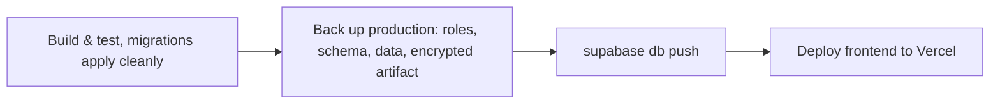

# Development setup

## Prerequisites

- **Node 20 LTS** — a safe default for a Vite 6 project; match it locally. Newer Node works for the
  build but produces npm compatibility warnings.
- **npm 9+**.
- A **Supabase project** (or the Supabase CLI for a local one).

There is no `.nvmrc` / `.tool-versions` in the repo. Adding one is a two-line fix that removes a
whole class of "works on my machine" — see [contributing](./08-contributing.md).

## First run

```bash
git clone <repo> && cd YULMixLaBedaine
npm install                 # NOT npm ci — see below
cp .env.example .env        # then fill in the two VITE_ values
npm run dev                 # http://localhost:5173
```

`src/lib/supabase.ts` throws at import time if either variable is missing, so a bad `.env` fails
immediately and loudly rather than at the first query.

> ⚠️ **`npm ci` currently fails**: `package-lock.json` is out of sync with `package.json`
> (`@testing-library/dom` and its transitive deps are missing from the lock). Verified locally:
> `npm ci` exits with *"can only install packages when your package.json and package-lock.json are
> in sync"*. Run `npm install` once, commit the updated lockfile, and `npm ci` — and therefore CI —
> becomes usable.

## Supabase setup

1. Create a project; copy the URL and anon key into `.env`.
2. Enable the **Google** provider, and register the redirect URLs
   (`http://localhost:5173` and the production origin) under
   *Authentication → URL Configuration*.
3. Apply the schema from `supabase/migrations/`. For a local database, `supabase start` applies
   every migration. For a new hosted project, link it and push:
   `supabase link --project-ref <ref>`, then `supabase db push`.

## Database migrations

The schema lives in `supabase/migrations/` ([ADR 0013](./adr/0013-supabase-migrations.md)). The
first file, `20260924233313_baseline_live_schema.sql`, is a dump of production as of
2026-09-24. Every later file is one reviewed change. Nothing else in `supabase/` is applied by
the CLI. `supabase/legacy/` holds the hand-run SQL snippets from before migrations, kept only as
history.

### Changing the schema

```bash
supabase migration new add_something        # creates supabase/migrations/<timestamp>_add_something.sql
# write the SQL (ALTER TABLE…, CREATE OR REPLACE FUNCTION…, new policies, GRANTs)
supabase db reset                           # local: rebuild from all migrations, fails loudly on bad SQL
npm run db:types                            # regenerate src/lib/database.types.ts from it, and commit it
```

- **Never edit a migration that has been applied to production.** Fix it with a new one.
- **New tables need explicit `GRANT`s** for `anon`/`authenticated`. New tables are not exposed to
  the Data API automatically (see `auto_expose_new_tables` in `supabase/config.toml`), and
  production's baseline grants only what it needs.
- If you changed the local database interactively (Studio, `psql`), `supabase db diff -f <name>`
  writes the difference to a new migration. Read the output before committing it.
- **Regenerate the database types** (`npm run db:types`, #201) whenever a migration changes a
  table, view or function, and commit `src/lib/database.types.ts` with it. The Supabase client is
  typed with it, so `npm run typecheck` then tells you which typed code the change breaks. Run it
  against a local database built from the migrations alone (`supabase db reset`), with the CLI
  version CI pins (`SUPABASE_CLI_VERSION` in `deploy.yml`): CI regenerates the file the same way
  and fails if yours differs.

Every PR that touches `supabase/migrations/` gets two checks in `.github/workflows/deploy.yml`:

- *Migrations apply cleanly* starts an empty local database and applies every migration. A
  migration that doesn't parse, or depends on something that doesn't exist, fails here. It then
  regenerates the database types and fails if `src/lib/database.types.ts` isn't up to date.
- *Lint migrations (squawk)* runs [Squawk](https://squawkhq.com) on the migration files the PR adds
  or changes, and comments its findings on the PR. It blocks statements that would break the app
  still running while the new one deploys: dropping or renaming a column or table, changing a
  column's type, adding a `NOT NULL` column without a default. Rules about lock duration on big
  tables are off (`.squawk.toml` says why). To accept a finding on purpose, put
  `-- squawk-ignore <rule>` on the line above the statement and explain why in the PR.

### Applying to production

**Merging is applying.** Nobody runs `db push` day to day
([ADR 0014](./adr/0014-ci-applies-migrations-on-merge.md)). When a push to `main` brings new
migration files, the workflow runs, in order:


```mermaid
flowchart LR
  Build["Build & test, migrations apply cleanly"] --> Backup["Back up production: roles, schema, data, encrypted artifact"]
  Backup --> Migrate["supabase db push"]
  Migrate --> Deploy["Deploy frontend to Vercel"]
```

A push that touches no migration skips the backup and migrate jobs and goes straight to the Vercel
deploy. If the backup or `db push` fails, the Vercel deploy for that push doesn't run either, so no
code that needs the missing schema ships. Each migration file runs in its own transaction, so a
failed file leaves nothing half-applied.

Once it has run, check the app as both a member and an admin.

**When a migration fails in CI.** Read the *Apply migrations to production* job log. Either
re-run the failed jobs (for a transient error such as a network timeout), or fix it in a new PR. A
migration whose push failed was never applied, so it may be fixed in place. The next push to `main`
retries anything still pending, even a frontend-only push, because the workflow compares against
the last fully successful run, not the previous commit. Merge the fix before anything else.

**Fix forward.** There are no down-migrations. If an applied migration turns out wrong, write a new
migration that corrects it and merge it like any other. Never edit an applied migration: `db push`
won't re-run it, so the edit silently does nothing in production. If data was lost, restore it from
the backup the workflow took just before the push (next section).

**Removing things takes two PRs.** The frontend deploys a minute or two after the migration runs,
and the old frontend keeps running until then. To drop or rename something the frontend reads,
first merge a PR that stops reading it, then a PR that drops it.

### Backups

Every migrate run is preceded by a dump of production (roles, schema, all data including
`auth.users`), uploaded as the workflow artifact `supabase-backup-<commit sha>` and kept 90 days.
This repository is public and artifacts are downloadable by any signed-in GitHub user, so the dump
is encrypted with the `SUPABASE_BACKUP_PASSPHRASE` secret first. To use one, download it from the
run's *Summary* page (or `gh run download <run id>`), then:

```bash
gpg -d supabase-backup-<sha>.tar.gz.gpg | tar -xzf -   # asks for the passphrase
# → roles.sql, schema.sql, data.sql, migration-list.txt
```

Read what you need from it. Putting rows back into production is itself a change: do it through a
reviewed migration or script, not by replaying the whole dump over live data.

### Running `db push` by hand (recovery only)

For when CI can't do it, for example GitHub Actions is down during an event, or a secret has
expired. Take a backup first, then push from an up-to-date `main`:

```bash
git switch main && git pull
supabase link --project-ref ceacurlofmasyvhsoska   # once per machine
supabase db dump --linked -f schema.sql && supabase db dump --linked --data-only --use-copy -f data.sql
supabase migration list --linked                   # what production has vs. what's in the repo
supabase db push --linked --dry-run                # shows which files would run; runs nothing
supabase db push --linked                          # applies them, records them in production's history
```

Keep those dump files off the repository and delete them once you're done: they hold personal data.

Production's migration history was started on 2026-09-24 by marking the baseline as already
applied (`supabase migration repair --status applied 20260924233313 --linked`). That was a one-time
step. Don't repeat it.

**Do not** use `supabase db query --linked` or the SQL editor to change production's schema. It
creates exactly the drift ADR 0013 exists to stop. `db query` is still fine for read-only
`SELECT`s.

## Scripts

| Command | What it does | Verified state (2026-09-17) |
|---|---|---|
| `npm run dev` | Vite dev server on :5173 | — |
| `npm run build` | Production build to `dist/` | ✅ passes, ~1.3s, 1943 modules |
| `npm run preview` | Serve the built `dist/` | — |
| `npm run typecheck` | `tsc --noEmit`: checks the `.ts` modules (strict) and their use of the database types; `.js`/`.jsx` files aren't checked (#201) | what CI's "Build & test" runs; Vite and Babel strip types without checking them |
| `npm run db:types` | Regenerates `src/lib/database.types.ts` from the local database | needs the local Supabase running; see [Changing the schema](#changing-the-schema) |
| `npm run test:pricing` | Jest, `pricingEngine.test.js` only | ✅ 5/5 cases pass |
| `npm test` | Jest, default (unit) suite | ✅ passes — excludes the RLS integration suite, see below |
| `npm run test:rls` | Jest, RLS suite only, `--config jest.rls.config.js` | needs a local Supabase instance; fails on `ECONNREFUSED` without one (not on a jsdom artifact — see below) |
| `npm run test:e2e` | Playwright, real Chromium against `npm run dev` | needs a local Supabase instance; fails cleanly if it isn't running — see below |
| `npm run lint` | ESLint, whole repo | repo-wide `local/no-literal-ui-strings` is a **warning** — there's a pre-existing backlog (see `eslint.config.js`), not something a single PR is expected to clear |
| `npm run lint:diff -- <baseRef>` | Fails on any `local/no-literal-ui-strings` warning on a line *added* since `baseRef` (default `origin/main`) | what CI's "Lint changed files for new hardcoded UI strings" step runs; needs the commit(s) to already exist (`baseRef...HEAD`) |
| `npm run lint:diff:staged -- <baseRef>` | Same rule, but against the **staged** snapshot instead of `HEAD` | what the `lint-diff-staged` pre-commit hook runs — see below; this is what lets it catch a violation *before* the commit exists, not one commit later |
| `npm run db:preview:reset` | Wipes the **Preview** Supabase database, re-applies migrations, loads generated fake data; new sign-ins become admins | Preview only, never production — see [Resetting the Preview database](#resetting-the-preview-database) |
| `npm run db:preview:push` | Applies this branch's pending migrations to the **Preview** database, keeping its data; resets it instead if Preview holds migrations this branch doesn't | Preview only; CI runs it on `main` after a migration merges |
| `npm run db:local:demo` | Same generated fake data, into the local Supabase | local only |
| `npm run db:seed:generate` | Only writes the generated SQL to `supabase/seeds/preview.generated.sql` | touches no database |

## Pre-commit hooks

The repo ships a [pre-commit](https://pre-commit.com) config (`.pre-commit-config.yaml`) that runs
the same checks as CI's "Build & test" and "Lint migrations (squawk)" jobs before each commit:
`npm run build`, `npm run typecheck`, `npm run test:pricing`, `npm test`, `npm run lint`, `npm run lint:diff:staged`,
`deno test` and `deno check` on `supabase/functions/`, and squawk on migrations. Each hook is
scoped to only run when it's relevant (e.g. `build` only fires when `src/` or `package.json`
changed), so an unrelated doc-only commit doesn't pay for a full build/test cycle. The Deno hooks
need `deno` on your PATH; squawk runs through `npx` at CI's pinned version.

The two lists are kept identical on purpose, so a commit that passes its hooks shouldn't fail CI's
checks. Change them together. The one check that stays CI-only is "Migrations apply cleanly", which
replays every migration on a fresh Postgres and needs Docker. Locally, `supabase migration up`
against your running stack is the nearest thing.

The `lint-diff-staged` hook exists because `npm run lint:diff` alone doesn't work as a pre-commit
check: it diffs `baseRef...HEAD`, and at pre-commit time `HEAD` is the *previous* commit — the one
being made isn't in it yet, so a violation would only surface on the *next* commit's lint run, or
not until CI. `scripts/lint-diff.mjs --staged` fixes this by diffing the staged index against
`merge-base(baseRef, HEAD)` and linting the staged blob content directly (`git show :<file>` piped
into `eslint --stdin`), so it sees the commit that's actually about to be made.

Setup (once per clone):

```bash
pip install pre-commit   # or: pipx install pre-commit / brew install pre-commit
pre-commit install --hook-type pre-commit
```

A blocked commit prints exactly what CI's `lint:diff` step would have said, e.g.:

```
src/views/HomeView.jsx:129:10 Literal UI string "..." must come from src/locales/fr.json ...
lint-diff: 1 new literal UI string(s) introduced in this diff. Move them into src/locales/fr.json.
```

Fix the string (move it into `fr.json` or `registrationOptions.ts`) and re-commit — pre-commit
re-runs on the corrected staged snapshot. `git commit --no-verify` skips the hooks entirely; per
[`CLAUDE.md`](../CLAUDE.md#the-rules-that-actually-matter) don't reach for that as a shortcut.

Build output, for reference — code splitting is configured in `vite.config.js` so Supabase, the
router and Lucide are separate chunks:

```
dist/assets/index-*.css      29.53 kB │ gzip:  6.06 kB
dist/assets/lucide-*.js       5.17 kB │ gzip:  1.74 kB
dist/assets/router-*.js      51.07 kB │ gzip: 17.96 kB
dist/assets/supabase-*.js   227.02 kB │ gzip: 58.86 kB
dist/assets/index-*.js      322.16 kB │ gzip: 92.00 kB
```

The build succeeds **without** a `.env` file, because the env check is a runtime throw rather than a
build-time one. Do not read a green build as "the app is configured".

## Testing

Two suites exist, deliberately kept on separate tracks: a unit suite that needs nothing but Node,
and an integration suite that needs a live Supabase instance. `npm test` only runs the former, so
CI can be green without any external infrastructure.

### `src/lib/pricingEngine.test.js` — the unit suite

Five Jest `test()` cases covering the edge cases from the requirements: zero points, a single
adult, the new-member discount, fractional selling prices, and grandfathering a paid party. Run it
on its own with `npm run test:pricing`, or as part of `npm test`. It is the only meaningful
coverage in the repo, and it is genuinely pure — no Supabase, no DOM, no I/O.

### `supabase/functions/*/*_test.ts` — the Edge Function unit suite

Deno tests for the email logic (which emails a party is owed, fr-CA formatting, the rendered
templates) and for the `impersonate` function's request handling (who may start and end a « Voir
comme » session, against a fake gateway): `deno test supabase/functions/`. They need no Supabase
and run in CI's build job, with `deno check supabase/functions/*/index.ts`.

### `src/__tests__/rlsPolicies.test.js` — the RLS integration suite

The most valuable *kind* of test in the repo (see [security](./06-security-and-rls.md#testing-rls))
but the most expensive to run: it drives a real local Supabase instance with both an anon and a
service-role client, asserting members cannot see DRAFT events, cannot read others' registrations,
and so on.

It is excluded from `npm test` via `jest.config.js`'s `testPathIgnorePatterns` and run separately
with `npm run test:rls`, which points Jest at `jest.rls.config.js` (identical to the default config
minus that exclusion). The file itself carries an `@jest-environment node` docblock pragma, so it
gets Node's native `fetch` — jsdom, the project's default test environment, does not provide one,
and without the pragma every request used to fail with `ReferenceError: fetch is not defined`
regardless of whether Supabase was even reachable.

#### Running the RLS tests

With the environment issue fixed, `npm run test:rls` fails cleanly on `ECONNREFUSED` in this repo
today — the honest failure, because no Supabase instance is running here. To make it actually pass:

1. A local Supabase: `supabase start` (or `supabase db reset` for a fresh one with the seeded
   `member@test.local` / `admin@test.local` users). It uses the committed `supabase/config.toml`
   and applies `supabase/migrations/`, so the local schema matches production's.
2. Nothing to configure: `jest.rls.config.js` reads the URL, anon key and service-role key from
   `supabase status`, as `playwright.config.js` does. `.env.test` is only the fallback when that
   command fails; a hand-copied one goes stale when the local keys change, and every request then
   fails with `PGRST301` ("None of the keys was able to decode the JWT").
3. Seed data: each `describe` block creates the rows it needs (as the signed-in admin, since
   `service_role` can only read `events`) and deletes them afterwards.
4. The custom access token hook (« Voir comme », #265, ADR 0025) enabled in the running Auth
   server. `supabase/config.toml` enables it (`[auth.hook.custom_access_token]`, calling
   `public.custom_access_token_hook`), but Auth reads that file at `supabase start`: a stack
   started before it needs `supabase stop && supabase start`. Without it the « Voir comme »
   sessions fail with "The access token has no impersonated_by claim". The suite can also point
   those sessions at another Auth server with `SUPABASE_AUTH_URL` (its REST root, e.g.
   `http://127.0.0.1:59999`).

   With the hook enabled, the database must have the function: a database reset from a branch
   that predates #265 makes every sign-in fail with a 500, "Error running hook URI:
   pg-functions://postgres/public/custom_access_token_hook" (the function is missing). Restart the stack from
   that branch, or merge `main` into it.

`supabase/tests/README.md` documents the intended workflow, in PowerShell — the project was
developed on Windows. The commands are shell-agnostic enough to translate.

### `e2e/auth-and-rls.spec.js` — the Playwright suite

A real-browser suite (Chromium, via `@playwright/test`) that drives `npm run dev` and asserts what
a member and an admin actually see and can do — not just what the code implies they should. It
covers the ground the "exercise the change as both a member and an admin" rule in
[Contributing](./08-contributing.md) otherwise leaves as an unverified aspiration.

There is no email/password sign-in UI (`Header.jsx` only offers Google OAuth), so the
suite can't log in through the form. Instead `e2e/support/auth.js` calls Supabase's password grant
directly for the seeded `member@test.local` / `admin@test.local` users
(`supabase/seed.sql`), then hands the resulting tokens to the app's own Supabase client via
`auth.setSession()` — that client is exposed as `window.__supabase`, but only in dev builds
(`src/lib/supabase.ts`, guarded by `import.meta.env.DEV`; dead-code-eliminated from `npm run
build`'s output).

Run it with `npm run test:e2e`. `playwright.config.js` reads `supabase status -o env` at config-load
time (not in `globalSetup` — Playwright starts `webServer` before `globalSetup` runs, which is too
late for Vite to pick up `VITE_SUPABASE_URL`/`VITE_SUPABASE_ANON_KEY`) and fails with a clear error
if Supabase isn't running.

1. A local Supabase: `supabase start`, or `supabase db reset` for a guaranteed-fresh database —
   `supabase start` alone can resume from a cached snapshot that predates a recent migration or
   reseed.
2. `npx playwright install chromium` once, to download the browser (~300 MB; not part of
   `node_modules`, cached under `~/.cache/ms-playwright`).
3. `npm run test:e2e`.

`e2e/admin-tabs.spec.js` covers the admin sub-navigation tabs. The seed has no events, so it
creates its own active event and member registration (`e2e/support/testData.js`, signed in as the
seeded admin; refuses any non-local URL) and archives it again afterwards. It also runs in a second
project, `mobile-chrome` (Pixel 7 viewport), which checks the admin screens on a phone: no
horizontal page overflow, 44px tab targets, controls within the viewport. That project depends on
`chromium` because both mutate the same single active event; use `--project=mobile-chrome --no-deps`
to run it alone. Set `E2E_SCREENSHOT_DIR=<dir>` to save full-page mobile screenshots for a visual
check.

Every spec shares one active event and the seeded member's registration, so they never run side by
side: each project is a link in a chain (`dependencies`), and `chromium`, which holds several such
files, runs one worker (#170). To run one project alone, pass `--no-deps`; never run two projects
at once.

**Adding a spec.** A spec that only reads, or makes its own data, goes in `e2e/` and runs in
`chromium` with no config change. A spec that reseeds or mutates the shared active event needs a
project of its own: append **one entry** (`{ name: 'my-spec' }`, with a comment saying why) at the
end of `SERIAL_ENTRIES` in `playwright.config.js`. The chain of `dependencies` and `chromium`'s
`testIgnore` are generated from that list, so nothing else is edited (`spec` defaults to the name,
`device` to `'Desktop Chrome'`). Never add a hand-written project to `projects`: that is what made
every branch conflict (#244).

**When the suite fails for reasons that look unrelated, reset the local database first**
(`supabase db reset`, always safe locally). Interrupted runs leave throwaway members and parties
behind, and the preview seed (`scripts/preview-seed`) must never be applied locally: its trigger
makes every new account an admin. `createThrowawayMember()` refuses to go on when it sees that,
with a message saying to reset.

Not yet wired into CI — it stays a local/agent verification tool for now, matching this repo's
"For UI or frontend changes, start the dev server and use the feature in a browser" rule, until the
browser-install strategy and runtime cost for CI runners are worked out.

## « Voir comme » (Edge Function `impersonate`)

`supabase/functions/impersonate` opens and ends a read-only session of a member for an admin
([ADR 0025](./adr/0025-voir-comme-read-only-impersonation.md), #266; its checks are in
[Security](./06-security-and-rls.md#-voir-comme--read-only-impersonation-265-adr-0025)).
`handler.ts` is the request handling, `gateway.ts` the calls to PostgREST and Auth (plain
`fetch`, no dependency), `handler_test.ts` the Deno tests.

```http
POST /functions/v1/impersonate          Authorization: Bearer <the admin's access token>
{ "action": "start", "target_id": "<uuid>" }
→ 200 { access_token, refresh_token, expires_at, session_id, ends_at, target: { id, full_name } }

{ "action": "end", "session_id": "<uuid>", "access_token": "<the impersonated token, optional>" }
→ 200 { ended: true, revoked: true|false }
```

`expires_at` is the token's `exp` (epoch seconds), capped by the hook; Auth's own `expires_at`
isn't. `ends_at` is when the « Voir comme » session ends for good (the log row's `expires_at`):
the UI's countdown reads `ends_at`, not `expires_at`. The UI always sends the impersonated
`access_token` on end, so the session is signed out and not only refused by the hook. Errors are
`{ "error": "<code>" }`, mapped to French in `src/lib/dbErrors.ts`.

It only works with the custom access token hook enabled in Auth: otherwise every start is refused
with `impersonation_not_marked` (the unmarked session is signed out). Locally,
`supabase/config.toml` enables it, but Auth reads that at `supabase start` (see
[Running the RLS tests](#running-the-rls-tests), step 4). Then `supabase functions serve` serves it,
and a start can be tried with the seeded users:

```bash
eval "$(supabase status -o env | grep -E '^(API_URL|ANON_KEY)=')"
TOKEN=$(curl -s "$API_URL/auth/v1/token?grant_type=password" -H "apikey: $ANON_KEY" \
  -d '{"email":"admin@test.local","password":"password123"}' | jq -r .access_token)
curl -s "$API_URL/functions/v1/impersonate" -H "Authorization: Bearer $TOKEN" \
  -d '{"action":"start","target_id":"00000000-0000-0000-0000-000000000001"}'
```

On a shared stack that can't be restarted, run a throwaway Auth with the hook instead: a
`gotrue` container on the stack's Docker network with the stack Auth container's environment plus
`GOTRUE_HOOK_CUSTOM_ACCESS_TOKEN_ENABLED=true` and
`GOTRUE_HOOK_CUSTOM_ACCESS_TOKEN_URI=pg-functions://postgres/public/custom_access_token_hook`,
published on a spare port. It shares the database and the signing keys, so PostgREST accepts its
tokens. Point the RLS suite at it with `SUPABASE_AUTH_URL`; the function itself takes one URL for
both PostgREST and Auth, so run `createHandler(createGateway(...))` from a Deno script behind a
small proxy that sends `/auth/v1/*` to that container and the rest to the stack (how #266 was
verified).

Production: CI deploys it with the other functions (`supabase functions deploy`, job **Deploy
Edge Functions**); it needs no secret of its own. It is useless there until the hook is enabled in
the dashboard (#268). Preview: each PR deploys its functions there and CI enables Preview's hook
(job **Deploy Edge Functions to Preview**, see [Deploying](#deploying)).

## Transactional email (Edge Function)

`supabase/functions/send-party-email` sends the lifecycle emails
([ADR 0016](./adr/0016-edge-function-for-transactional-email.md)). Locally:

```bash
supabase functions serve        # serves every function against the local stack
```

`supabase db reset` seeds `private.settings` with the local function URL, so registering, paying,
assigning a bed or promoting a party locally calls it. There is no `RESEND_API_KEY` locally: the
function prints the email it would send in the `functions serve` output and records a `dry_run`
row in `email_log`. Nothing leaves the machine.

Production: CI deploys the function when `supabase/functions/` or `supabase/config.toml` changes
(job **Deploy Edge Functions** in `deploy.yml`) and points the trigger at it. That job **fails until
`RESEND_API_KEY` is set** on the production project, so no production registration can be
recorded as a dry run and never emailed. One-time, by a maintainer, locally:

```bash
supabase secrets set --project-ref ceacurlofmasyvhsoska RESEND_API_KEY=re_...
```

Use a Resend "Sending access" key restricted to `yulmix.com`. Optional overrides, same command:
`EMAIL_FROM` (default `La Bédaine <bedaine@yulmix.com>`) and `SITE_URL` (default
`https://www.yulmix.com/`). Preview never sends: it has no key (PRs deploy the function there, see [Deploying](#deploying),
so a call would only record a dry run), and its seeded function URL points at a host that only
exists in the local stack.

## Environment files

| File | Tracked | Purpose |
|---|---|---|
| `.env.example` | yes | template for `.env` |
| `.env` | no (gitignored) | your local Supabase credentials |
| `.env.test.example` | yes | template for `.env.test` |
| `.env.test` | no (gitignored) | fallback keys for `npm run test:rls` when `supabase status` can't answer |
| `.env.preview.local` | no (gitignored) | `PREVIEW_DB_URL`, for `npm run db:preview:reset` and `db:preview:push` |
| `supabase/preview-seed.json` | yes | knobs for the generated fake data |

## Deploying

**Production runs on Vercel.** `vercel.json` sets the build command, `dist` output, and the SPA
rewrite; set `VITE_SUPABASE_URL` and `VITE_SUPABASE_ANON_KEY` in the Vercel project settings.

**`Preview` points at its own, separate free-tier Supabase project**, not production — see
[ADR 0015](./adr/0015-dedicated-preview-supabase-project.md). CI keeps its schema in sync with
`main`: when a push to `main` brings migrations, the deploy workflow's **Apply migrations to
Preview** job runs `npm run db:preview:push`. That applies the pending migrations and keeps
Preview's data. If Preview holds a migration `main` doesn't have (after a reset from a branch
whose migration hasn't merged), the push is refused and the job resets Preview from `main`
instead; its summary says so. The job never blocks production: nothing waits on it. If it
fails, the next push to `main` retries it.

**Edge Functions on Preview.** On every pull request from this repository (not doc-only), the
**Deploy Edge Functions to Preview** job deploys the PR's `supabase/functions/` to Preview, so its
Vercel preview can call them (« Voir comme » needs `impersonate`). **Preview is shared: it runs
the functions of the last PR deployed there**, whatever preview deployment you are looking at.
Push to your PR again (or re-run that job) before testing a function on its preview. Production's
functions deploy only from `main`, as before. The job needs the `PREVIEW_SUPABASE_ACCESS_TOKEN`
repo secret ([permissions below](#preview_supabase_access_token-permissions)); until it is set,
the job warns and skips.

The same job enables the custom access token hook on Preview's Auth
([ADR 0025](./adr/0025-voir-comme-read-only-impersonation.md)), without which every « Voir
comme » fails with `impersonation_not_marked`. It sets only the hook's two fields through the
Management API (`PATCH /v1/projects/<ref>/config/auth`), never the rest of Auth's config:
`supabase config push` would push all of `supabase/config.toml` (local site URL, redirect URLs,
providers) over Preview's, so it is not used. It does so only once Preview's database has
`public.custom_access_token_hook` callable by `supabase_auth_admin` (with the hook on and the
function missing, every sign-in fails), and never turns the hook off. Production's Auth config is
never touched by CI (#268).

To enable it by hand instead (once, e.g. if the token lacks the Auth permission): Supabase
dashboard → project **YULmix - La Bedaine (Preview)** → **Authentication** → **Hooks** →
**Add hook** → **Customize Access Token (JWT) Claims** → hook type **Postgres**, schema
`public`, function `custom_access_token_hook` → **Create hook** (enabled). Check first, in the SQL
editor, that `select has_function_privilege('supabase_auth_admin',
'public.custom_access_token_hook(jsonb)', 'EXECUTE');` returns `true`.

### Resetting the Preview database

To test a branch's preview deployment against known data, reset the Preview database from that
branch. It's shared by every preview deployment, and a reset applies *that branch's* migrations,
so other open PRs' previews may not match its schema until someone resets from their branch.
One tester at a time.

**From GitHub (no local setup):** Actions tab → **Reset Preview DB** → **Run workflow**, pick
the branch, optionally type a seed number. It uses the `PREVIEW_DB_URL` repo secret
(`.github/workflows/preview-db-reset.yml`).

**From your machine:** put `PREVIEW_DB_URL=<connection string>` in `.env.preview.local`
(gitignored). Get it from the Supabase dashboard → project **YULmix - La Bedaine (Preview)** →
**Connect** → method **Session pooler** (not "Direct connection": that host is IPv6-only on the
free tier and GitHub runners can't reach it), with the database password filled in
(percent-encoded). The same URL goes into the `PREVIEW_DB_URL` repo secret. Then
`npm run db:preview:reset` and type the Preview project ref to confirm.

What a reset does (`scripts/preview-db.mjs`):

1. Generates fake data into `supabase/seeds/preview.generated.sql` (gitignored) from
   `supabase/preview-seed.json`.
2. Runs `supabase db reset --db-url <Preview>`: drops everything in `public`, **deletes every
   user** (all `auth` tables are truncated), re-applies `supabase/migrations/`, then loads
   `supabase/seed.sql` (`member@test.local` / `admin@test.local`) and the generated file.
3. The generated file ends by installing a Preview-only trigger: **every account created from
   then on is an admin**, so whoever signs in with Google on a preview deployment can use the
   admin screens. The seeded users stay regular members (except `admin@test.local`). No migration
   knows about this trigger, so it never reaches production.

The generated registrations go through `save_registration()`, which acts on behalf of
`auth.uid()` (attendees are writable only that way, #246), so the seed sets `request.jwt.claims`
to each registrant before the call and clears it after the loop. CI's "Migrations apply cleanly"
job loads the generated seed on the migrated schema (after `seed.sql`), so a migration that breaks
the seed fails the PR. The seed is not reapplied to Preview on merge: reseed it after a merge that
changes migrations touching seeded tables or the seed scripts.

#### Signing in as a test account ("Se connecter comme…")

A preview deployment only offers Google sign-in, so the account menu there has **Se connecter
comme…** (#105). It signs in as any seeded `@test.local` account, which all share the password
`password123`:

- **Admin de test**, **Organisateur de test**, **Comité de test** and **Membre de test** in one
  click, from any state, even signed out (the current account's button is disabled). A member
  can't list other accounts (RLS), so the admin link is the way back. Organisateur and Comité
  hold their role on the active event only where the seed grants it (the Preview seed does; the
  plain local seed has no event, so grant them first, as the e2e setup does).
- Any other `@test.local` address, typed in.
- When the current account is an admin: the full list, searchable and filterable by level
  (Admin, Organisateur, Comité, Membre, on the active event), with each account's level and
  state on the active event (registered or waitlisted, paid, bed, email to check). The list is
  the shared `AccountPicker` (`src/components/AccountPicker.jsx`), which « Voir comme » (#106)
  reuses; only the action on choosing differs.

While signed in as a test account, a thin bar under the header says so. It is the same on the
local dev server against a local stack, which is how `e2e/preview-account-picker.spec.js` tests it.

It never reaches production, by two separate guards:

1. **Build time.** `vite.config.js` defines `__PREVIEW_TOOLS__`: true on the dev server and when
   `VERCEL_ENV=preview` (set by `vercel build` in the preview job), false otherwise, including when
   `VERCEL_ENV` is missing. When it's false, Rollup drops the lazy `src/preview/` chunk: a
   production build contains none of its code, strings (`src/locales/fr.preview.json`, kept out of
   `fr.json` for that reason) or the password. Check with `npm run build`, then
   `grep -rl password123 dist` (no output).
2. **Runtime.** It renders only when `VITE_SUPABASE_URL` is the Preview project or a local stack.

#### Choosing the fake data

Edit `supabase/preview-seed.json` (changes go through a PR like any other file):

| Key | Default | Meaning |
|---|---|---|
| `seed` | `20260927` | Random seed. Same config + same seed = exactly the same data, so a bug seen on Preview stays reproducible after a reset. Override once with `--seed <n>` or the workflow's seed field. |
| `members` | `40` | Fake members, on top of the two test accounts. All `…@test.local`, password `password123`. |
| `activeEvent.registrations` | `40` | Registrations on the active event (registration open, event ~8 weeks out). Test Member is always one of them. At most `members + 1`. |
| `activeEvent.maxAttendees` | `70` | Capacity; every attendee counts, kids included. Parties arriving once it's full are waitlisted. `0` = no limit. |
| `activeEvent.sellingPrice` | `260` | Whole-event selling price ($). |
| `activeEvent.paidShare` | `0.5` | Share of active-event registrations already paid (0–1). |
| `pastEvents.count` | `2` | Archived past editions, for profile history. |
| `pastEvents.registrationsEach` | `15` | Registrations per past edition, all paid. |
| `pastEvents.sellingPrice` | `220` | Past editions' selling price ($). |
| `parties.minSize` / `maxSize` | `1` / `4` | People per registration. |
| `parties.newMemberShare` | `0.15` | Chance an adult or teen is a new member (priced at the main-event rate). |
| `parties.teenShare` / `kidShare` | `0.2` / `0.2` | Chance each extra person is a teen / a kid (the registrant is always an adult). |
| `emails.failed` / `pending` | `2` / `1` | Active-event parties whose latest email is `failed` (with a Resend error) / stuck `pending`, so the admin views have something to follow up. Never Test Member; the generated SQL lists which accounts got them. |
| `emails.promotedShare` | `0.1` | Chance a non-waitlisted party's history is waitlist then promotion instead of a plain confirmation. |

Every registration also gets an email history (`email_log`) matching its state, as `send-party-email`
would have sent it: confirmation or waitlist, then payment once paid and accommodation once a bed is
assigned, all `sent`. Past editions' rows are `backfilled`, like the migration that created the table.

Names come from [faker](https://fakerjs.dev/) with a French-Canadian locale; free text (notes,
messages, allergies) is picked from French phrase lists in `scripts/preview-seed/generate.mjs`.
Amounts and waitlisting are computed by the database, as for real registrations (registrations go
through `save_registration()`).

To look at the data without touching any database: `npm run db:seed:generate` (add
`-- --seed <n>` for another variant) and open `supabase/seeds/preview.generated.sql`. To load it
into your **local** Supabase instead: `npm run db:local:demo` (a plain `supabase db reset` goes
back to just the two test users, which is what the e2e tests expect).

Safety: the script only connects through `PREVIEW_DB_URL` and refuses the URL unless it names
the Preview project (`uacfrldoiixfstigosqv`) and not production. It never uses the CLI's linked
project, which is production. When `PREVIEW_DB_URL` isn't in the environment it reads
`.env.preview.local`, so on a machine that has that file, `reset` and `push` reach the real
Preview database: never use them to try something out locally. `--dry-run` checks the URL and
prints the command without connecting.

`netlify.toml` is leftover config from before the host was settled — it is not in use and should
be deleted (see [issue #45](https://github.com/YULmix/yulmix-la-bedaine/issues/45)).

**Vercel's own git integration is currently disconnected** — the project is still linked to the
repo's pre-transfer identity (`Dekayd/YULMixLaBedaine`), and reconnecting it needs a `YULmix` org
owner. See [Live environment audit](./11-live-environment.md#deployment) for how that was found.

Until that's reconnected, `.github/workflows/deploy.yml` deploys straight from CI using the Vercel
CLI: on every push and PR it runs `npm run build` and `npm run test:pricing`; on push to `main` it
also runs `vercel pull` / `vercel build` / `vercel deploy --prebuilt --prod`, after applying any new
migrations ([Database migrations](#applying-to-production)). This is the CI gate that used to be
missing, whichever way the Git integration ends up.

It needs three repo secrets, set once by someone with access to the `yulm-ix` Vercel account:

| Secret | Value |
|---|---|
| `VERCEL_TOKEN` | a personal token from `vercel.com/account/tokens` |
| `VERCEL_ORG_ID` | `team_2Dq8V0ST1KNITgzIndZyh3IX` |
| `VERCEL_PROJECT_ID` | `prj_hAUPlcsCKxYEW6URcw08AuyE8G8J` |

Set them with `gh secret set <name>`, typed or pasted directly into that command — never handed to
an AI assistant, since that would force rotating them. The workflow pulls the app's own
`VITE_SUPABASE_URL` / `VITE_SUPABASE_ANON_KEY` from the Vercel project itself, so those aren't
duplicated here.

Applying migrations needs two more, set once by someone with access to the "YULmix - La Bedaine"
Supabase project, **before** the first migration PR merges (without them the backup job fails, and
that blocks the deploy):

| Secret | Value |
|---|---|
| `SUPABASE_ACCESS_TOKEN` | a personal access token from `supabase.com/dashboard/account/tokens` — set with `gh secret set SUPABASE_ACCESS_TOKEN --env supabase-production`, **not** a plain repo secret |
| `SUPABASE_BACKUP_PASSPHRASE` | a long random string, also kept in a password manager: it's the only way to decrypt a backup |

`SUPABASE_ACCESS_TOKEN` is account-wide, so it lives in the `supabase-production` GitHub
Environment, which is branch-restricted to `main` — a workflow run on any other branch can't read
it, even though the repo itself is public. This is a branch policy, not a reviewer gate: nothing
pauses for approval, it just narrows which branch can see the secret. No database password is
needed: given only the access token, the Supabase CLI logs in through a temporary role it creates
via the Management API.

#### `SUPABASE_ACCESS_TOKEN` permissions

Create it as a **scoped** token (`supabase.com/dashboard/account/tokens`), resource access
**Project → YULmix - La Bedaine** (not Organization), with exactly this set — everything else
stays `None`, including `Backups` (this pipeline does its own dump; it doesn't use Supabase's
PITR/restore feature):

| Category | Setting |
|---|---|
| Project Settings | Read |
| Database | Read-write |
| Connection Pooling | Read |
| Migrations | Read-write |
| API Keys | Read |
| API Key Secrets | Read |
| Edge Functions | Read-write |
| Edge Function Secrets | Read |

Supabase tokens can't be edited after creation — getting this wrong means regenerating, so here's
why each one is needed, traced against the CLI's own source (`supabase/cli`, not just the docs
page, which doesn't list the raw permission IDs):

- **Project Settings** (`project_admin_read`) and **API Keys** + **API Key Secrets**
  (`api_gateway_keys_read` / `api_gateway_keys_secret_read`): `supabase link` — which `backup`,
  `migrate`, and `migration list` all run first — makes two calls that must succeed:
  `GET /v1/projects/{ref}` and `GET /v1/projects/{ref}/api-keys?reveal=true`. The `reveal=true`
  fetch (used internally to probe tenant service versions) is what requires the **Secrets**
  variant specifically, not just key metadata — Supabase itself documents this as "grants
  elevated access." There's no CLI flag to skip it.
- **Connection Pooling** (`database_pooling_config_read`): `link` also tries to cache a pooler
  connection URL via `getPoolerConfig`, but that call is best-effort (silently swallowed on
  failure) — so a token missing this permission makes `link` *look* successful while leaving no
  cached pooler URL. `db dump`/`db push`/`migration list` then try a direct Postgres connection
  first, which fails on GitHub Actions runners (no IPv6 egress), and their pooler fallback needs
  this same permission to fetch a connection — without it they fail with a generic "IPv6 is not
  supported on your current network" error that gives no hint the actual cause is a missing
  scope.
- **Database** (`database_write`, for `Read-write`): `db dump`/`db push`/`migration list` all
  mint a temporary Postgres login role via `POST /v1/projects/{ref}/cli/login-role` once they have
  a connection, rather than needing a stored database password.
- **Edge Functions** (`Read-write`) and **Edge Function Secrets** (`Read`,
  `edge_functions_secrets_read`): the **Deploy Edge Functions** job
  ([ADR 0016](./adr/0016-edge-function-for-transactional-email.md)) runs `supabase functions
  deploy`, and first `supabase secrets list` to refuse to activate the email trigger while
  `RESEND_API_KEY` is missing. Read is enough for that check: the job never writes secrets, a
  maintainer sets them. Without it the list call fails with `403 Missing required permission(s):
  edge_functions_secrets_read` (first seen on the #92 merge, 2026-09-28).
- **Migrations** (`Read-write`): not actually exercised by any of the three commands above in
  this CLI version — they apply/list migrations over the raw Postgres connection, not a separate
  Management API call. Kept anyway since `supabase migration repair` (used for the one-time
  history-repair step, see [Database migrations](#database-migrations)) is a plausible future
  need and it's a low-risk permission to hold.

#### `PREVIEW_SUPABASE_ACCESS_TOKEN` permissions

A second scoped token, for the **Deploy Edge Functions to Preview** job. Unlike
`SUPABASE_ACCESS_TOKEN` it is a **repo** secret (pull-request runs must read it), so it must be
scoped to **Project → YULmix - La Bedaine (Preview)** only, never production or the organization:
anyone who can push a branch here could use it. Everything `None` except:

| Category | Setting | Why |
|---|---|---|
| Project Settings | Read | `supabase functions deploy` reads the project |
| Edge Functions | Read-write | `supabase functions deploy --project-ref uacfrldoiixfstigosqv` |
| Auth (configuration) | Read-write | read, then `PATCH`, the two hook fields of Preview's Auth config |

Set it with `gh secret set PREVIEW_SUPABASE_ACCESS_TOKEN` (run locally, never pasted to an AI
assistant). If the dashboard names the Auth permission differently, pick the one granting read and
write of the Auth configuration; if the hook step then fails with a 403, enable the hook by hand
([Deploying](#deploying)) and the deploy step still works.

After changing the Supabase project or the production domain, re-check the OAuth redirect URLs —
a mismatch there is the classic "sign-in loops back to the home page signed out" symptom.

## Agent tooling in this repo

- **`.clinerules`** — the rules David's agent (Cline) worked under. Two thirds of it is genuinely
  useful project convention (stack, localisation, encoding, schema-change protocol); the last third
  hardcodes **Windows PowerShell 5.1** shell rules that are wrong on macOS/Linux. Split it: project
  conventions belong in a shared `AGENTS.md` / `CLAUDE.md`, shell specifics belong in each
  developer's own config.
- Individual contributors may have their own local agent skill installs (e.g. under `.agents/` or
  `.claude/`) — these are personal tooling, gitignored, and not part of the project's conventions.
