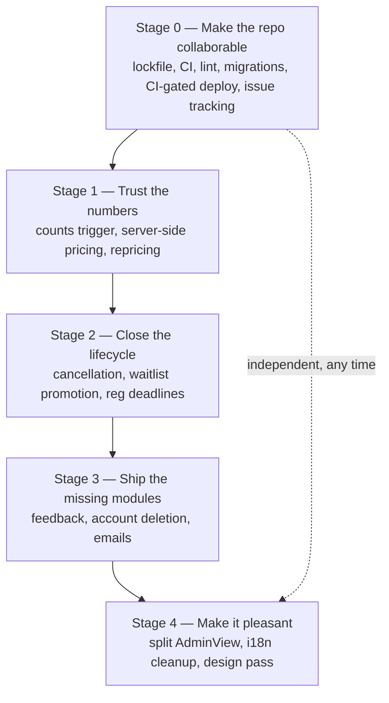

# Roadmap

Ordered by dependency, not by appetite. Each stage leaves the app in a shippable state.

## Stage 0 — make the repo collaborable

Nothing else is safe to do in parallel until this exists, because there is currently no automated
signal that a change broke something.

1. ~~`npm install`, commit the lockfile so `npm ci` works.~~ **Done.**
2. GitHub Actions: `npm ci && npm run build && npm test` on every PR.
3. ~~Make `npm test` honest~~ **Done.** `pricingEngine.test.js` is now Jest `test()` blocks, the RLS
   suite runs on Node (`@jest-environment node`) and is excluded from the default `npm test` run
   (`jest.config.js`) — it runs separately via `npm run test:rls` / `jest.rls.config.js` — and
   `example.test.js` is deleted.
4. ESLint + `eslint-plugin-react-hooks`; fix what it finds (starting with the undefined
   `fetchPartiesForActiveEvent`).
5. `.nvmrc` → Node 20.
6. Commit `supabase/config.toml` (`supabase init`) and adopt `supabase/migrations/`. Seed it with the
   current schema as `0001_baseline.sql` — with the `admin_set_is_admin` dollar-quoting fixed — after
   diffing against the live database. This is the single highest-value item in the document.
7. **Put the Vercel deploy behind CI**: deploy only after `npm run build` and `npm test` pass on
   `main`, instead of Vercel's git integration deploying on push directly. Delete the unused
   `netlify.toml` while here.
8. **Move work tracking out of the requirements doc** and into GitHub Issues (or beads tasks, if
   adopted) — file each item in [state of the code](./09-state-of-the-code.md) as an issue so
   progress is visible and assignable, instead of living only in this static list.
9. Housekeeping: delete `App.jsx.backup` and the three dead locale files, strip BOMs, gitignore
   `.env.test`.

## Stage 1 — trust the numbers

The app's whole purpose is telling ninety people what they owe. Today that number is computed by the
browser, is never revalidated, goes stale when the price changes, and the admin aggregates that
sanity-check it read zeros.

1. **Fix the attendee-shape mismatch** so `counts` is real ([state of the code](./09-state-of-the-code.md), item 1).
   Verify the live trigger first.
2. **Move pricing into Postgres**: a `BEFORE INSERT OR UPDATE` trigger on `user_parties` that
   recomputes `calculated_amount_owed` from `attendees` and the event's `selling_price_whole_event`,
   ignoring whatever the client sent. Port the point weights and new-member rule to SQL; keep
   `pricingEngine.js` as the *display* estimate so the form stays live, and test that the two agree.
3. **Wire up grandfathering** against the real columns: a party with `payment_status = 'Payé'` keeps
   its stored amount.
4. **Add an admin "reprice unpaid registrations" action** so setting the price a month out actually
   updates everyone's balance.
5. **Fix the audit attribution** (`edited_by = auth.uid()`), so god-mode edits are traceable to the
   organiser who made them.
6. **Aggregate from `attendees`, not party-level summaries**, for the sleeping and dietary breakdowns —
   organisers need people-counts to buy food and assign 48 beds.

## Stage 2 — close the lifecycle

The event has a beginning but no end.

1. **Cancellation**: a "Se désinscrire" action that sets `status = 'Annulé'` (never deletes), and
   remove the second stray "Annuler" button. The RLS UPDATE gate already stops members from editing a
   cancelled registration — the status just needs to be written. Tighten or remove the member DELETE
   policy at the same time.
2. **Waitlist promotion**: when a party cancels, either auto-promote the oldest waitlisted party or
   give organisers a one-click promote with a clear count of remaining places. Decide which
   ([open question 3](./09-state-of-the-code.md#open-questions-for-the-group)).
3. **Add a real event date** (`event_start_date`), then enforce registration close at
   `event_start_date − x_reg_close_weeks` — server-side, not just a banner.
4. **Payment reminders view**: unpaid parties, amount, days until the deadline. This is what organisers
   will actually open every day in the final month.
5. **Archive/activate as one confirmed step**, as the requirements specify, with a warning.

## Stage 3 — the missing modules

1. **Feedback module** — the floating widget, clipboard image paste to the `feedback` storage bucket,
   admin triage, and the one-time "refresh the page" banner keyed by resolution timestamp in
   `localStorage`. The table and policies already exist.
2. **Account deletion** — "Supprimer mon compte" with confirmation. Decide first what happens to the
   person's past registrations: cascade (history lost) or anonymise (history kept). `profiles` currently
   cascades from `auth.users`, which would silently delete their history.
3. **Emails** — French confirmation on registration and on payment received. This needs infrastructure
   the app does not have (a Supabase Edge Function or an external service); it is the first real reason
   to add server-side code, so treat it as an architectural decision and write an ADR.
4. **Venue address as a Google Maps link** — five minutes, visible every time.

## Stage 4 — make it pleasant

1. **Split `AdminView.jsx`** (1364 lines) into `EventManager`, `AggregateDashboard`, `LogisticsTable`,
   `UserTable`, `ScenarioSimulator`, `ExportActions`. Do this before two people need to edit the admin
   screen in the same week.
2. **i18n cleanup**: add the two missing keys, move the ~45 hardcoded strings into `fr.json`, drop the
   91 unused ones, and add a CI check that every `fr.*` reference resolves.
3. **Extract `src/lib/format.js`** and a shared `<Toast>` — each is duplicated four or five times.
4. **Replace `window.location.reload()`** with refetch callbacks.
5. **A design pass**: agree a small token set (colours, spacing, card style) instead of per-component
   choices, and verify the flow on a phone — most members will register from one.
6. **Consider TypeScript**, at least for `lib/`. The JSONB payload shapes are the exact kind of
   implicit contract that types would have caught before the `tier`/`type` divergence shipped.

## Explicitly not planned

Recorded so nobody re-proposes them by accident:

- **A backend of our own** — not until emails force it ([ADR 0001](./adr/0001-supabase-as-the-only-backend.md)).
- **Multi-tenant / other friend groups** — this is one group's tool.
- **Online payments** — Interac e-transfer to an organiser, tracked by a manual `payment_status`
  toggle, is deliberate. Payment processing brings fees, PCI scope and refund handling to a group of
  friends splitting a cottage.
- **Deleting events or registrations** — archiving and cancellation only. The no-delete trigger is a
  feature.
