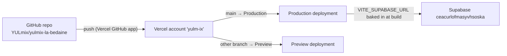

# Live environment audit

What the **running** system looks like, as opposed to what the repo says. Established on
**2026-09-18** by read-only inspection of the live Supabase project, the Vercel/GitHub deployment
records, and the deployed JS bundle. Nothing was changed in either service.

This document exists because the rest of `docs/` was written from the repo alone. Where a claim here
contradicts another doc, **this one wins for live behaviour** — but re-run the commands in
[How to re-verify](#how-to-re-verify) before relying on it; the live systems change and this file
does not.

Each finding is tagged **Verified** (observed directly, with the method given) or **Inferred** (a
reasonable reading of evidence, not confirmed by the people who would know).

## Summary

| Question | Answer | Status |
|---|---|---|
| Which Supabase project does production use? | `ceacurlofmasyvhsoska` ("YULmix - La Bedaine", `ca-central-1`) | Verified |
| Is it the same DB the repo's `.temp` link points at? | Yes | Verified |
| Where does production deploy? | A Vercel account slug `yulm-ix`, **not** the `YULMIX-Labedaine` team | Verified |
| How does a deploy start? | Vercel's GitHub integration: push to `main` → Production, other branches → Preview | Verified |
| Is production running the latest `main`? | **No.** `65a6171` was blocked; production is on `a2cec16` | Verified |
| Why was it blocked? | Most likely the Hobby-plan rule that only the account owner can trigger deploys of a private repo | Inferred |
| Was emptying `supabase/schema.sql` deliberate? | **Undetermined** | see [below](#the-emptied-supabase-schema-sql) |
| Does the old `schema.sql` still describe the live DB? | Yes at the level of names; not proven for function bodies | Verified (names) |
| Were the two views a data leak? | Read access: **yes, measured**. Write access: plausible, never tested. **Fixed 2026-09-18** | Verified |

## Deployment



- **Trigger — Verified.** `gh api repos/YULmix/yulmix-la-bedaine/deployments` lists 14 deployments,
  all created by `vercel[bot]`: `Production` for commits on `main`, `Preview` for the docs branch.
  There is no `.github/` directory and no Actions secrets, so **no CI gate exists** — Vercel builds
  whatever is pushed.
- **Which Vercel account — Verified.** Deployment URLs and the commit status link are all under
  `…-yulm-ix.vercel.app` / `vercel.com/yulm-ix/…`. `vercel teams ls` for the `ceffo` login shows only
  `YULMIX-Labedaine` (Hobby), and `vercel projects ls` there returns **no projects**;
  `--scope yulm-ix` errors with "scope does not exist". So the project that actually serves
  production is in an account the current maintainer cannot see. *Unknown:* whether `yulm-ix` is a
  personal account or a team, and who owns it.
- **Environment variables — Unverified.** They live in that inaccessible project. `vercel.json`
  declares `VITE_SUPABASE_URL` and `VITE_SUPABASE_ANON_KEY` with **empty-string** values
  (`vercel.json:9-12`). It is not established whether those empty strings shadow the dashboard
  values; the app evidently works in production, so today they do not break the build, but the block
  is misleading and worth removing once the project is accessible.
- **What production talks to — Verified.** The last successful production bundle
  (`/assets/index-Drz1cwNv.js` on deployment `…3c5b3qqpa…`, built from `a2cec16`) contains the host
  `ceacurlofmasyvhsoska.supabase.co`. Only the host was extracted; no key was printed.
- **The latest deploy is blocked — Verified.** Commit `65a6171` (merge of PR #1): deployment status
  `failure`, description *"Deployment was blocked"*. The previous commit `a2cec16` succeeded. The
  preview for `390e083` failed with *"Git author ceffo must have access to the project on Vercel to
  create deployments."* The block on `65a6171` gives no reason of its own; sharing that cause is an
  **inference**. It matches the stated motive for making the repo public: the free plan only lets
  the account owner deploy a private repo, so a collaborator's commit is refused. Docs-only, so the
  live app is not missing functional changes — but the next code change from anyone but the owner will
  hit the same wall.
- **Correction to earlier docs.** [Architecture](./02-architecture.md#deployment) and
  [Development setup](./07-development-setup.md#deploying) say production "runs on Vercel" via the
  git integration. That is right, but omit that it is a *different account* from the team and that
  deploys are currently being blocked.

### Update, 2026-09-22: access gained, root cause found

**Verified.** The maintainer signed into the shared account behind `yulm-ix`. It is a Vercel *team*
(`YULMix`, Hobby), and that account is its **Owner** — the earlier block was never a Vercel
permissions problem.

The real cause: `YULmix/yulmix-la-bedaine` is a **transferred** repo. Querying its pre-transfer
name, `Dekayd/YULMixLaBedaine`, redirects to the current one with the same numeric repo ID — it used
to be a private repo under `dekayd`'s personal account. `vercel project inspect` shows **no Git
section at all**; every one of the project's 17 deployments (`vercel ls --json`) has
`"importSource": "import-suggestions"` and metadata still naming the old owner
(`githubOrg: "Dekayd"`, `githubRepoOwnerType: "User"`). GitHub Apps are installed per-account, so
the app that used to deploy this repo lost access the moment it moved into the `YULmix` org — that
is what "Deployment was blocked" meant. Confirmed dead: none of the four commits merged to `main`
after gaining Vercel access (`40da184`, `435d7ad`, `37c922e`, `30dee21`) produced any Vercel commit
status at all. Production has stayed up only because someone has been running `vercel --prod` by
hand from a local clone.

Reconnecting `vercel git connect` to the current repo needs a `YULmix` **org owner** (currently only
`Dekayd`) to authorize the Vercel GitHub App for the org — a GitHub-side permission, separate from
the Vercel team ownership above.

**Fix, until that authorization happens:** `.github/workflows/deploy.yml` deploys from GitHub
Actions using the Vercel CLI directly (`vercel pull` / `vercel build` / `vercel deploy --prebuilt`),
which needs no GitHub App access — only a Vercel token and the project/org IDs, held as repo
secrets. See [Development setup → Deploying](./07-development-setup.md#deploying). This also adds
the CI gate (`npm run build`, `npm run test:pricing`) that was missing in front of every deploy.

## Live database

**Verified** by `supabase db query --linked` (catalog `SELECT`s only) and
`supabase db advisors --linked`. No row data was read.

- **Shape.** 5 tables (`profiles`, `events`, `user_parties`, `registration_edits`, `app_feedback`),
  all with RLS enabled; 2 views; 10 functions in `public`; 9 trigger events on `public` tables plus
  `on_auth_user_created` on `auth.users` (8 distinct trigger names in `public`); 16 RLS policies. This matches the object inventory of
  the old `schema.sql` (see below).
- **`admin_set_is_admin` is sound.** It is callable by `anon` and `authenticated`, but the body
  re-checks `is_admin()`, refuses self-change, and refuses to demote the hardcoded root admin
  (`yulmixalabedaine@gmail.com`, also hardcoded in `is_admin()` and `handle_new_user()`).
- **The two views were `SECURITY DEFINER` — fixed 2026-09-18 (see below).** `user_event_history` and `registration_summary_view` are
  owned by `postgres`, have no `security_invoker` option, and `authenticated` holds
  `SELECT, INSERT, UPDATE, DELETE, TRUNCATE…` on both. Supabase's advisor rates both **ERROR**. This
  confirms what [Security & RLS](./06-security-and-rls.md) and [Data model](./03-data-model.md)
  left as "verify against the live DB": it is **not** resolved.
  - `user_event_history` (`src/views/AdminView.jsx:348`, the only use in the code) joins `profiles`,
    `user_parties`, `events` with no per-user filter. Because it bypasses RLS, **any signed-in user
    can read every member's email, name, amount owed and payment status** through the REST API.
    Verified from the view definition and grants; not exercised as a normal user.
  - `registration_summary_view` is referenced by **no code** in `src/`. It is a plain single-table
    view over `user_parties`, so it may also be *writable*, letting a member alter another member's
    row (e.g. `payment_status`) past RLS. **Untested** — proving it means a write to production, so
    do it on a copy.
  - **Measured before the fix**, as a non-admin user, read-only: the tables showed 1 registration and
    1 profile (their own); `user_event_history` returned 2 rows covering 2 different members and
    `registration_summary_view` returned 2 rows.
  - **Fix applied 2026-09-18** by `supabase/fix_views_security.sql`: `registration_summary_view`
    dropped (unused); `user_event_history` set to `security_invoker = true` with `SELECT` granted to
    `authenticated` only. **Verified after**, read-only: non-admin sees 1 row / 1 member through the
    view; the root admin sees 2 of 2; the security advisor reports 0 ERRORs (was 2). *Not verified:*
    the admin screen in a real browser session — check that member history still loads.
- **Other advisor warnings (WARN).** All 10 functions have a mutable `search_path`; trigger
  functions are executable via `/rest/v1/rpc/…` by `anon` and `authenticated`; leaked-password
  protection is off in Auth.
- **Not yet checked.** Auth settings (email confirmation on/off — relevant because the root admin is
  identified by email), storage buckets, and the `seed_test_data` RPC that
  `src/__tests__/rlsPolicies.test.js:54` calls (it is **not** among the live functions, and that
  test handles its absence).

## The emptied `supabase/schema.sql`

**Facts (Verified, from git):**

- On `main`, `supabase/schema.sql` is 3 bytes — a UTF-8 BOM and nothing else.
- Commit `a2cec16` ("Fixed Admin Event Save", `dekayd`, 2026-09-17 23:54 -0400) took it from 597
  lines to that. The full file survives at `a2cec16^` and on the stale branch
  `origin/docs/add-some-documentation`.
- The same commit added `fixed.txt`, `test.txt`, `oldblock.txt` (BOM-prefixed scratch copies of one
  function; `fixed.txt` contains `AS $` where `AS $$` belongs), `fix_admin_function.sql`, and
  `remote_schema.sql` (a CSV export of the live DB, not SQL), plus 9 `supabase/.temp/` CLI files.
  Its message only mentions the admin event-save fix.
- No code, script or CI reads `schema.sql`; only `.clinerules` names it as the place to put schema
  changes.

**What the old file was worth (Verified, names only).** Every live column, both views and every
trigger name I checked appears in `a2cec16^:supabase/schema.sql`, and policy/function counts match
(16 / 10). So until then the file was a faithful description of the live schema. It already had a
known defect: `admin_set_is_admin` was defined with a duplicated `LANGUAGE`/`SECURITY DEFINER`
clause, which is what `fix_admin_function.sql` says it repairs. The live function is the repaired
one, so the file was slightly *behind* the database.

**Was it deliberate? Undetermined.** The circumstantial picture leans toward accident — an unrelated
commit message, scratch files with BOMs and truncated delimiters landing in the same commit, a
copy-paste-into-editor workflow — but nothing in the repo records an intent, and the author is the
only one who can say. **Ask them.** Until answered, treat the file as *lost, not retired*, and do not
delete the history that holds the good copy.

**If it turns out to be an accident** the natural repair is: restore `a2cec16^:supabase/schema.sql`,
apply the corrected `admin_set_is_admin` from `fix_admin_function.sql` into it, fix the view
definitions (see above), and delete `fixed.txt`, `test.txt`, `oldblock.txt`. That also unblocks
[ADR 0002](./adr/0002-single-schema-file-no-migrations.md), whose premise is that this file exists.

## How to re-verify

Requires `supabase` and `vercel` CLIs, logged in, and `gh`. Everything below is read-only.

```bash
supabase link --project-ref ceacurlofmasyvhsoska
supabase db advisors --linked --type security
supabase db query --linked -o json "select relname, relrowsecurity from pg_class where relnamespace='public'::regnamespace and relkind in ('r','v')"
supabase db query --linked -o json "select relname, reloptions from pg_class where relnamespace='public'::regnamespace and relkind='v'"
supabase db query --linked -o json "select tablename, policyname, cmd, qual, with_check from pg_policies where schemaname='public'"

gh api repos/YULmix/yulmix-la-bedaine/deployments --jq '.[]|[.environment,.ref[0:7],.created_at]|@tsv'
gh api repos/YULmix/yulmix-la-bedaine/commits/main/status --jq '.statuses[]|[.context,.state,.description]|@tsv'
vercel teams ls && vercel projects ls
```

## Open questions (need a person, not a tool)

1. Who owns Vercel account `yulm-ix`, and can the maintainer be added or the project transferred to
   the team? Until then env vars, domains and deploy logs are invisible to us.
2. Was `schema.sql` emptied on purpose? (`dekayd`)
3. What is the Auth configuration — email confirmation, signup allowed, redirect URLs?
4. Is the `Kill this` Supabase project (`fjnqlhztdiuzegkywddu`, inactive) safe to delete? Nothing in
   the repo references it.
