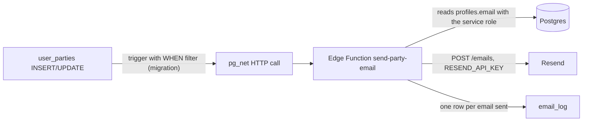

# Transactional email is sent by one Supabase Edge Function, triggered from Postgres

[Issue #12](https://github.com/YULmix/yulmix-la-bedaine/issues/12) needs five emails (registration
confirmation, waitlist notice, waitlist promotion, payment confirmation, accommodation assigned),
each caused by a change to a `user_parties` row. This is the first thing that has to run on a
server, the case [ADR 0001](./0001-supabase-as-the-only-backend.md) predicted. We make a narrow
exception to "no backend of our own": **a single Supabase Edge Function, `send-party-email`, called
by a Postgres trigger, sends the email through Resend's REST API.** Nothing else runs server-side,
and the SPA still never talks to it.

**Constraint: $0 budget** (see [ADR 0015](./0015-dedicated-preview-supabase-project.md)). Resend's
free plan (100 emails/day, 3,000/month) and Supabase's free Edge Function allowance (500,000
calls/month) cover a yearly event of about 40 parties with a wide margin. Neither bills overages
on the free plan; they refuse the request, so the failure mode is a lost email, not an invoice.
Provider research: [`docs/research/2026-09-25-transactional-email-provider.md`](../research/2026-09-25-transactional-email-provider.md).

**Status: accepted.**

## Considered options

- **Resend's Supabase integration.** Rejected: it only sets Resend as Supabase Auth's SMTP server.
  Auth sends login-flow emails only, and this app signs in with OAuth, so it would send nothing.
- **Resend's Vercel integration plus a Vercel Function.** Rejected: the Vercel deployment is a
  static SPA. The function would be a second backend on a second platform. Postgres would still
  have to call out to it, and it would need its own shared secret and a Supabase service-role key.
  Its only gain is that the integration sets `RESEND_API_KEY` for us. A key in Vercel env vars is
  also one `VITE_` prefix away from being bundled into public JavaScript.
- **Sending from the browser after a save.** Rejected: an admin's bulk edit, a trigger-driven
  waitlist promotion (#37) or a direct SQL change would never email anyone, and the API key would
  have to be public.

## Consequences

- **The trigger only knocks; the function decides from state.** The trigger is created in a
  migration (ADR 0013/0014) with a `WHEN` clause, so unrelated edits (transport, dietary notes)
  never call the function. It sends only the party id. The function reads the committed row and
  `email_log` and sends what is owed and not yet logged, so a repeated, late or forged call can't
  send a wrong or duplicate email. That is why the function can run without JWT verification and
  needs no shared secret with the database.
- **The daily cap is the real limit.** Emails fire on state changes only: first registration,
  waitlisted, promoted, payment becoming `paid`, and a party's beds going from none assigned to
  some. Later bed reshuffles don't resend. A refusal from Resend (rate limit or quota) is logged
  and not retried.
- **`email_log` is our delivery record.** Resend's free plan keeps logs for 30 days, and an
  organiser may need to check a year later whether someone was told they were promoted. The same
  table makes the function idempotent: pg_net can call it twice, and a template already sent for
  that party and transition is not sent again.
- **Only production sends.** `RESEND_API_KEY` is set with `supabase secrets set` on the production
  project only. Local Supabase has no key, and the function logs the email it would have sent
  instead. This protects the quota and keeps fake seeded addresses from bouncing and damaging
  `yulmix.com`'s sender reputation.
- **The function URL is per-environment data, not schema.** It lives in `private.settings`: the
  local seed sets it, CI writes the production one after deploying the function. Preview loads the
  same seed, whose URL only resolves locally, so nothing is sent there; where it is unset, the
  trigger does nothing. CI refuses to deploy while production has no
  `RESEND_API_KEY`, so production never records real registrations as dry runs that would then
  never be emailed.
- **Existing registrations are backfilled.** The migration that creates `email_log` records every
  party's current state as `backfilled`, so the first change after deploying doesn't email people
  about things that happened weeks earlier.
- **The key is narrow.** A Resend "Sending access" key restricted to `yulmix.com`, never a full-access
  key. It lives only in Supabase's secret store, never in the repo or in Vercel.
- **CI deploys the function.** After migrations on merge (ADR 0014), `supabase functions deploy`
  runs against production when `supabase/functions/` changes. A function change is reviewed in its
  PR like a migration, and its Deno tests run in the build job.
- **Sender identity.** Mail is sent from an address on `yulmix.com` with Reply-To
  `yulmixalabedaine@gmail.com`. The Gmail address still appears in the body as the Interac
  recipient.
- **Code in Deno.** Edge Functions run Deno, unlike the Node/Vite app. Sending is one `fetch`, so no
  Resend SDK is needed. The fr-CA templates live with the function, not in `src/locales/fr.json`,
  which only the SPA reads.
