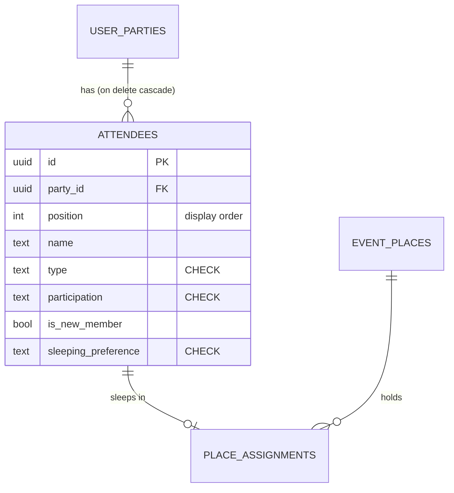

# Attendees live in their own table, not in a JSON array

[ADR 0004](./0004-per-attendee-logistics-inside-attendees.md) put each registration's attendees in
`user_parties.attendees`, a JSONB array, so that the form could load and save one row. That held
while nothing needed to point at a person. Sleeping places ([#112](https://github.com/YULmix/yulmix-la-bedaine/issues/112))
are the first feature that does, and building them on the JSON took a trigger to stamp ids into it,
rules against forging or duplicating those ids, name matching for clients that don't send them,
a trigger to delete assignments when someone leaves the array, and a copy of the assignment inside
the JSON kept in sync by five more (draft PR [#125](https://github.com/YULmix/yulmix-la-bedaine/pull/125)).
**Attendees become rows of an `attendees` table, referenced by foreign key; `user_parties` keeps
no derived copy of attendee data** ([issue #126](https://github.com/YULmix/yulmix-la-bedaine/issues/126)).

**Status: accepted** (September 2026), not yet implemented. Supersedes ADR 0004.

## Why

- **Referential integrity.** Anything about a person (a place, and later maybe a payment or a
  check-in) is a foreign key with a cascade, not an id inside JSON that triggers have to protect
  and clean up after.
- **One copy of each fact.** A value that can be derived is derived at read time (a view, an embed),
  not stored and kept in step by triggers. That applies to the sleeping label and to what the JSON
  already duplicated: `counts` (derived from the array) and `logistics.sleeping` (copied from the
  first attendee).
- **A validated shape.** ADR 0004 noted that nothing validated an attendee object, and the
  `tier` vs `type`/`participation` mismatch (#34) was that contract breaking silently. Columns with
  `CHECK` constraints replace the convention.
- **Changing the model is expected.** We normalise when a feature needs it, rather than bending the
  feature around a JSON column.

## Consequences

- The registration form writes two tables, which PostgREST can't do in one transaction. Registrations
  are saved through one function, `save_registration(...)` (`SECURITY INVOKER`, so RLS still
  applies), which writes the party and its attendees and recomputes the party's derived fields
  (amount owed, waitlist). It is the single write path for members and admins.
- Every trigger that reads `user_parties.attendees` moves to the table: amount owed and the price
  lock, capacity and waitlist, waitlist promotion, the close-date lock, the audit log, and the
  email trigger. The Edge Function reads attendees and places through a join.
- Reads embed attendees (`user_parties(*, attendees(*))`, ordered by `position`), so most screens
  still get an array. `pricingEngine.js` doesn't change.
- A one-off migration backfills the table from the JSON. Every party's attendees, order and amount
  owed must come out identical.
- ADR 0004's per-attendee logistics stand: they are columns of `attendees` now.
