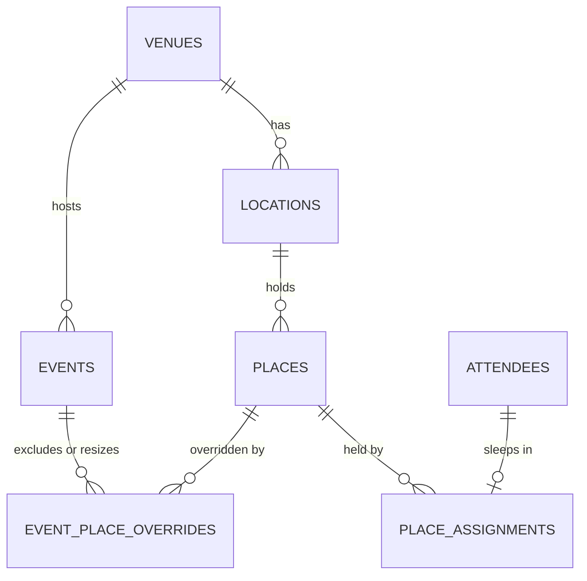

# Venues are shared by events; what differs per edition is an override

Sleeping locations and places were defined per event (#112, #113): every location had an
`event_id`. The same venue hosts edition after edition, so its rooms were typed in again each time,
and a copy made by hand drifts from the house it describes
([#137](https://github.com/YULmix/yulmix-la-bedaine/issues/137)). **A venue (name, address,
locations, places) is defined once and reused; an event uses one venue; what is particular to one
edition (a place unavailable, another capacity) is stored against the event, never by editing the
venue** ([issue #145](https://github.com/YULmix/yulmix-la-bedaine/issues/145)).

**Status: accepted** (September 2026), implemented by #145 (migration
`20260929162040_shared_venues.sql`). Supersedes the "per event" part of #112 and the location copy
of #116.

## Decisions

- **Venue** (UI « Site ») → **location** (« Lieu ») → **place** (« Place »). `event_locations` and
  `event_places` became `locations` and `places`; a location has a `venue_id`, not an `event_id`.
- **One venue per event**, `events.venue_id`, NULL until picked. The address is the venue's;
  `events.venue_address` is gone, and members read it through the embedded venue.
- **Per-edition differences are overrides.** `event_place_overrides (event_id, place_id)` holds
  `is_excluded` and an optional `capacity`. Editing the venue from an event is not a thing: the
  event editor picks the venue and overrides places (#147).
- **Assignments stay per event.** An attendee holds a place of their event's venue, not one the
  event excludes. Two events at one venue assign the same places to their own people.
- **Excluding a place someone of that event holds is refused**, like deleting an occupied place:
  the organiser moves them first. Nobody silently loses their bed.
- **Changing an event's venue clears its assignments and overrides**, in the database; the UI names
  who is affected and asks first.
- **Venues are archived, never deleted** (as events, [ADR 0008](./0008-archive-never-delete.md)):
  no `DELETE` grant, an `archived_at` instead.
- **Existing data**: each event with locations (or an address) got a venue of its own, its
  locations moved there, assignments unchanged.

## Consequences

- A change to a venue shows in every event held there that isn't archived. An archived event keeps
  the layout it had: archiving copies its venue ([ADR 0020](./0020-freeze-archived-event-layout.md), #148).
- The event editor's Couchage section edits the event's venue (and creates it if the event has
  none) until the venues tab (#146) and the venue picker (#147) exist.
- Occupancy is always per event: counting a place's occupants means counting the assignments of
  one event's attendees, never every assignment of the place.
