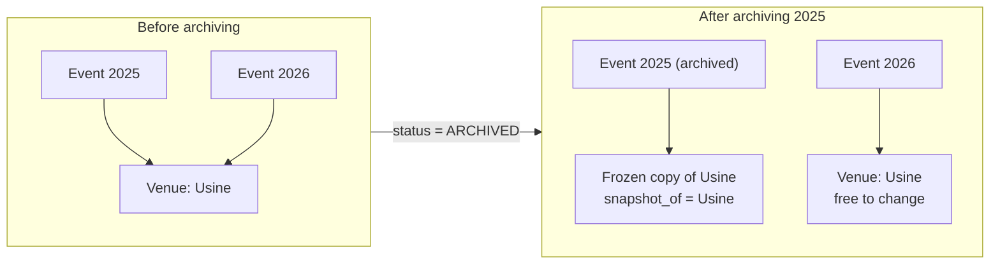

# An archived event keeps its layout: archiving copies its venue

Since [ADR 0019](./0019-shared-venues.md) an event reads its locations and places from a shared
venue, so renaming, resizing or removing a place would rewrite what past editions show, and the
places a past edition's attendees held could never be deleted
([issue #148](https://github.com/YULmix/yulmix-la-bedaine/issues/148)). **When an event is
archived, the database copies its venue (locations, places) into a frozen venue that only this
event uses, and moves the event, its assignments and its overrides onto the copy in the same
transaction.**

**Status: accepted** (September 2026), implemented by #148 (migration
`20260929181259_freeze_archived_event_layout.sql`).

## Options considered

- **Copy the venue on archive (chosen).** The copy is ordinary rows in `venues`, `locations`
  and `places`, so every reader (`attendee_places`, bed labels, the editor, emails) shows an
  archived edition exactly as it was, with no second code path. The live venue's places are no
  longer held by past assignments, so they can be edited and deleted freely.
- **A JSON snapshot on the event.** Smaller, but every screen that shows an archived event would
  need to read the snapshot instead of the tables, and the past assignments would still point at
  live places, blocking their deletion. Rejected (decided with the organisers, 2026-09-29).

## Decisions

- `venues.snapshot_of` marks a frozen copy and names the venue it copies. A copy is archived from
  birth, never listed in the Sites tab (its event shows under the venue copied), and its layout
  can't change: inserting, editing or deleting its locations or places, or renaming it, is refused
  (`venue_layout_frozen`). Archiving or restoring the copy row itself is harmless and allowed.
- An archived event's venue link and overrides can't change (`event_layout_frozen`): changing its
  venue would clear who slept where.
- The freeze runs in a trigger on the archive transition, as the table owner, and lets its own
  writes through the guards with a transaction-local setting (`bedaine.freezing_event`) that
  clients can't set.
- Un-archiving (not offered by the app) leaves the event on its copy, with its assignments; picking
  a live venue again then clears its places like any venue change. Archiving it again copies
  nothing more.
- Existing archived events on a venue were frozen by the migration.

## Consequences

- Each archived edition adds one venue row and a copy of its locations and places: a few dozen
  rows a year.
- A copy keeps the venue's name and address as they were; renaming the live venue doesn't reach
  past editions, by design.
