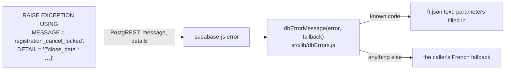

# Database errors are codes; the app translates them

Our SQL used to raise user-facing sentences, most in French and some in English
(`RAISE EXCEPTION 'Les événements ne peuvent pas être supprimés…'`). The app showed them by
putting `err.message` straight into toasts and banners. That broke "French for users, English
for code" in two ways. Rewording a message needed a migration. And any other error (an RLS
refusal, a network failure, a PostgREST error) reached users as raw English text
([issue #102](https://github.com/YULmix/yulmix-la-bedaine/issues/102)). **Every error our SQL raises
is now a stable English code, with its parameters as JSON, and the app maps the code to French.
The app never displays a raw error message.**

**Status: accepted** (September 2026). PR #100 (#36) started it. #102 converted the remaining
functions (migration `20260930200216_database_errors_are_codes.sql`).

## Decisions

- **In SQL, raise a code.** Write `RAISE EXCEPTION USING MESSAGE = '<snake_case_code>'`. Add
  parameters as `DETAIL = json_build_object(...)::text`, and pass raw values (a date, a name),
  never formatted text: the app formats them (dates in fr-CA). Keep the SQLSTATE the rule calls
  for (`check_violation`, `42501`…) in `ERRCODE`.
- **In the app, map it.** `dbErrorMessage(error, fallback)` looks the code up in `src/lib/dbErrors.js`
  and returns the `fr.json` text with its parameters filled in. For any other error it returns
  `fallback`, a specific French sentence chosen by the caller, never the error's own message.
  `console.error` still logs the raw error for debugging.
- **The app's own errors.** When app code throws an error whose text is already French from
  `fr.json`, it uses `appError(fr.someKey)`, and `dbErrorMessage` shows it as is. A plain
  `new Error(...)` gets the fallback like any other unknown error.

## Consequences

- A new `RAISE` needs three things in the same PR: the code in SQL, an entry in `dbErrors.js`, and
  a `fr.json` key. Without the entry, users see the caller's fallback, which is vague but never raw.
- Tests that check SQL errors (the RLS suite) match the code and its details. End-to-end tests
  match the mapped `fr.json` text.
- Rewording an error is a `fr.json` change, not a migration.
- Supabase Auth errors and Edge Function errors aren't ours to code, so they go through the same
  fallback when displayed.
