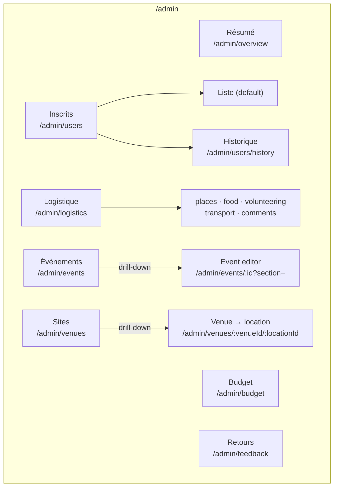

# Admin navigation: seven flat sections, one switcher per level, two page widths

Every admin feature added its own tab, sub-view or card wherever it fit. By October 2026 the admin
had 7 tabs, which filled the phone's 7-column bottom bar with no room for an 8th. Each nested level
had its own switcher (pills, a custom tablist, back buttons). « Outils » had become a catch-all,
and dense lists shared the narrow page with forms. On a 1280×800 laptop, the chrome above the
change history took 533 px ([issue #190](https://github.com/YULmix/yulmix-la-bedaine/issues/190),
[#189](https://github.com/YULmix/yulmix-la-bedaine/pull/189)). **The admin has seven flat sections,
reached from a sidebar on desktop and from a bottom bar plus « Plus » on phones. Each level has one
switcher. Every view is either dense or narrow, and the URLs are paths.**

**Status: accepted** (October 2026), decided in the design pass
[#191](https://github.com/YULmix/yulmix-la-bedaine/issues/191). It is implemented by #196 (routes),
#195 (one module per section), #208 (shell), #209 (dissolve Outils), #210 (drill-down pages) and
#211 (member pages). The shell (#208) is in: the registry is `src/lib/adminSections.ts`, the
navigation `src/components/admin/AdminNav.jsx`.

## Decisions

- **Who uses it, and where.** Organisers use the admin on a phone for everything, not only at
  the event. Every section is first-class on a phone.
- **Seven flat sections, no groups:** Résumé, Inscrits, Logistique, Budget, Événements, Sites,
  Retours. Grouping them (« Cette édition » / « Configuration ») and merging some (Budget into
  Résumé, Sites into Événements) were both rejected: they hide sections without saving a tap.
- **« Outils » is dissolved, and nothing becomes a catch-all again.** The change history is
  Inscrits' « Historique » view, because it logs registrations. The data export is an « Exporter »
  action in the Inscrits header, because it exports registrations. The feedback inbox is its own
  section, « Retours », with a count of unresolved items. A new screen goes where its data
  lives, or becomes a section; it never goes into a miscellaneous bucket.
- **Desktop (≥ `md`).** The app header stays (logo, Infos, Covoiturage, account). Below it, a
  left sidebar lists the sections, and the active section's views are nested under it. There are
  no view pills on desktop.
- **Phone (< `md`).** A bottom bar in the thumb zone shows Résumé, Inscrits, Logistique and
  Budget, plus « Plus », a bottom sheet with Événements, Sites and Retours. A section's views
  show as the shared `ViewTabs` pills under its header. Markers (unsaved draft, unresolved
  feedback) show on the bar item, or on « Plus » when the marked section is behind it.
- **One section registry** declares each section's id, labels, icon, views, page width and
  marker. The sidebar, the bottom bar, « Plus » and `ViewTabs` all render from it.
- **Less chrome.** The « ADMIN » page title goes. Each page opens with one line: its title and
  its actions. Target: content starts at about 160 px or less on 1280×800.
- **Drill-down pages** (the event editor, venue → location) keep their parent section active.
  They open with a back link naming the parent (« ← Événements ») and a title, and their own
  sections use the shared `ViewTabs`. The party edit stays a dialog (a bottom sheet on phones).
- **Two page widths.** Each view declares its width, and the shell applies it:
  - **dense** (lists, logs, tables: Inscrits, Logistique, Historique, Retours): full width,
    with the list scrolling inside a box that ends on screen (« one scrollbar at a time »,
    `useFitToViewport`);
  - **narrow** (forms, summaries, the event editor's details): a max width of about `3xl`.
- **URLs are paths with English ids:** `/admin/<section>/<view>`, and the default view has no
  segment. One pure admin routes module parses and builds them. Every older URL (`?tab=`, `?view=`,
  `?venue=`, `?location=`, the Outils views) redirects to its path with `replace`, so the
  bookmarks and links already shared keep working.
- **Member pages keep their navigation** (header links, no bottom bar). Home, `/inscription` and
  Infos are narrow, and `/carpool` is dense if its board needs the width.

## Consequences

- An 8th section adds one row under « Plus » and one entry in the sidebar. The phone bar stays
  at four plus « Plus ». Changing which sections are in the bar is a decision, not a side effect
  of order.
- Sections become independent modules (#195). The shell mounts only the current section, so
  drafts live in stores rather than in a component that stays mounted.
- Reviewers check a new screen against the rules in the
  [frontend guide](../05-frontend-guide.md#adding-an-admin-section-or-view): where it lives, which
  width it has, and which switcher reaches it.
- `.ulpi/design/redesign.md` §2 describes the information architecture this replaces, and
  points here.
