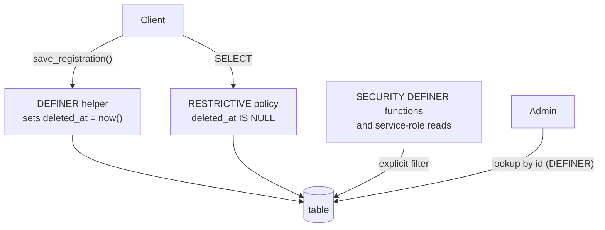

# No hard deletes: removed rows keep their `deleted_at`

Removing someone from a party used to `DELETE` their `attendees` row, which left anything that
referred to them by id (#236's « Payé par », the change history) pointing at nothing
([issue #237](https://github.com/YULmix/yulmix-la-bedaine/issues/237)). **Data the app removes is
marked removed, not deleted, in the database.** Attendees are the first application.

**Status: accepted** (October 2026), implemented for attendees by #237 (migration
`20261003222508_soft_delete_attendees.sql`). Other tables adopt it when they are next touched.

## The rule, table by table

| Table | Removal |
|---|---|
| `events` | archived, never deleted ([ADR 0008](./0008-archive-never-delete.md)) |
| `profiles` | `deleted_at` (account deletion), already the precedent |
| `attendees` | `deleted_at` (#237) |
| others | not yet covered; a table moves to this rule in the PR that changes how it is removed |

Rows that are pure join or derived data (`place_assignments` of a removed attendee) may still be
deleted: they hold no identity anything refers to.

## The pattern

- A `deleted_at timestamptz` column, NULL while live. Never a boolean: it says when, and it
  matches `profiles.deleted_at`.
- A **RESTRICTIVE** SELECT policy `deleted_at IS NULL`, so it is ANDed with whatever permissive
  policies exist and survives their being rewritten.
- RLS does not apply to `SECURITY DEFINER` code or the service role, so **every such function and
  every service-role read filters `deleted_at IS NULL` itself** (counts, capacity, amounts owed,
  snapshots, Edge Functions). A new reader that forgets is the main risk of this pattern.
- A `SECURITY DEFINER` helper does the soft delete; no client can write `deleted_at`, and nothing
  restores a removed row.
- Uniqueness and exclusion constraints are **partial or `EXCLUDE ... WHERE (deleted_at IS NULL)`**,
  so a removed row does not block a live one (a position, a place). Foreign keys stay as they are.
- Admins resolve a removed row by id with a dedicated `SECURITY DEFINER` lookup
  (`attendee_by_id()`), not by relaxing the policy.

## Options considered

- **`deleted_at` plus a restrictive policy (chosen).** One column, the existing tables and
  queries, hiding enforced by Postgres for every client.
- **A boolean flag** (`is_deleted`). Loses when; inconsistent with `profiles.deleted_at`. Rejected.
- **A view in front of the table** that clients read instead. Two names for one thing, writes
  and embeds (PostgREST) need the view everywhere, and the base table stays readable by mistake.
  Rejected.
- **Archive tables** (move the row to `*_deleted`). Foreign keys can't point at the moved row, so
  the dangling reference we wanted to fix remains, and every move copies the schema. Rejected.

## Consequences

- Every new reader of a covered table must filter in its definer code; the RLS suite has a case
  per reader (see « removed attendees (#237) »).
- Removed rows accumulate. Personal data in them is still subject to account deletion
  ([ADR 0008](./0008-archive-never-delete.md) and the `profiles` erasure), not to this rule.
