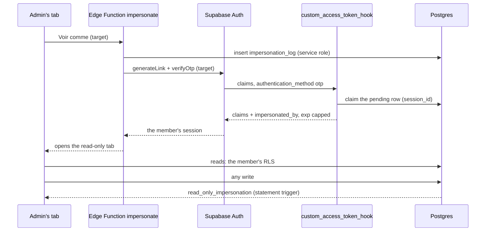

# « Voir comme »: an admin views the app in a member's real, read-only session

Admins regularly need to see what one member sees: why someone's summary looks wrong, what
Comité sees on an edition, whether a fix worked for that person. Rendering member screens inside
the admin's own session would show what *the admin's* RLS returns, which is everything, so it
proves nothing about the member's view
([issue #106](https://github.com/YULmix/yulmix-la-bedaine/issues/106)). **« Voir comme » opens a
real Supabase session of the member, marked as impersonated by a claim in its JWT, valid 30
minutes, and the database refuses every write made with it.**

**Status: accepted** (October 2026), decided with the organiser while grooming #106. Database
side: #265 (migration `20261004183537_impersonation.sql`). The `impersonate` Edge Function is
#266, the UI #267, enabling the hook in the production and Preview dashboards #268.

## Decisions

- **A real member session, not a simulated one.** The point is to run the member's RLS,
  `edition_role()` and `SECURITY DEFINER` functions exactly as they run for them. "As if Comité" is
  never an override: to see what Comité sees, impersonate someone who is Comité on that edition.
- **Minting: a magic link verified server side, marked by a custom access token hook.** Both
  Supabase projects sign tokens with managed ES256 keys (their public JWKS), so we can't sign a
  token ourselves; the legacy HS256 secret isn't used. The Edge Function inserts an
  `impersonation_log` row with the service role, generates a magic link for the member and
  verifies it at once (`generateLink` + `verifyOtp`). Supabase Auth then calls
  `public.custom_access_token_hook`, which adds `impersonated_by` (the admin's id) and caps `exp`
  at the row's `expires_at`, **only** for a magic-link/OTP sign-in matching a pending row of that
  member created in the last 60 seconds. It ties the row to the session (`session_id`) and, on
  every refresh of that session, keeps the claim and the cap, or refuses the token once the row
  has expired or ended. Every other token passes through unchanged: members sign in with Google,
  never by magic link, so no member session is ever marked.
- **Read-only is one trigger on every table.** `private.refuse_when_impersonating()` runs
  `BEFORE INSERT OR UPDATE OR DELETE ... FOR EACH STATEMENT` on every table in `public` and
  `private` and raises `read_only_impersonation` when `auth.jwt()` carries `impersonated_by`.
  Triggers fire inside `SECURITY DEFINER` functions too, so `save_registration()`,
  `save_logistics()`, `set_payment_status()`, `delete_my_account()` and the rest are covered
  without a guard of their own. The RLS suite fails when a table lacks the trigger, so a new
  table can't silently escape it. Storage isn't one of our tables, yet members write it (uploads
  to the `feedback` bucket): RESTRICTIVE policies on `storage.objects` refuse INSERT, UPDATE and
  DELETE from a session carrying the claim.
- **30 minutes, not extendable.** The database sets `started_at` and `expires_at` on insert and
  refuses pushing `expires_at` back; « Quitter » sets `ended_at`, which ends that session only.
- **One pending row per member.** The hook claims the member's newest pending row, so two admins
  opening « Voir comme » on the same member within the same minute could each get the other's row
  (the log would say the wrong admin). The insert is refused (`impersonation_target_pending`, with
  a partial unique index as the backstop) while a claimable row exists; a pending row older than
  60 seconds, which no sign-in can claim any more, is ended by the next insert. The Edge Function
  (#266) shows that refusal as « try again in a minute ».
- **Admins only; targets are active non-admin accounts.** Members, Comité and Organisateur can be
  viewed; an admin, a deleted account or oneself can't (a trigger on `impersonation_log`; the Edge
  Function refuses them too). Admins already see everything, so viewing one adds a privilege path
  for no testing value.
- **Members are told nothing.** No mention in « À propos »; the log is for admins (« Équipe »).

## Options considered

- **Render member screens in the admin's session.** No real RLS, proves nothing. Rejected.
- **Sign a JWT ourselves.** Needs the signing key; the projects use managed ES256 keys. Rejected.
- **RESTRICTIVE policies plus a guard in each `SECURITY DEFINER` function** (the original #106
  design). Policies don't apply inside definer functions, so every function that writes needs its
  own check, and a new one that forgets is an open door. Rejected for the trigger.

## Consequences

- **The hook runs on every token issued.** A bug in it locks everyone out, so it never raises:
  malformed input passes through. On an internal error it fails closed for a session already in
  the log and passes the token through for everyone else. A fresh claim that failed therefore
  yields an unmarked, writable session: the Edge Function must check that the token it got carries
  `impersonated_by` and sign that session out otherwise.
- **The session response's `expires_at` isn't lowered.** Supabase Auth computes it from its own
  JWT lifetime, after the hook; only the token's `exp` is capped. The impersonated tab must read
  `exp` from the token (or treat the refused refresh as the end).
- **What the trigger doesn't cover.** Supabase Auth's own API writes `auth.*`, not our tables:
  an impersonated tab could still call `updateUser()` (email, password, metadata) or a global
  `signOut()`, which would sign the member out everywhere. The UI must sign out locally only and
  never offer account settings; the Edge Function and the UI issues own those limits.
- **Ending a session leans on the hook.** No Auth endpoint deletes a session by id, so the
  function signs a session out only with its own access token (the UI always sends it on end).
  Otherwise, and at natural expiry, the session and its refresh token stay in `auth.sessions`,
  refused by the hook alone. Turning the hook off would let an old « Voir comme » refresh token
  return as an ordinary, writable member session: never disable it, or first sign out every
  session listed in `impersonation_log`.
- **A new table must attach the trigger** in its migration (`CREATE TRIGGER
  trg_refuse_when_impersonating BEFORE INSERT OR UPDATE OR DELETE ON ... FOR EACH STATEMENT
  EXECUTE FUNCTION private.refuse_when_impersonating()`); the catalog test fails otherwise.
- **The hook is configuration, not schema.** Locally `supabase/config.toml` enables it, read at
  `supabase start` (a running stack needs a restart). In production and Preview CI enables it
  by its own job (`scripts/enable-access-token-hook.sh`, #268), never by hand.
