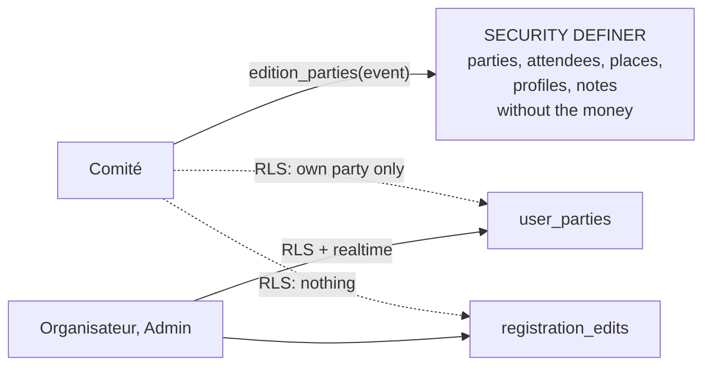

# Comité doesn't see finances

[ADR 0023](./0023-edition-roles.md) gave Comité, the read-only edition role, every registration in
full, payments included: "helpers are trusted organisers, and hiding columns would need a database
function per view". In October 2026 the organisers decided otherwise: the people who help run an
edition (the cooks, the drivers' coordinator) have no business knowing who owes what or who has
paid ([issue #290](https://github.com/YULmix/yulmix-la-bedaine/issues/290)). **Comité no longer
reads a party's finances. Postgres enforces it: Comité reads its edition's parties through one
`SECURITY DEFINER` function that leaves the money out, and no longer reads `user_parties` nor the
change history directly.** Organisateur and above, and admins, are unchanged.

**Status: accepted** (October 2026), decided by the organiser in triage on #290, implemented by
#290: migration `20261005033046_comite_no_finances.sql`, `listEditionParties()`
(`src/lib/parties.ts`), the admin parties store (`src/lib/adminParties.ts`) and `can(role,
'seeFinances')` (`src/lib/editionRoles.ts`). Amends ADR 0023's Comité bullet and its consequences.

## Decisions

- **Finances are a party's amounts and payment status**: `calculated_amount_owed`,
  `locked_selling_price_whole_event`, `locked_ratio_main_whole` and `payment_status`, and what
  derives from them: paid counts (Résumé's « Groupes payés »), totals, and the amounts and payment
  changes logged in the change history. The budget was already Organisateur and above. The event's
  selling price and the tier prices aren't a party's finances: every member sees them.
- **A definer function, not a UI rule.** `edition_parties(event)` (`SECURITY DEFINER`, stable,
  pinned `search_path`) returns the edition's parties as the admin list shows them (attendees in
  order with their place, the registrant's profile, the organisers' notes) for Comité and above on
  the event, and refuses anyone else (`committee_only`). It names the columns it returns, so a
  money column added later stays out. Like every definer reader (ADR 0024) it filters removed
  attendees itself, and it leaves out a deleted account's cancelled registrations as the admin list
  does.
- **Comité loses its direct read of `user_parties` and `registration_edits`.** Those policies are
  Organisateur and above now; one's own rows and admins are unchanged, so a Comité member who
  registered still reads their own registration in full. What Comité reads directly stays:
  attendees and where they sleep (`attendee_places`, the place tables), the registrants' profiles,
  the organisers' notes. Those policies used to reach the event through `user_parties` under the
  caller's RLS; they now ask two definer helpers (`private.edition_team_reads_party()`,
  `private.party_event_id()`). None of them carries an amount or a payment status.
  `user_event_history`, which does, runs as the caller, so Comité sees only its own rows there.
- **Rejected:** moving the money columns to their own table (a wide refactor of every write path
  and of the pricing triggers, for one role), and hiding the columns in React only (the data would
  still reach the browser).
- **Accepted trade-off: Comité's admin screens don't live-refresh.** Supabase realtime follows RLS,
  which no longer shows Comité its edition's parties; its screens reload on navigation and on
  retry. Organisateur and above keep the realtime channel.
- **Screens follow the database**, through one capability, `can(role, 'seeFinances')`
  (Organisateur and above): no « Groupes payés » in Résumé (the strip reflows to three figures), no
  amount nor payment in « Liste », the « Inscription » dialog and the profile dialog. For Comité the
  profile dialog lists the member's registration in the current edition, from the same parties,
  instead of `user_event_history`.

## Consequences

- ADR 0023's "Comité sees payments and private notes. If that ever becomes a problem, the fix is
  restricted functions per view" is what happened, for payments; private notes stay readable to
  Comité.
- Any new screen or export that shows money checks `can(role, 'seeFinances')`; any new read of
  parties for Comité goes through `edition_parties()` (or another definer function that names its
  columns), never a direct read of `user_parties`.
- A new policy or invoker view that reaches an event through `user_parties` under the caller's RLS
  no longer works for Comité: use `private.party_event_id()` or `private.edition_team_reads_party()`.
