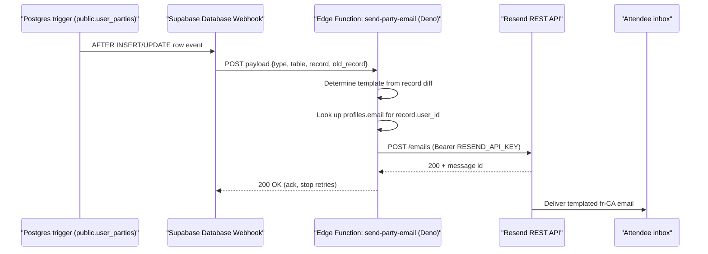

# Transactional email provider for issue #12

Research for [issue #12](https://github.com/YULmix/yulmix-la-bedaine/issues/12) ("[Integration]
Transactional Email Confirmations (French)"), which needs 5 fr-CA templates (registration
confirmation, payment confirmation, accommodation assignment, waitlist notice, waitlist promotion)
fired from lifecycle changes on `public.user_parties`.

## Constraints that shape the answer

- **Supabase is the only backend** ([ADR 0001](../adr/0001-supabase-as-the-only-backend.md)): no
  server of our own. ADR 0001 explicitly calls out email as the thing most likely to break this:
  "Anything genuinely server-side (sending email, scheduled jobs) will be the first thing to break
  this decision. When that happens — probably for confirmation emails — write a new ADR rather than
  quietly adding a function." Any provider we pick has to be reachable from a **Supabase Edge
  Function**, which runs on **Deno**, not Node.
- Volume is tiny and permanent: fewer than 60 users, fewer than 50 emails/day, ~1,500/month, 100%
  French, no marketing sends — five templates fired one at a time.
- No dedicated email-sending domain exists today. The project sends Interac e-transfers from
  `yulmixalabedaine@gmail.com`. The org owns `yulmix.com` as a web domain but per
  `gh issue view 28` / `gh issue view 21` (both open, `ready-for-human`) it has no MX/DKIM/SPF
  records configured yet — those issues are about OAuth redirect domains, not email sending, but
  confirm `yulmix.com` DNS is currently just what's needed for the Vercel web deployment.
- `public.user_parties` columns actually relevant to the triggers (`docs/03-data-model.md:65-66,
  147, 195`): `payment_status` is English (`unpaid`|`paid`, not the French `'Payé'` the issue text
  uses — see [ADR 0012](../adr/0012-migrate-status-columns-to-english.md)), `is_waitlisted` is a
  trigger-computed boolean, and the assigned bed/room note lives at
  `logistics.sleeping.assigned` inside a JSONB column, admin-write only.

## Comparison table

| Provider | Free tier (durable?) | Runtime fit | Domain requirement | Credit card | Notable gotchas |
|---|---|---|---|---|---|
| **Resend** | 100 emails/day, 3,000/month, forever (no stated expiry) — [Resend pricing](https://resend.com/pricing): "100 emails a day" / "3,000" emails/month on the free plan, "3 domains" included | Plain HTTP REST API (`POST https://api.resend.com/emails`, `Authorization: Bearer <key>`) — [Resend API reference](https://resend.com/docs/api-reference/emails/send-email). Supabase's own docs use **plain `fetch`** from Deno, no SDK needed: "const res = await fetch('https://api.resend.com/emails', ...)" — [Supabase: Sending Emails](https://supabase.com/docs/guides/functions/examples/send-emails), and Resend publishes a Supabase-Edge-Functions-specific guide — [Resend: Send emails with Supabase Edge Functions](https://resend.com/docs/send-with-supabase-edge-functions) | Must verify a domain you own to send outside sandbox: "You must add and verify at least one domain to send emails with Resend... Resend sends emails using a domain you own (i.e., not a shared or public domain)" — [Resend: Sending domains](https://resend.com/docs/dashboard/domains/introduction). Records needed: an MX + SPF TXT on a subdomain, plus a DKIM TXT Resend generates; propagation "can take up to 24 hours" — [Resend domain verification search results, corroborated across community docs] | Not stated on the pricing page (unconfirmed either way from Resend's own site) | Sandbox-only sending (no verified domain) is limited to the account owner's own address; once a domain is verified, sending is unrestricted. Cloudflare-proxied ("orange cloud") DNS records won't resolve for Resend's checks — must be DNS-only. |
| **Supabase built-in Auth SMTP mailer** | N/A — not a general email service | N/A | N/A | N/A | Explicitly **auth-flow only**: Supabase's own docs say the built-in mailer covers "email and password accounts," "passwordless accounts using one-time passwords or links sent over email (OTP, magic link, invites)," and social-login confirmations — [Supabase: Auth SMTP](https://supabase.com/docs/guides/auth/auth-smtp). It also caps at **2 messages/hour** by default, has "no SLA guarantee on message delivery or uptime," and Supabase says it's "not [intended] for production applications" — you're told to configure a custom provider (Resend, SES, Postmark, etc.) instead, which itself gets only 30 msgs/hour to start. **This rules it out entirely for issue #12**: it cannot send arbitrary transactional emails (registration confirmation, payment receipt, etc.) outside auth events. |
| **Brevo** (ex-Sendinblue) | 300 emails/day forever, no card, no time limit — [Brevo Free plan FAQ](https://help.brevo.com/hc/en-us/articles/208580669-FAQs-What-are-the-limits-of-the-Free-plan) (confirmed via cached/search result: "Brevo's free plan offers 300 emails a day... completely free forever with no credit card required and no time limit"); the pricing page itself is `https://www.brevo.com/pricing/` but returned no fetchable body during this research — treat the FAQ citation as the primary source and re-verify on the live page before committing | Plain REST API: `POST https://api.brevo.com/v3/smtp/email`, header `api-key: <key>`, JSON body with `sender`/`to`/`subject`/`textContent` (or `htmlContent`) — [Brevo: Send a transactional email](https://developers.brevo.com/docs/send-a-transactional-email). Callable from Deno via `fetch`, no SDK required | Domain-level sender authentication required: verifying a sender publishes a "Brevo code" TXT record plus a DKIM TXT record; Brevo's own material notes "There is no need to set up an SPF record for Brevo, as the 'Envelope From' domain will always be handled by Brevo's servers" (DMARC passes on DKIM alignment alone) — so **2 DNS TXT records**, lighter than Resend/SES's MX+SPF+DKIM set | No card required (per FAQ above) | Two-TXT-record domain verification is the least DNS work of any domain-verifying provider evaluated here. |
| **Mailjet** | 200 emails/day, 6,000/month, no card — [Mailjet pricing](https://www.mailjet.com/pricing/): "6,000 emails/month" with "200 emails per day"; FAQ: "No, there is no credit card required for the free plan at sign up" | REST API, standard HTTP, Node/Python/PHP SDKs exist but a plain `fetch` call works from Deno the same way (not independently re-verified against Mailjet's Deno-specific docs in this pass) | Requires sender/domain verification (not deep-dived here beyond pricing page) | No | Free-tier daily cap (200/day) is generous versus this project's <50/day, but Mailjet wasn't verified in as much depth as Resend/Brevo — treat as a viable but less-vetted option |
| **Amazon SES** | No SES-specific perpetual free-tier email allotment found on the pricing page itself — AWS's own pricing page speaks only of a general "$200 in AWS Free Tier credits" for new customers, usable "within 12 months" — [AWS SES pricing](https://aws.amazon.com/ses/pricing/). Historically SES had a free 62,000 emails/month tier when sent from an EC2 instance; current pricing page text found here does not restate that, so it should be reconfirmed before relying on it | REST/SDK (`SendEmail` API via SigV4-signed HTTP calls); works from Deno via manual signing or a Deno-compatible AWS SDK, but there is real integration friction versus a bearer-token REST call | No email-specific domain TXT walkthrough was fetched in this pass, but SES requires verifying every sending identity (domain or address) regardless of sandbox status: "you still have to verify all identities that you use as 'From'... addresses" — [AWS: Request production access](https://docs.aws.amazon.com/ses/latest/dg/request-production-access.html) | Yes — requires a full AWS account (billing profile) | **Sandbox mode is a hard blocker for this exact use case**: "You can only send mail to verified email addresses and domains... You can send a maximum of 200 messages per 24-hour period... 1 message per second" until you request production access, which needs a manual AWS review (~24h turnaround) — [AWS: Request production access](https://docs.aws.amazon.com/ses/latest/dg/request-production-access.html). Real attendees' inboxes (Gmail, Hotmail, etc.) would bounce until that review completes and is approved. SigV4 auth adds real Deno-Edge-Function complexity versus a bearer token. |
| **Postmark** | **No durable free tier for this project's volume**: "All new accounts start off on our free developer plan with 100 emails per month... it doesn't expire" — [search-derived from Postmark's own pricing/support pages]. 100/month is below the stated need (up to ~1,500/month), even though it's not a time-limited trial | REST API (bearer-token style `X-Postmark-Server-Token` header), well documented, plain HTTP-callable | Requires verified sending domain/addresses even in the free tier; **and** a manual account approval step: "A member of their team manually reviews the account... until your account is approved you won't be able to send to any email address outside the domains you've verified" — [Postmark: How does the account approval process work?](https://postmarkapp.com/support/article/1084-how-does-the-account-approval-process-work) (turnaround "less than 24 hours on weekdays") | Not confirmed either way in this pass | Free tier's hard 100/month cap disqualifies it outright for ~1,500/month of expected volume; the manual approval gate adds friction beyond every REST-API competitor evaluated here |
| **Loops** | Free plan combines marketing + transactional into one pool: "up to 4,000 total emails to your 1,000 newest contacts in any rolling 30-day window," no card required — [Loops pricing](https://loops.so/pricing) | REST/API-first, `fetch`-callable | Not confirmed in depth in this pass | No | Loops is built around a **contacts list** model (marketing-tool shaped) with transactional sends layered on top, rather than being a pure transactional-email API; a poor conceptual fit for "fire one templated email per lifecycle event with no mailing list," and its free-tier accounting mixes marketing and transactional sends together, which is a worse fit than a provider that only counts transactional messages |

## Recommendation

**Resend**, with **Brevo as runner-up.**

Reasoning specific to this project:

1. **Deno/Edge-Function fit is a differentiator, not an afterthought.** Supabase's own docs
   (`supabase.com/docs/guides/functions/examples/send-emails`) use Resend as the worked example for
   exactly this stack — a plain `fetch` POST from a Deno Edge Function, no SDK, no Node-only
   dependency. Resend also publishes a dedicated Supabase-Edge-Functions guide. No other candidate
   evaluated has that level of first-party alignment with "Supabase Edge Function calling a
   transactional email API."
2. **Free tier durability comfortably covers this project's ceiling.** 100/day and 3,000/month is
   2x the stated daily ceiling (<50/day) and 2x the monthly ceiling (~1,500/month), described on
   Resend's own pricing page with no visible expiry language.
3. **Domain verification is unavoidable either way** (Resend requires it to send outside its
   sandbox, full stop), so the fact that Brevo's setup is lighter (2 TXT records vs. Resend's
   MX+SPF+DKIM set) is Resend's one real disadvantage against Brevo. That said, the DNS work is a
   one-time human step, explicitly labeled `ready-for-human` in issue #12, and Resend's own docs
   walk through it directly — it's not a blocker, just slightly more setup than Brevo.
4. **Brevo is the pragmatic runner-up**, not a weaker choice on volume (300/day vs Resend's 100/day
   is actually more headroom) — it loses only on Deno/Supabase-specific first-party documentation
   and on being a heavier product overall (it's a marketing-suite-with-transactional-API, whereas
   Resend is transactional-first, matching this project's "just fire 5 templates" need more
   narrowly).
5. **Every domain-verifying provider (Resend, Brevo, SES) requires DNS work on a domain the org
   doesn't currently use for mail** — none can send real transactional email to arbitrary Gmail/
   Hotmail recipients from a bare `@gmail.com` sender indefinitely. The best available identity path
   is verifying a subdomain of `yulmix.com` (e.g. `mail.yulmix.com` or `notifications.yulmix.com`)
   so this doesn't collide with any future MX setup on the apex domain, then sending
   `no-reply@notifications.yulmix.com` (display name "La Bédaine"), while keeping
   `yulmixalabedaine@gmail.com` as the Interac payment address referenced *inside* the email body
   (not as the From/Reply-To).
6. **SES and Postmark are effectively disqualified**: SES's sandbox mode would silently fail to
   deliver to real attendees until a manual AWS review completes, and its SigV4 auth is real
   integration overhead versus a bearer token; Postmark's free tier (100/month) is below the
   project's expected volume and also requires manual account approval before it can send to
   external domains at all.
7. **Loops is a marketing-tool-shaped product** (contacts-list-centric free-tier accounting) that
   doesn't map cleanly onto "one templated transactional email per lifecycle event, no mailing
   list," so it was set aside despite a nominally generous free allowance.

## Integration shape (assuming Resend)



### 1. Postgres Database Webhook configuration

- **Table**: `public.user_parties`.
- **Events**: `INSERT` and `UPDATE` (no `DELETE` — none of the 5 templates fire on delete).
- **Column-level filtering caveat**: the Supabase Studio dashboard UI for Database Webhooks does
  not currently expose a `WHEN` clause for `UPDATE` events (confirmed via Supabase's own GitHub
  discussions on the feature request for this). Since this repo already manages triggers as SQL
  migrations rather than dashboard clicks (see
  [ADR 0013](../adr/0013-supabase-migrations.md)), the webhook should be created directly with
  `supabase_functions.http_request()` in a migration, with an explicit `WHEN` clause so Postgres —
  not the Edge Function — does the first filtering pass:
  - fire on `INSERT` unconditionally (registration confirmation + waitlist notice both derive from
    the inserted row's `is_waitlisted`);
  - fire on `UPDATE` only `WHEN (old.payment_status IS DISTINCT FROM new.payment_status
    OR old.is_waitlisted IS DISTINCT FROM new.is_waitlisted
    OR old.logistics->'sleeping'->>'assigned' IS DISTINCT FROM new.logistics->'sleeping'->>'assigned')`.
  - This avoids invoking the Edge Function (and burning Resend quota) on unrelated column edits
    (e.g. a transport-preference change), and avoids the self-retriggering loop noted in Supabase's
    own community discussion about webhooks lacking a UI-level `WHEN` clause.
- Point the webhook at the Edge Function URL
  (`https://<project-ref>.supabase.co/functions/v1/send-party-email`), matching the pattern
  Supabase's own Database Webhooks docs describe (`pg_net`-based, asynchronous, non-blocking).

### 2. Edge Function (`supabase/functions/send-party-email`) responsibilities

- Parse the payload `{ type: "INSERT" | "UPDATE", table, record, old_record }`.
- **Template selection** (mirrors the `WHEN` clause, computed defensively again inside the function
  since a webhook payload should never be trusted blindly):
  - `INSERT` and `record.is_waitlisted = true` → waitlist notice.
  - `INSERT` and `record.is_waitlisted = false` → registration confirmation.
  - `UPDATE` and `old_record.is_waitlisted = true` and `record.is_waitlisted = false` → waitlist
    promotion.
  - `UPDATE` and `old_record.payment_status != 'paid'` and `record.payment_status = 'paid'` →
    payment confirmation.
  - `UPDATE` and the `logistics.sleeping.assigned` value went from empty/absent to non-empty →
    accommodation assignment.
- **Recipient lookup**: join `record.user_id` against `public.profiles.email` (per issue #12's
  stated mapping) using the Edge Function's service-role key — this is a case where a
  `SECURITY DEFINER` read is legitimate infrastructure code, not a bypass of RLS intent.
- **Idempotency / retry safety**: `pg_net`-backed Database Webhooks can retry on function timeout
  or non-2xx response. To avoid double-sends on a Resend transient error or Supabase-side retry:
  - Compute a deterministic idempotency key, e.g.
    `sha256(user_parties.id || event_type || new_value)` (e.g. `id:paid`, `id:waitlisted:false`),
    and pass it as Resend's client-side dedupe mechanism if/when available, **or** maintain a small
    `public.email_log (user_party_id, template, sent_at)` table with a unique constraint on
    `(user_party_id, template)` that the function inserts into *before* calling Resend, inside the
    same transaction-like flow — a conflict on that insert means "already sent, skip the API call."
  - This log table also gives the human operator an audit trail (`ready-for-human` issue), and
    means a re-delivered webhook event is a no-op rather than a duplicate email in someone's inbox.
  - Always return HTTP 200 from the Edge Function once the email has been accepted by Resend (or
    already logged as sent) so the webhook doesn't retry a successful send.
- **Templates**: since 100% of content is static fr-CA HTML with a handful of `{{placeholders}}`,
  keep templates as plain template-literal strings (or small `.html` files bundled with the
  function) — no need for a templating framework at this volume; substitute values with a simple
  string-replace before calling Resend.

### 3. Resend API call

- **Endpoint**: `POST https://api.resend.com/emails`.
- **Auth**: `Authorization: Bearer ${Deno.env.get("RESEND_API_KEY")}` — `RESEND_API_KEY` set as an
  Edge Function secret (`supabase secrets set RESEND_API_KEY=...`), never committed.
- **Minimal payload**:
  ```json
  {
    "from": "La Bédaine <no-reply@notifications.yulmix.com>",
    "to": ["attendee@example.com"],
    "subject": "Confirmation de votre inscription – {{event_theme}} | La Bédaine",
    "html": "<p>Bonjour {{full_name}}, ...</p>"
  }
  ```
- No SDK import is required — a plain `fetch` call matches Supabase's own documented pattern and
  avoids adding an npm/Deno dependency at all.

### What the human picking up issue #12 needs to do (the `ready-for-human` part)

1. Create a Resend account (`resend.com`) — no credit card required per current signup flow
   (unconfirmed against Resend's own docs in this research pass — verify at signup time).
2. Add and verify a sending subdomain of `yulmix.com` (e.g. `notifications.yulmix.com`) in Resend's
   dashboard: add the MX, SPF (TXT), and DKIM (TXT) records Resend generates to the domain's DNS
   provider; if DNS is on Cloudflare, set those records to "DNS only" (grey cloud), not proxied.
   Allow up to 24h for propagation before relying on delivery.
3. Generate a Resend API key scoped to sending only, and set it as a Supabase Edge Function secret
   (`supabase secrets set RESEND_API_KEY=re_xxx` — do this per environment: local, preview, prod).
4. Confirm `public.profiles.email` is populated and trustworthy for every row that can appear in
   `public.user_parties` (recipient mapping depends on it).
5. Write the migration that creates the `email_log` table, the `WHEN`-filtered trigger/webhook
   wiring, and deploy the `send-party-email` Edge Function — this part is a normal PR, not a human
   dashboard step.
6. After deploy, exercise all 5 lifecycle transitions against a real (or Resend test) inbox to
   confirm the fr-CA accented content renders without mojibake, per this project's own
   [Contributing → verify acceptance criteria](../08-contributing.md) rule.
